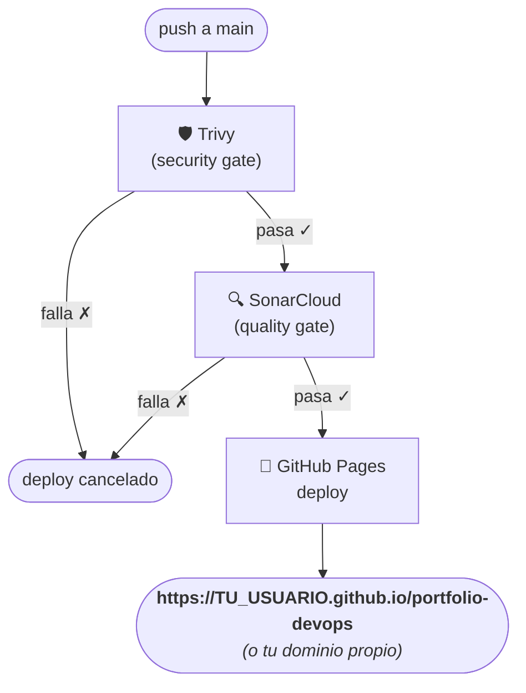

# Ejercicio Integrador — Portfolio DevOps

A lo largo del curso vas a construir y publicar tu propio **portfolio/CV online**. Este portfolio es el hilo conductor del ciclo completo: lo containerizarás con Docker, desplegarás automáticamente con GitHub Actions y analizarás su calidad con SonarCloud.

El template base está disponible en:
`git@github.com:ORT-ATI-CertificadoDevOps/portfolio-template.git`

---

## Las 4 fases

| Fase | Herramienta | Qué vas a hacer | Lab |
|------|-------------|----------------|-----|
| **1** | Git | Clonar el template, personalizar con tu info, primeros commits | [T01 Git](/T01%20-%20Nivelacion/Obligatorias/02-Git/1-Configuracion-y-commits) |
| **2** | Docker | Construir y correr el portfolio dentro de un contenedor nginx | [T02 Docker](/T02%20-%20Procesos%20DevOps/Obligatorias/01-Docker/3-Webapp_en_Docker) |
| **3** | GitHub Actions | Publicar en GitHub Pages con deploy automático en cada push | [T02 GitHub Actions](/T02%20-%20Procesos%20DevOps/Obligatorias/03-GitHub-Actions/04-Pipeline-Completo) |
| **4** | SonarCloud | Quality gate: el portfolio solo se publica si pasa el análisis | [T02 SonarCloud](/T02%20-%20Procesos%20DevOps/Obligatorias/02-SonarCloud/2-Generar_nuestro_primer_analisis_con_SonarCloud) |
| **5** | Trivy | Security gate: escanear la imagen Docker en busca de CVEs antes del deploy | [T02 GitHub Actions](/T02%20-%20Procesos%20DevOps/Obligatorias/03-GitHub-Actions/04-Pipeline-Completo) |

Al final del curso vas a tener un portfolio real, con URL pública, pipeline de CI/CD completo, análisis de calidad y escaneo de seguridad automatizados.

---

## Fase 1 — Git: Clonar y personalizar

**Lab:** [T01 Git — Ejercicio Integrador](/T01%20-%20Nivelacion/Obligatorias/02-Git/1-Configuracion-y-commits) (al final del laboratorio)

Clonar el template del portfolio y adaptarlo con tu información:

```bash
git clone git@github.com:ORT-ATI-CertificadoDevOps/portfolio-template.git
cd portfolio-template
git remote remove origin
git remote add origin git@github.com:TU_USUARIO/portfolio-devops.git
git push -u origin main
```

Personalizar los 8 puntos marcados con `<!-- TODO: -->` en `index.html` (nombre, rol, descripción, habilidades, proyectos, educación y contacto) y commitear los cambios.

> Para la guía detallada, ver el archivo `ejercicio-integrador.md` dentro del template clonado.

---

## Fase 2 — Docker: Containerizar el portfolio

**Lab:** [T02 Docker — Ejercicio Integrador](/T02%20-%20Procesos%20DevOps/Obligatorias/01-Docker/3-Webapp_en_Docker) (al final del laboratorio)

El template ya incluye un `Dockerfile` que sirve el portfolio con `nginx:alpine`:

```bash
cd portfolio-devops
docker build -t portfolio-devops .
docker run -d -p 8080:80 --name mi-portfolio portfolio-devops
# Abrir http://localhost:8080
```

Para desarrollo con live-reload:

```bash
docker compose up
```

---

## Fase 3 — GitHub Actions: Deploy automático a GitHub Pages

**Lab:** [T02 GitHub Actions — Ejercicio Integrador](/T02%20-%20Procesos%20DevOps/Obligatorias/03-GitHub-Actions/04-Pipeline-Completo) (al final del laboratorio)

Habilitar GitHub Pages en **Settings → Pages → Source: GitHub Actions** y agregar `.github/workflows/deploy.yml`:

```yaml
name: Deploy Portfolio

on:
  push:
    branches: [main]
  workflow_dispatch:

permissions:
  contents: read
  pages: write
  id-token: write

concurrency:
  group: "pages"
  cancel-in-progress: false

jobs:
  deploy:
    name: Deploy a GitHub Pages
    environment:
      name: github-pages
      url: ${{ steps.deployment.outputs.page_url }}
    runs-on: ubuntu-latest
    steps:
      - uses: actions/checkout@v4
      - uses: actions/configure-pages@v5
      - uses: actions/upload-pages-artifact@v3
        with:
          path: '.'
      - id: deployment
        uses: actions/deploy-pages@v4
```

Resultado: portfolio disponible en `https://TU_USUARIO.github.io/portfolio-devops`.

---

## Fase 4 — SonarCloud: Quality gate

**Lab:** [T02 SonarCloud — Ejercicio Integrador](/T02%20-%20Procesos%20DevOps/Obligatorias/02-SonarCloud/2-Generar_nuestro_primer_analisis_con_SonarCloud) (al final del laboratorio)

Conectar el repositorio `portfolio-devops` a SonarCloud y agregar `sonar-project.properties`:

```properties
sonar.projectKey=TU_USUARIO_portfolio-devops
sonar.organization=TU_ORGANIZACION_EN_SONARCLOUD
sonar.sources=.
sonar.exclusions=**/*.md,**/.github/**,**/node_modules/**
```

Extender el workflow para que SonarCloud actúe como quality gate: si falla, el deploy no se ejecuta.

---

## Fase 5 — Trivy: Security Gate

**Lab:** [T02 GitHub Actions — Ejercicio Integrador](/T02%20-%20Procesos%20DevOps/Obligatorias/03-GitHub-Actions/04-Pipeline-Completo) (al final del laboratorio)

El portfolio usa `nginx:alpine` como imagen base. Trivy va a escanear esa imagen antes del deploy para detectar CVEs conocidos. Si encuentra vulnerabilidades `CRITICAL` o `HIGH` con fix disponible, el deploy queda bloqueado.

Reemplazar `.github/workflows/deploy.yml` con la versión final que incluye todos los gates:

```yaml
name: Deploy Portfolio

on:
  push:
    branches: [main]
  workflow_dispatch:

permissions:
  contents: read
  pages: write
  id-token: write

concurrency:
  group: "pages"
  cancel-in-progress: false

jobs:
  scan:
    name: Security Gate (Trivy)
    runs-on: ubuntu-latest
    steps:
      - uses: actions/checkout@v4

      - name: Build imagen para escaneo
        uses: docker/build-push-action@v5
        with:
          context: .
          push: false
          load: true
          tags: portfolio-devops:${{ github.sha }}

      - name: Escaneo Trivy
        uses: aquasecurity/trivy-action@master
        with:
          image-ref: portfolio-devops:${{ github.sha }}
          format: table
          exit-code: '1'
          ignore-unfixed: true
          vuln-type: 'os,library'
          severity: 'CRITICAL,HIGH'

  quality-gate:
    name: Quality Gate (SonarCloud)
    runs-on: ubuntu-latest
    needs: scan
    steps:
      - uses: actions/checkout@v4
        with:
          fetch-depth: 0

      - uses: SonarSource/sonarcloud-github-action@master
        env:
          GITHUB_TOKEN: ${{ secrets.GITHUB_TOKEN }}
          SONAR_TOKEN: ${{ secrets.SONAR_TOKEN }}

  deploy:
    name: Deploy a GitHub Pages
    runs-on: ubuntu-latest
    needs: quality-gate
    environment:
      name: github-pages
      url: ${{ steps.deployment.outputs.page_url }}
    steps:
      - uses: actions/checkout@v4
      - uses: actions/configure-pages@v5
      - uses: actions/upload-pages-artifact@v3
        with:
          path: '.'
      - id: deployment
        uses: actions/deploy-pages@v4
```

Orden de ejecución: `scan → quality-gate → deploy`. Si Trivy falla, ni SonarCloud ni el deploy se ejecutan.

> **¿Qué hacer si Trivy falla?** Ver la sección [4.9 del laboratorio](/T02%20-%20Procesos%20DevOps/Obligatorias/03-GitHub-Actions/04-Pipeline-Completo#49-qué-hacer-si-trivy-falla) — las opciones incluyen cambiar la imagen base a `cgr.dev/chainguard/nginx` (cero CVEs), usar `.trivyignore` para CVEs aceptados, o bajar el umbral de bloqueo.

> **¿Por qué escanear una imagen de portfolio estático?** La imagen base `nginx:alpine` tiene dependencias del sistema operativo que pueden tener CVEs conocidos. Trivy los detecta aunque el código fuente sea solo HTML/CSS/JS. Es una buena práctica escanear siempre la imagen completa, no solo el código propio.

---

## Bonus — Dominio personalizado

GitHub Pages permite asociar un dominio propio al portfolio en lugar de usar la URL por defecto (`TU_USUARIO.github.io/portfolio-devops`). Es una práctica habitual en el mundo profesional y tiene ventajas concretas.

### Beneficios

- **HTTPS gratuito y automático** — GitHub Pages provisiona un certificado TLS via Let's Encrypt sin costo ni configuración manual. Cualquier dominio propio conectado queda protegido con HTTPS.
- **URL profesional** — `www.tunombre.dev` comunica mucho más que una URL de GitHub Pages genérica.
- **Independencia del hosting** — si en el futuro migrás el portfolio a otro proveedor, el dominio te sigue perteneciendo; solo cambiás a dónde apunta.

### Dónde adquirir un dominio

Algunos registradores recomendados con buena relación precio/calidad:

| Registrador | Notas |
|-------------|-------|
| [Namecheap](https://www.namecheap.com) | Precios bajos, interfaz clara, incluye WhoisGuard gratis |
| [Porkbun](https://porkbun.com) | Muy económico, incluye WHOIS privacy gratis |
| [Cloudflare Registrar](https://www.cloudflare.com/products/registrar/) | Precio de costo (sin markup), DNS gestionado por Cloudflare |

Los dominios `.dev` y `.io` son populares en el mundo tech. Un `.dev` ronda los USD 10–15/año.

### Configuración

**1. Agregar el dominio en GitHub Pages**

En el repositorio `portfolio-devops`:
**Settings → Pages → Custom domain** → ingresar el dominio (ej: `www.tunombre.dev`) → Save.

GitHub va a crear automáticamente un archivo `CNAME` en el repositorio con el dominio configurado.

**2. Configurar los DNS en el registrador**

Para un subdominio `www`, agregar un registro `CNAME`:

| Tipo | Host | Valor |
|------|------|-------|
| `CNAME` | `www` | `TU_USUARIO.github.io` |

Para un apex domain (`tunombre.dev` sin `www`), agregar registros `A` apuntando a las IPs de GitHub Pages:

```
185.199.108.153
185.199.109.153
185.199.110.153
185.199.111.153
```

**3. Esperar la propagación y verificar HTTPS**

La propagación DNS puede tomar entre unos minutos y 48 horas. Una vez propagado, GitHub habilita automáticamente el certificado TLS. En **Settings → Pages** se puede ver el estado del certificado.

> El archivo `CNAME` que crea GitHub debe commitearse al repositorio para que el dominio persista entre deploys. Si usás el workflow de GitHub Actions, el archivo ya estará presente y se incluirá en el artefacto desplegado.

---

## Pipeline final

Una vez completadas las 5 fases, cada push a `main` en el repositorio `portfolio-devops` dispara:


