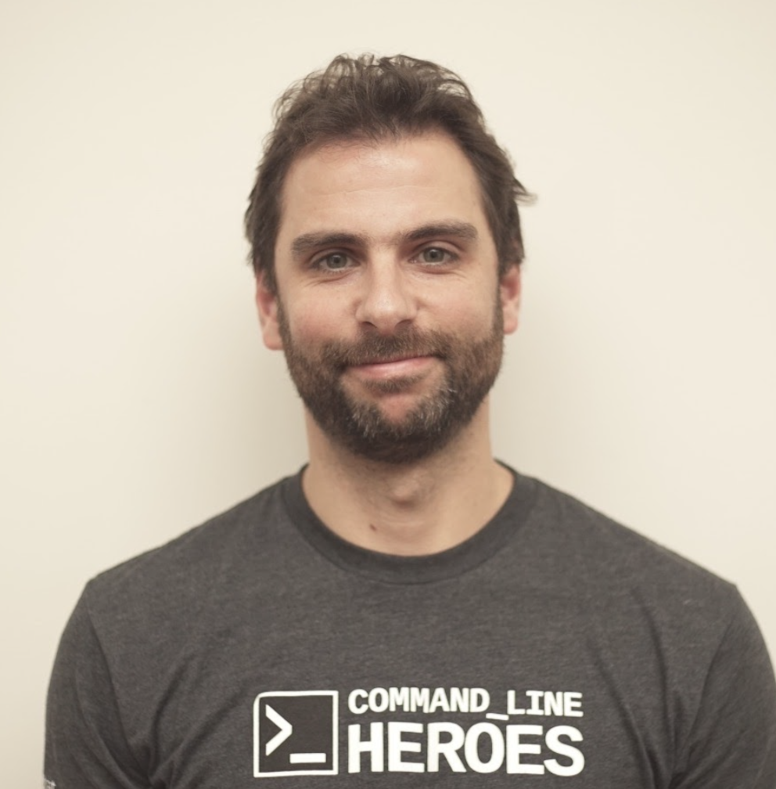
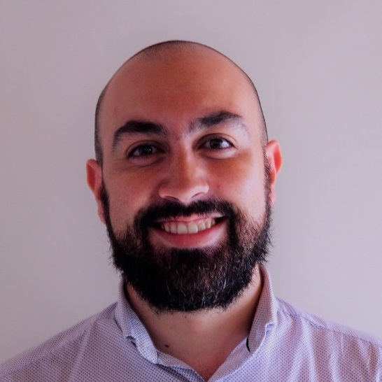

<p class="logo" align="center">

</p>

# Facultad de ingeniería | Escuela de tecnología - DevOps | Laboratorios

Estimados, sean bienvenidos al repositorio oficial para seguir las clases de los laboratorios.

Aquí van a encontrar material para hacer los prácticos correspondientes a las unidades temáticas en forma ordenada, encontrandose prácticas **OBLIGATORIAS** y **EXTRAS**.

## Estructura

El repositorio se organiza de la siguiente manera:

- **Extras:** Carpeta utilizada para almacenar contenido de múltiple uso en el repositorio.
- __T0x - _NOMBRE_:__ Laboratorios correspondientes a cada una de las unidades temáticas.
   - **Obligatorios:** Laboratorios obligatorios que se deben de realizar antes de avanzar con la unidad siguiente.
   - **Recomendadas:** Laboratorios recomendados para que puedan tener practicas extras sobre la unidad en cuestión.

```ini
.
├── Extras
├── T01 - Nivelacion
│   ├── Obligatorias
│   ├── Recomendadas
├── T02 - Procesos DevOps
│   ├── Obligatorias
│   ├── Recomendadas
├── T03 - Herramientas CICD
│   ├── Obligatorias
│   ├── Recomendadas
├── T04 - Cloud
│   ├── Obligatorias
│   ├── Recomendadas
├── T05 - Arquitectura y Microservicios
│   ├── Obligatorias
│   ├── Recomendadas
├── T06 - Infrastructure as Code
│   ├── Obligatorias
│   ├── Recomendadas
├── T07 - Containers
│   ├── Obligatorias
│   ├── Recomendadas
└── T08 - Kubernetes
    ├── Obligatorias
    ├── Recomendadas
```

## Links e información relevante

### Horarios

- **Lunes 19:00 a 22:00**

- **Martes 19:00 a 22:00**

- **Jueves 19:00 a 21:00**

### Planillas

- [Planilla cuentas correo y usuarios GitHub](https://docs.google.com/spreadsheets/d/1Vtfhugh22_WzbB8R3ZN_1U4HehB6jqsoMQvZYozxcF8/edit?usp=sharing)

### Contacto

- [Link de Zoom](https://aulas.ort.edu.uy/mod/url/view.php?id=472800)
- ID reunión: 98461994484
- Código de acceso: UeMQN8Or

### Proyecto

- [Link del proyecto]()
- [Foro dudas proyecto](https://aulas.ort.edu.uy/mod/forum/view.php?id=359876)

## Equipo docente

Los docentes para el dictado somos:



**Mauricio Améndola**
(**amendola@fi365.ort.edu.uy**)



**Victor Silva**
(**vmsilvamolina@gmail.com**)

- [T01 - Nivelación](/T01%20-%20Nivelacion/index_nivelacion.md)
- [T02 - Procesos DevOps](/T02%20-%20Procesos%20DevOps/index_devops.md)
- [T03 - Herramientas CICD](/T03%20-%20Herramientas%20CICD/index_cicd.md)
- [T04 - Cloud](/T04%20-%20Cloud/index_cloud.md)
- [T05 - Arquitectura y Microservicios](/T05%20-%20Arquitectura%20y%20Microservicios/index_microservicios.md)
- [T06 - Infrastructure as Code](/T06%20-%20Infrastructure%20as%20Code/index_iac.md)
- [T07 - Containers](/T07%20-%20Containers/index_containers.md)
- [T08 - Kubernetes](/T08%20-%20Kubernetes/index_kubernetes.md)