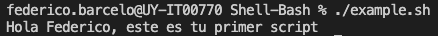

## Shell-Bash

### Puntos a tener en consideración
- Se deja un script de ejemplo en la carpeta del práctico, con la estructura necesaria para ser ejecutado como script, verificar que los archivos que son scripts llevan la extensión `.sh`.
- Todos los scripts deben de tener permisos de ejecución para poder ser invocados. Verificar que se cuentan con los permisos de execute (x) en el archivo para que el mismo sea ejecutado, a continuación una imagen para verificar que los permisos se encuentran de manera correcta y el script fue ejecutado de manera éxitosa.

- Si pudimos realizar lo anterior sin problema, podremos empezar a realizar el práctico de Shell-Bash-Scripting.
- Las variables dentro de Bash se definen de la siguiente manera:
  - VARIABLE="valor"
  - EJ: name="Federico"
- También se pueden alojar salidas de comandos dentro de las variables:
  - VARIABLE=$(COMANDO)
  - EJ: test=$(ls /)
- Se deja esta [página](https://ss64.com/bash/) en donde pueden encontrar en detalle una gran variedad de comandos de bash.

>**Nota:** Como siempre, si tienen dudas o se encuentran trancados no tengan miedo en consultar/preguntar, la idea de los laboratorios/prácticos es hacer lo más hands-on posible de manera grupal/independiente.

## Ejercicio 1
- Generar un archivo `ejercicio1.sh` que imprima por pantalla `"Hola NOMBRE, este es tu primer script"`.
- Reemplazar NOMBRE con tu propio nombre. Por ejemplo, si te llamas Ana, debería mostrar en pantalla "Hola Ana, este es tu primer script"
- Resultado esperado (ejemplo):

## Ejercicio 2
- Generar un archivo `ejercicio2.sh` para que ahora incluya el NOMBRE como una variable.
- Resultado esperado (ejemplo):
 

## Ejercicio 3
- Generar un archivo `ejercicio3.sh` que guarde en una variable EQUIPO el comando hostname y luego imprima por pantalla el siguiente mensaje: `"Este script se encuentra ejecutandose en el equipo X"`, en donde X es el valor obtenido por el comando hostname que se aloja la variable `EQUIPO`.
- Ej de la solución: 

## Ejercicio 4
- Generar un archivo ejercicio4.sh que valide si una determinada RUTA/PATH existe.
- Es recomendable alojar la RUTA/PATH como una variable.
- Si la RUTA **EXISTE**, se debe imprimir por pantalla "La ruta: RUTA existe!"
- Si **TENGO** permisos de ejecución sobre la ruta, se debe imprimir por pantalla "Tengo permisos de ejecución sobre la ruta: RUTA"
- Si la RUTA **NO EXISTE**, se debe de imprimir por pantalla "La ruta: RUTA no existe"
- Ej de la solución: 

## Ejercico 5
- Generar un archivo ejercicio5.sh que muestre por pantalla el nombre de 5 animales, apareciendo cada uno en una linea diferente.
- Ej de la solución: 

## Ejercicio 6
- Generar un archivo ejercicio6.sh que le pida al usuario una RUTA y verifique si la misma es un directorio, un archivo regular o otro tipo de archivo.
- En caso de ser un **DIRECTORIO**, se deberá de mostrar por pantalla "La ruta: RUTA recibida es un directorio".
- En caso de ser un **ARCHIVO REGULAR**, se deberá de mostrar por pantalla "La ruta: RUTA recibida es un archivo regular".
- En caso de ser **OTRO TIPO DE ARCHIVO**, se deberá de mostrar por pantalla "La ruta: RUTA es otro tipo de archivo".
- Ademas es necesario ejecutar un ls -l sobre la RUTA solicitada.
- Ej de la solución: 
- Ej de la solución: 

## Ejercicio 7
- Generar un archivo ejercicio7.sh a partir del archivo ejercicio6.sh, que en lugar de recibir la ruta por pantalla, la reciba como parámetro.
- Ej de la solución: 

## Ejercicio 8
- Generar un archivo ejercicio8.sh que mediante el comando function, muestre por pantalla el número total de archivos existentes en el directorio donde se encuentra el archivo ejercicio8.sh
- El nombre de function puede ser cual gusten, recomiendo que la definan como: function contar_archivos()
- Ej de la solución: 

## Ejercicio 9
- Generar un archivo ejercicio9.sh a partir del archivo ejercicio8.
- Realizar los cambios necesarios para que la function contar_archivos() pueda recibir los directorios como parametros.
- Una vez realizadas las modificaciones, utilizar la function sobre los directorios:
  - /etc
  - /var
  - /usr/bin
- Ej de la solución: 

## Ejercicio 10
- Generar un archivo ejercicio10.sh que muestre un número random por pantalla "El número random fue: xxxxx" (utilizar el comando RANDOM para obtener el número aleatorio).
- Cada vez que el .sh se ejecute, debe de guardarse el mensaje desplegado con el número aleatorio obtenido en un archivo llamado ejercicio10.txt, que debe de estar alojado en /var/tmp/
- Ej de la solución: 
- Ej de la solución: 