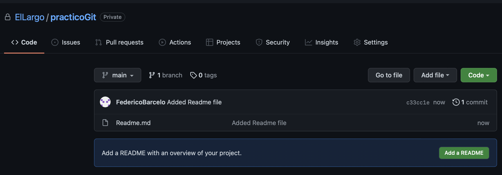
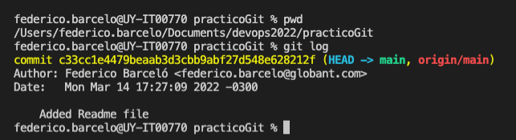
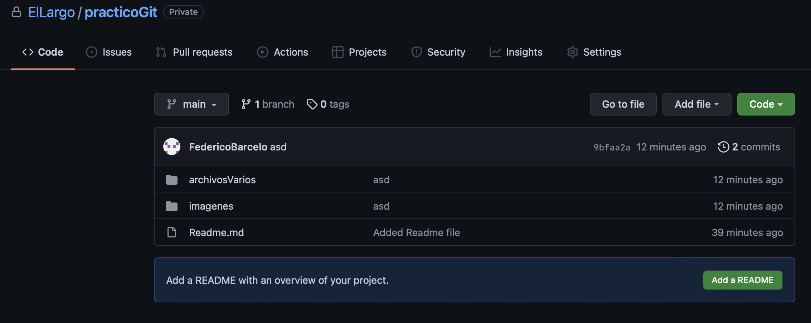
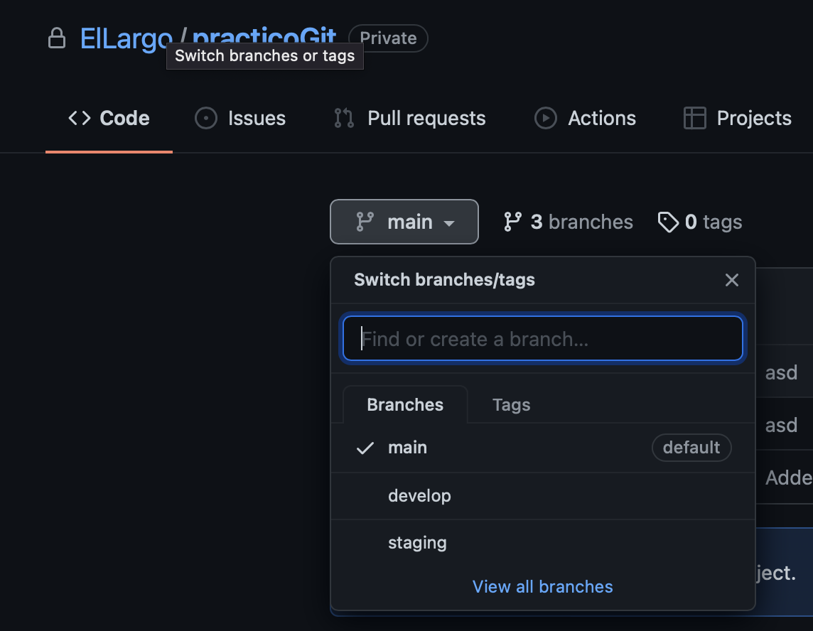
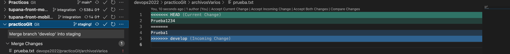

## Git

### Puntos a tener en consideración
- Si estamos leyendo este archivo, es porque tenemos acceso al repositorio en donde se encuentran los prácticos, por lo cual, tenemos una cuenta de GitHub generada para poder hacer el laboratorio.
- Se deja la [documentación](https://git-scm.com/docs) oficial de git por si es necesario consultar algún comando en especifico.
- También se deja disponible la [página](https://ss64.com/bash/) de bash utilizada en el laboratorio anterior por si tienen necesidad de utilizar algún comando extra.
- Tener en cuenta que va realizando cada comando, no ejecuten comandos por ejecutar, por más de estar realizando pruebas, necesitamos lograr entender que es lo que estamos realizando, así que si se pierden un poco, consulten/pregunten **TODAS** las veces que sean necesarias para eso estamos los docentes.

## Ejercicio 1
- Generar un directorio llamado `practicoGit`, no importa en donde lo ubiquen.
- Inicializar un nuevo repositorio, pueden realizarlo de dos maneras:
  - 1) Se posicionan sobre el nuevo directorio generado y ejecutan el comando git init, luego van a tener que subir el repositorio generado localmente a su cuenta de GitHub.
  - 2) Generan el repositorio desde su cuenta personal de GitHub y luego lo clonan sobre la carpeta generada anteriormente.
- No importa por cual opción fueron, para seguir deben de verificar:
  - Tener el repositorio clonado localmente.
  - Visualizar el repositorio en su cuenta de GitHub
- Ej de la solución: 
- Ej de la solución: 

## Ejercicio 2
- Agregar las siguientes dos carpetas sobre nuestro repositorio generado anteriormente:
  - archivosVarios
  - imagenes
- Alojar sobre la carpeta imagenes, 3 imágenes de su elección.
- Alojar sobre la carpeta archivosVarios, 2 archivos de texto con algo dentro y 1 archivo de su eleeción.
- Agregar sobre nuestra zona de stage los archivos correspondientes a la carpeta imagenes y 
agregar hacer un commit con ellos utilizando un mensaje descriptivo.
  - >**Nota:** Ver comandos `git add` y `git commit` para este paso
- Verificar que lo anterior fue realizado correctamente, puede utilizar el comando git status y git log.
- Si lo anterior fue visualizado correctamente, suban el commit al repositorio centralizado.
- Verificar en el repositorio centralizado (en la web de GitHub con su usuario) que el cambio que hicieron localmente, se encuentra allí.
- Repetir los pasos de agregar archivos en nuestra zona de stage pero para la carpeta de archivosVarios y realizar los mismos pasos hasta que quede todo subido sobre el repositorio centralizado.
- Ej de la solución: 

## Ejercicio 3

- Generar 2 nuevas ramas a partir de la rama main:
  - develop
  - staging
- Subir los cambios al respositorio centralizado y visualizar dichas ramas allí.
- >**Nota:** Apoyarse del comando `git branch` o `git checkout` y `git push`.
- Ej de la solución: 

## Ejercicio 4
- Posicionarse sobre la rama _develop_.
- Verificar que me encuentro posicionado en la rama develop.
- Generar un nuevo archivo de texto en la carpeta archivosVarios de extensión el archivo prueba.txt y agregar en la primera linea el texto "Prueba1"
- Agregar dicho archivo a la zona de stage, luego adicionarlo en la rama y al repositorio centralizado.
- Posicionarse sobre la rama _staging_.
- Verificar que me encuentro posicionado en la rama staging.
- Generar un nuevo archivo de texto en la carpeta archivosVarios de nombre _prueba.txt_ y agregar en la primera linea el texto "Prueba1234"
- Agregar dicho archivo a la zona de stage, luego adicionarlo en la rama y al repositorio centralizado.
- Posicionado sobre la rama _staging_, ejecutar el comando `git merge develop` (nos vamos a traer el contenido de la rama develop hacía la rama staging)
- Si todo ocurrio de manera correcta, estaremos visualizando el siguiente conflicto: 
- Ver las opciones disponibles, esto ocurre porque se estuvo trabajando sobre el mismo archivo, en este caso tenemos el mismo archivo llamado de igual manera en ambas ramas pero con contenido diferente, la herramienta de versionado nos esta alertando sobre la inconsistencia entre ambos archivos (que se encuentra en ambas ramas) y nos esta brindando la opción de elegir que hacer con el.
- Vamos a darle a la opción "Accept both changes" y guardamos el archivo.
- Ver que comandos debemos de utilizar para terminar de arreglar el conflicto y que quede subido al repositorio centralizado. (apoyarse de `git status`, `git commit` y `git push`).

## Bonus commands!

- `git config`
  - git config -global user.name "[NOMBRE]"
  - git config -global user.email "[email@domain]"

- `git add`
  - git add file1 folder1/
  - git add *

- `git diff`
  - git diff [branch1] [branch2]

- `git reset`
  - git reset [file]
  - git reset [commit]

- `git stash`
  - git stash pop
  - git stash drop

- `git fetch`

- `git shortlog`

- `git whatchanged`

- archivo _.gitignore_