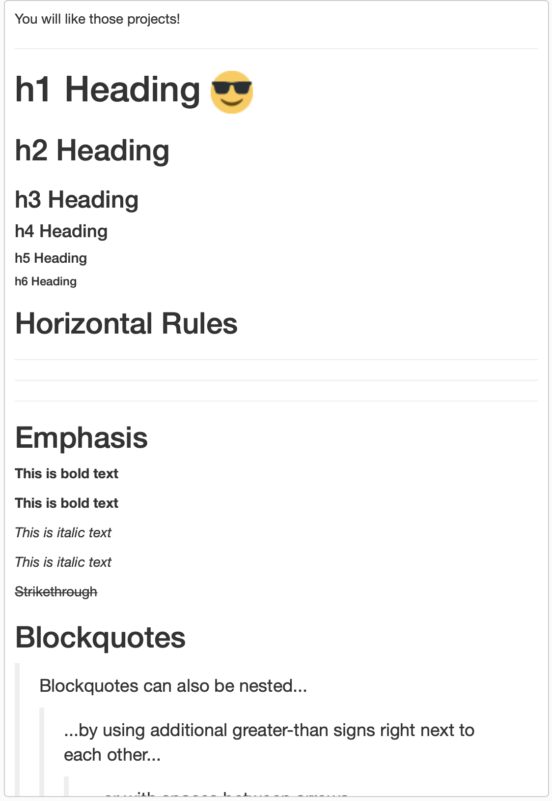
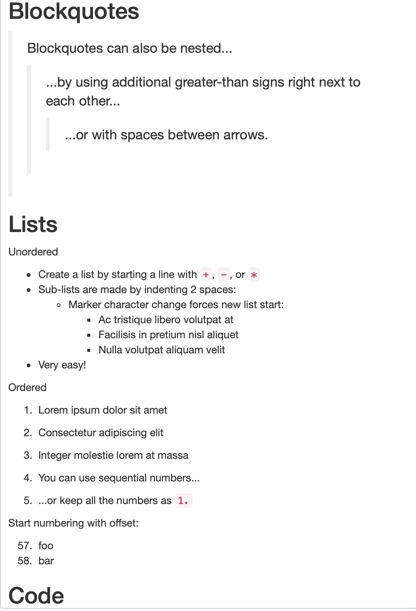
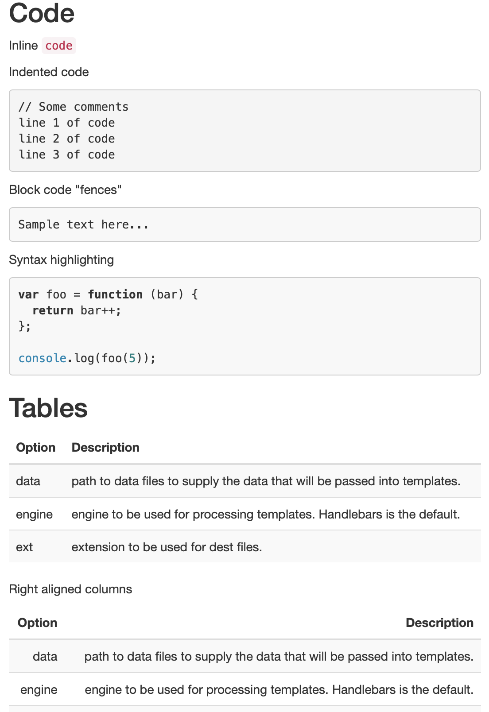
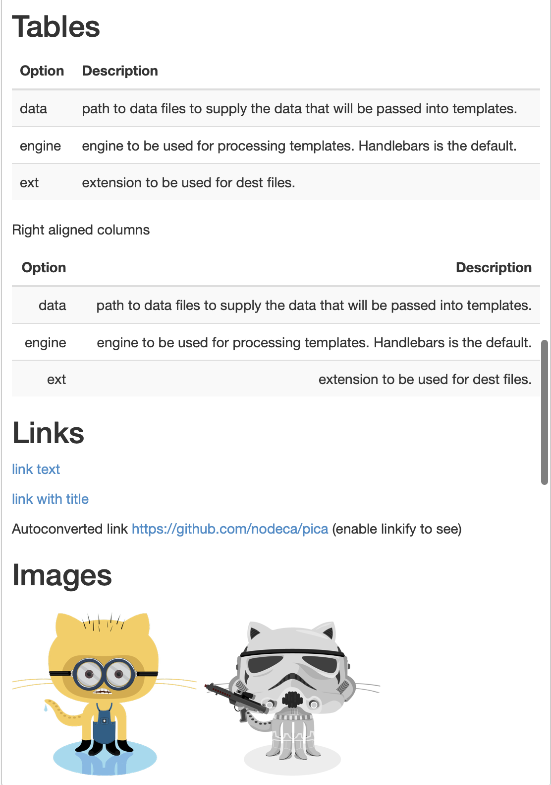
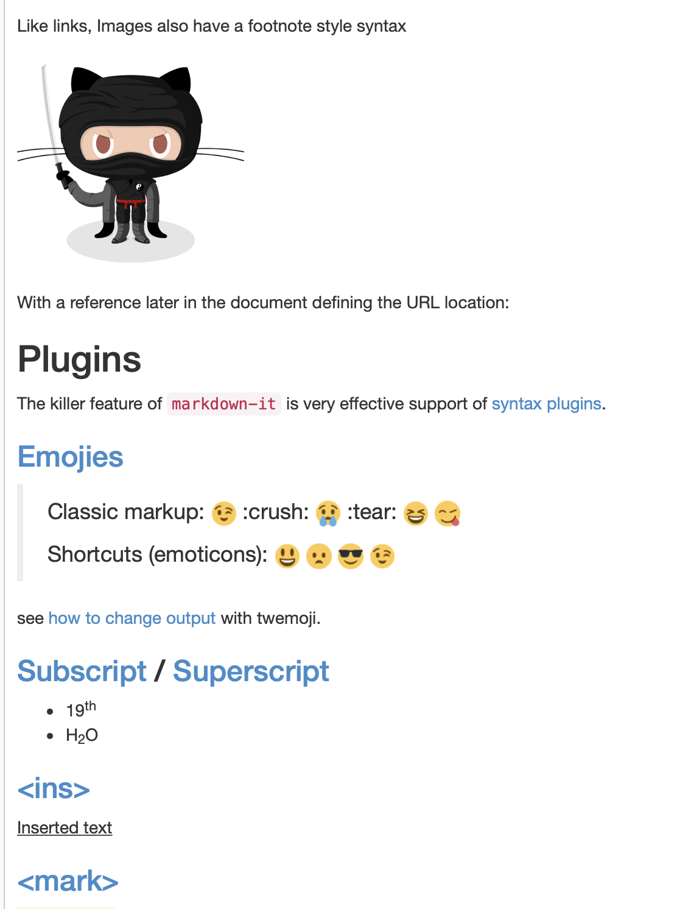
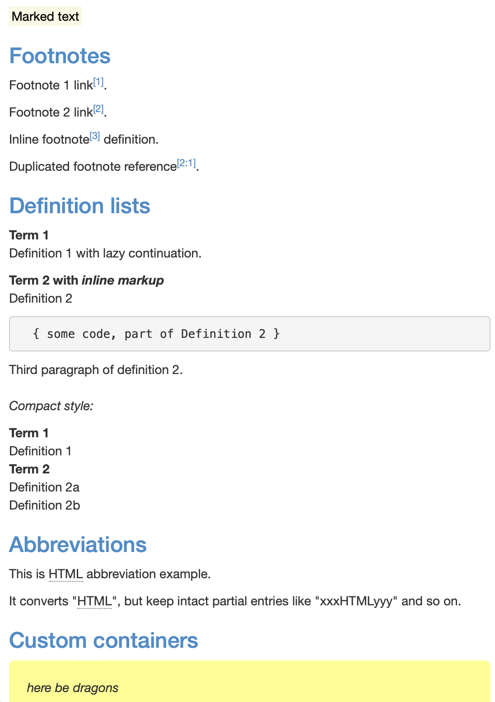
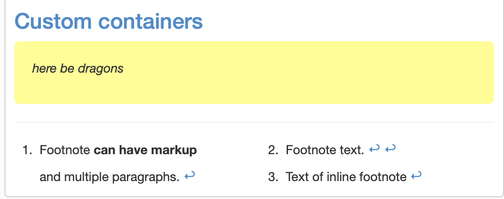

## Markdown

### Puntos a tener en consideración
- Markdown es un lenguaje de marcado ligero que puede usar para agregar elementos de formato a documentos de texto sin formato.
- Hoy en día es uno de los lenguajes de marcado más populares del mundo, se utiliza mucho para realizar documentaciones en la web, sobre todo en el rubro de TI.
- Se les deja la [documentación](https://www.markdownguide.org/cheat-sheet/) oficial de los comandos, la cual van a necesitar.
- Las imágenes que van a necesitar, se encuentran en la carpeta.

## Ejercicio
- Realizar un archivo Readme.md que se asemeje a las siguientes imagenes.
- Para irlo visualizarno el VSC instalando alguna extesión (recomendado) o directamente sobre alguna página en la web que permita ir viendo el preview.
- >**Nota:** Hay un archivo llamado Solucion.md con la solución, no vayan directamente a visualizarlo, traten de realizar el ejercicio y luego validen que les haya quedado de manera correcta.

