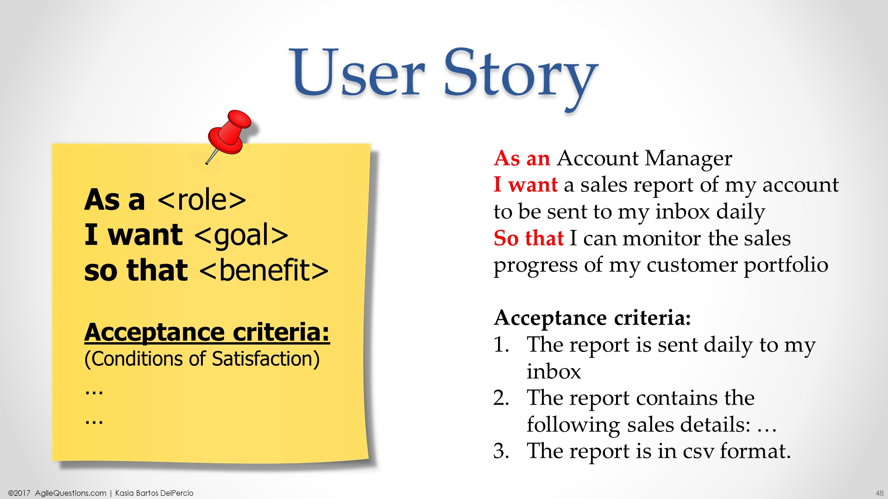
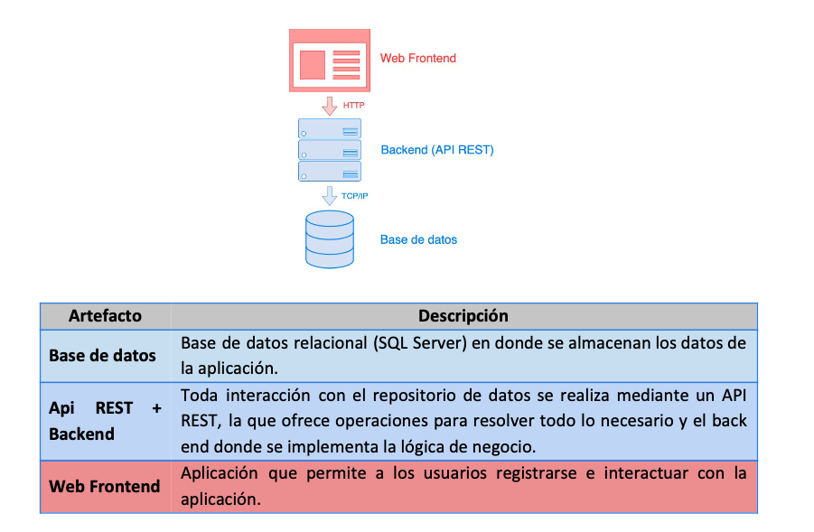

## Scrum

### Puntos a tener en consideración
- Esta actividad va a ser realizada en grupos (los mismos se van a armar de forma aleatoria).
- La modalidad de trabajo sera un integrante del equipo compartirá la pantalla y entre todos se van a hacer los aportes para la solución.
- Un miembro del equipo debe de crear una cuenta en [Azure DevOps](https://azure.microsoft.com/en-us/services/devops/) ya que vamos a utilizar el recurso de Azure Boards para la planificación.
- Una vez culminado el tiempo para el trabajo en grupo, se expondrá cada una de las soluciones en clase por parte de cada uno de los grupos.

>**Nota:** El docente va a realizar una breve explicación sobre el uso de la herramienta.

### Ejercicio
-  Se deberá de separar todas las tareas (ya sean correspondientes a desarrollo o infraestructura/cloud/devops) en un product backlog.
-  Si sienten la necesidad de algunas tareas en sub tareas, pueden realizarlo.
-  Si las correspondientes a desarrollo gustan evidenciarlas en formato de User Story, deberan de respetar las reglas que se muestran en la siguiente imagen:

- **NOTA:** No se busca que sean las descripciones con lujo de detalle, la finalidad del ejercicio es generar el product backlog como tal.

### Letra

El ​Ministerio de Turismo a través de su conocida marca ​“Uruguay Natural​” se encuentra trabajando en un plan de remodelación tecnológica de algunas de sus plataformas, con el fin de poder aprovechar la pausa en la actividad turística ocasionada por la pandemia, pudiendo así retomar la misma en un futuro potenciando la llegada de nuevos turistas tanto nacionales como internacionales.

Particularmente, luego de varios meses de trabajo detectaron algunos problemas con su sitio web actual, siendo el principal de ellos que el contenido es estático y demasiado genérico, por lo que es difícil poder atrapar los potenciales turistas sin ofrecerles una propuesta más atractiva y completa. En consecuencia, se tomó la decisión de permitir que los posibles turistas tengan una experiencia end-to-end: desde poder explorar lugares turísticos, hasta evaluar y reservar potenciales paquetes turísticos para cada cliente. Para ello, se decidió crear desde cero el sistema, teniendo foco en los siguientes requerimientos funcionales que son los que mayor valor aportan al negocio:

1) Búsqueda de puntos turísticos por región y por categoría:

   - Los usuarios (de aquí en más serán denominados también ​turistas​), pueden acceder al sitio web y explorar los diferentes lugares a visitar según la región de nuestro país y a través diferentes categorías bien definidas.
   - Particularmente, se definen las siguientes ​regiones para representar nuestro país que se saben que no cambiarán:
     - Región metropolitana
     - Región Centro Sur
     - Región Este
     - Región Litoral Norte
     - Región “Corredor Pájaros Pintados” 

   - Además, dentro de cada región se representan los denominados ​puntos turísticos, ​pudiendo cada uno pertenecer a diferentes ​categorías​ (por lo menos una). Estas categorías son:
     - “Ciudades”
     - “Pueblos”
     - “Áreas protegidas”
     - “Playas”
     - Etc.

   - Por último, cada ​punto turístico tiene un nombre, una descripción de máximo 2000 caracteres y una imagen asociada. Por ejemplo, dado el punto turístico “Punta del Este”:
     - Nombre​: Punta del Este
     - Descripción​: ​“Donde el lujo y la naturaleza convergen: Punta del Este es reconocido internacionalmente como uno de los principales balnearios de América y el más exclusivo de la región. Se ubica en el departamento de Maldonado, a sólo una hora y media de la capital del país. Lujosas residencias de veraneo, altos edificios de apartamentos frente al mar, enormes yates en el puerto, hoteles y restaurantes de lujo lo transforman en el balneario de mayor glamour de América”.
     - Región: ​Región Este
     - Categoría​: Ciudades, Playas, Áreas protegidas
     - Imagen​: ...
  
   - En resumen: una vez los usuarios acceden al sitio, se les lista las cinco regiones disponibles y al elegir una de ellas se les muestran los diferentes puntos turísticos asociados a dicha región, donde se ve el nombre, imagen y categorías de cada punto turístico en un listado y donde el usuario tiene la opción de filtrar por una o varias categorías.

2) Elegir un punto turístico y realizar una búsqueda de hospedajes

   - Los turistas, dado un cierto punto turístico que hayan seleccionado previamente pueden realizar una búsqueda de hospedajes. Para realizar dicha búsqueda se debe ingresar: ​el punto turístico previamente seleccionado, la ​fecha de check-in​, ​fecha de check-out y la ​cantidad de huéspedes​. Este último valor debe distinguir según la edad de los huéspedes, siguiendo las siguientes categorías:
     - Cantidad de Adultos (13 años o más)
     - Cantidad de Niños (de 2 a 12 años)
     - Cantidad de Bebés (menos de 2 años)

   - Una vez ingresada la búsqueda, el usuario obtiene una lista de ​hospedajes que coinciden con la búsqueda previamente ingresada. Cada hospedaje tiene un ​nombre​, ​cantidad de estrellas (1 a 5)​, punto turístico al cual pertenece, una ​dirección​, ​una o varias imágenes​, el ​precio por noche​, el precio total para el período seleccionado y una ​descripción de las características y servicios ofrecidos por el hospedaje. Para calcular el precio total para el período se asume que todos los días tienen el mismo costo y que todos los niños siempre pagan un 50% y los bebés un 25% del valor del día asociado. Esto aplica a cualquier hospedaje ofrecido por Uruguay Natural.

   - Por ejemplo, veamos la siguiente búsqueda y sus resultados:

     - Punto turístico:​ Colonia del Sacramento
     - Check-in: ​01/12/2020
     - Check-out: ​08/12/2020
     - Cantidad de huéspedes:​ 4 (dos adultos, un niño y un bebé)

    - Resultado: 2 hospedajes

     - Hospedaje 1:
       - Nombre​: Radisson Colonia Del Sacramento Hotel
       - Cantidad estrellas:​ 5
       - Dirección:​ Washington Barbot 283, 70000 Colonia del Sacramento, Uruguay
       - Descripción: ​Este hotel se encuentra a solo 1 calle del centro histórico de Colonia del
      Sacramento y ofrece vistas panorámicas a la bahía, una magnífica piscina climatizada y bañera de hidromasaje. También hay sauna y bañeras de hidromasaje modernas, WiFi gratuita y aparcamiento. Las habitaciones del Radisson Colonia Del Sacramento son amplias y disponen de TV LCD por cable, minibar y aire acondicionado. Algunas cuentan con balcón y gozan de vistas panorámicas al río de la Plata...
       - Imágenes​: ...
       - Precio por noche: $100
       - Precio total: $1925
          >Nota: Esto equivale al siguiente cálculo: 2 Adultos (7 * 100 * 2), más 1 niño (7 * 100 * 0.5), más 1 bebé (7 * 100 * 0.25). 7 equivale al número de noches del período.
     - Hospedaje 2:
       - Nombre​: Hotel Italiano
       - Cantidad estrellas:​ 3
       - Dirección: Intendente Suarez 105 Esq. Manuel Lobo, 70000 Colonia del Sacramento, Uruguay
       - Descripción: ​El Hotel Italiano ofrece habitaciones con vistas al jardín y WiFi gratuita, además de piscina al aire libre y bañera de hidromasaje, ambas rodeadas por sombrillas de paja y tumbonas. El barrio histórico de Colonia se encuentra a 5 minutos a pie. El hotel Italiano cuenta con gimnasio y piscina cubierta climatizada. También ofrece servicio de masajes. Las habitaciones presentan una decoración sencilla y elegante. Disponen de aire acondicionado.
       - Imágenes​: ...
       - Precio por noche: $40
       - Precio total: $770
          >Nota:  Esto equivale al siguiente cálculo: 2 Adultos (7 * 40 * 2), más 1 niño (7 * 40 * 0.5), más 1 bebé (7 * 40 * 0.25). 7 equivale al número de noches del período.

3) Dado un hospedaje, realizar una reserva:

   - Los turistas pueden confirmar una reserva en un hospedaje y los datos de reserva que automáticamente se llenan con los datos de búsqueda (check-in, check-out, cantidad de huéspedes) ingresando su ​nombre​, ​apellido y el ​e-mail​. Se deja de lado la posible utilización de mecanismos de pago para simplificar esta primera entrega.

   - Una vez realizada la reserva, estos reciben un ​código único que identifica la reserva, además de un número telefónico​ y un ​texto de información​ del contacto.

4) Se pide que los usuarios (​turistas​) puedan entonces:

   - Buscar​ puntos turísticos​ ​por región ​y filtrar dicha búsqueda​ por categoría​.
   - (*) ​Buscar​ hospedajes ​para un cierto​ punto turístico​ con los parámetros especificados.
   - (*) Realizar una reserva de un hospedaje​.
   - Consultar el estado actual de una reserva ​dado su número ​(el estado actual de una reserva consta
   de un texto que identifica el estado -su nombre- y una descripción).
   - Los estados posibles son [“Creada”, “Pendiente Pago”, “Aceptada”, “Rechazada”, “Expirada”].

5) A su vez, se cuenta con usuarios ​administradores​, que pueden:

   - Iniciar sesión en el sistema​ usando su ​e-mail​ y ​contraseña​.
   - Dar de alta un nuevo punto turístico, ​para una región existente.
   - Dar de alta un nuevo hospedaje​ o​ borrar uno existente, ​para un punto turístico existente.
   - Modificar la capacidad actual de un hospedaje​.
   - Cambiar el estado de una reserva​,​ ​indicando una descripción.
   - Un administrador también puede realizar el mantenimiento de los administradores del sistema (estos tienen ​nombre​, ​e-mail​ y ​contraseña​). El e-mail es único y no puede estar repetido.
   - Estas operaciones SOLO pueden ser llevadas a cabo por un administrador. Considere inicialmente agregar un usuario super-administrador en base de datos para poder crear futuros administradores.

6) Para resolver el problema se definió la siguiente arquitectura de alto nivel:
