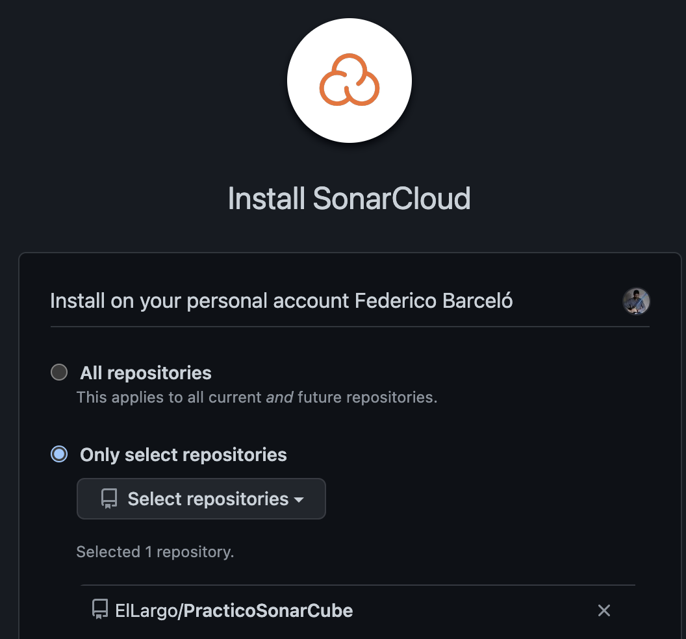
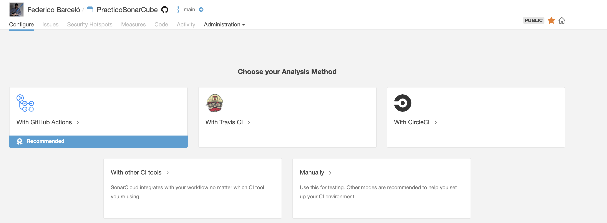
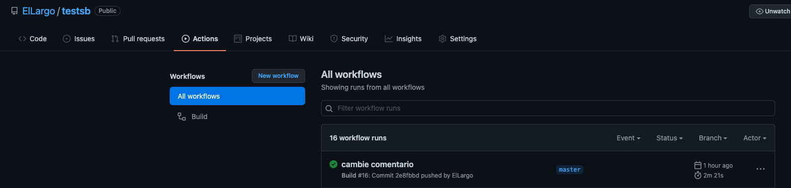
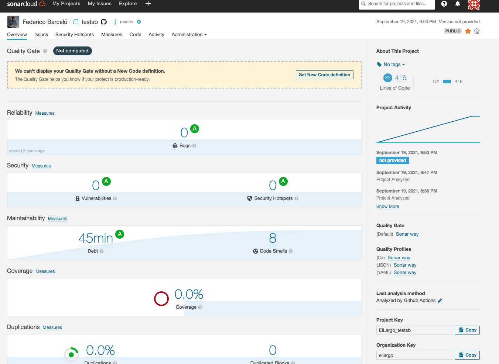
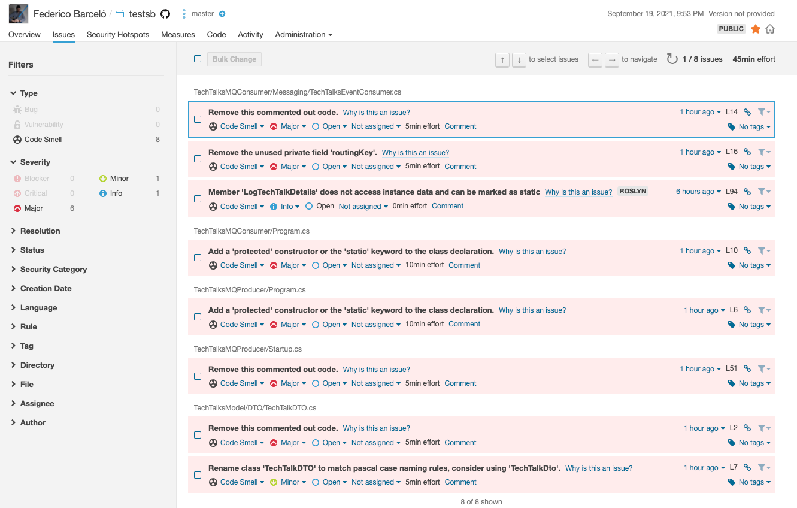

## 2 - Generar repositorio con codeExample para realizar análisis de código automáticos
Ahora que tiene todo configurado en su ambiente, es hora de ensuciarnos las manos. En esta sección, va a generar un repositorio nuevo y realizara la configuración necesaria para que cada vez que se integren cambios en el mismo, se realicen los análisis de código mediante los actions de GitHub.

### 2.1 Subir código codeExample.zip

Generar en su cuenta de GitHub un repositorio con el nombre **PracticoSonarCube** y que quede de manera **pública** como se muestra en la imagen a continuación:

> **Nota:** Se pueden tener problemas cuando se suba el código al repositorio, es reponsabilidad del alumno ver como solucionar los problemas que puedan aparecer durante este paso.

### 2.2 Asociar repositorio a SonarCloud

En este paso se va a asociar el repositorio en la cuenta de SonarCloud para poder realizar los análisis. Se debe elegir solamente el repositorio que generamos para el práctico al momento de realizar la configuración:

Generar la key con un nombre que recuerden y además elegir la opción **free plan**.

Terminado lo anterior, deberían de haber llegado a la siguiente pantalla:

### 2.3 Integrar SonarCube con GitHub actions

Vamos a realizar la integración entre nuestra herramienta de validación de código y las [GitHub Actions](https://github.com/features/actions).

> **Nota**: Las **GitHub Actions** se pueden utilizar para realizar pipelines de **CI/CD** pero para esta practico, vamos a utilizarlas para que cuando código sea integrado en ciertas ramas, se haga el análisis de código sobre el repositorio en esa rama.

Para esto, como se muestra en la imagen anterior, vamos a configurar el método recomendado con GitHub Actions, seguir las indicaciones al respecto. 

> **Notas:** 
> **Es responsabilidad del alumno detectar a partir del código de ejemplo de que manera se tiene que realizar la configuración para que se realice el análsis de código.**

Configurado lo anterior, se puede validar sobre el repositorio en la sección de **actions** y en la página de sonarcube si se cuenta con algo parecido a lo que muestran las imágenes, en caso de llegar a las mismas, aprovechen a visualizar todas las opciones disponibles para realizar configuraciones con las GitHub Actions y los análisis de SonarCube.

