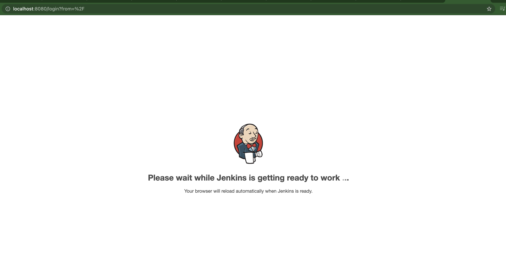
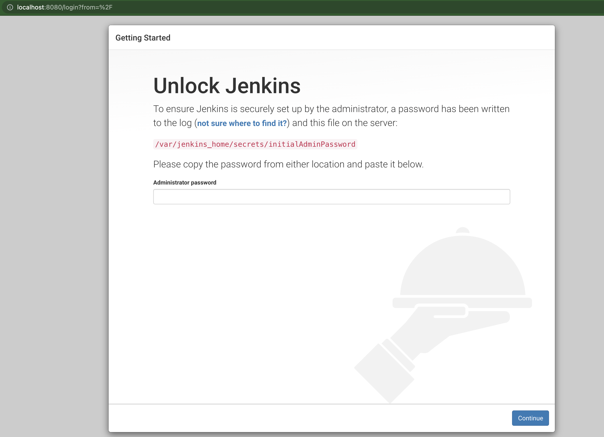
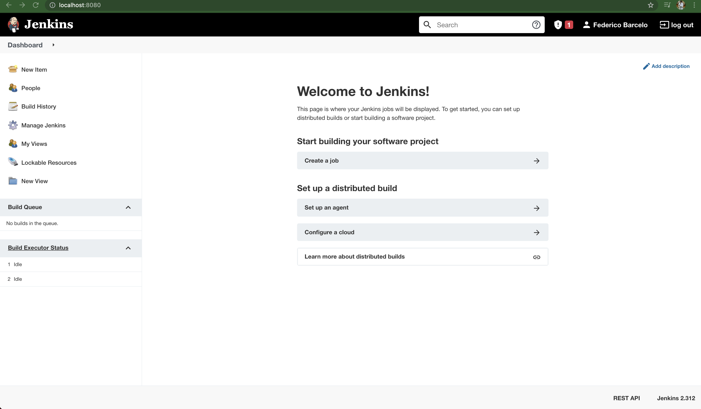

# 2 - Generar archivo docker-compose.yml
Ahora que tiene todo configurado en su ambiente, es hora de ensuciarnos las manos. En esta sección, generara un archivo **docker-compose.yml** para instalar el servidor de Jenkins.

>**Nota:** Recomendamos que utilicen una carpeta nueva en donde alojar el docker-compose.yml ya que se van a descargar varias cosas utilizadas.

## 2.1 - Escribir archivo docker-compose.yml

Para comenzar, generamos un archivo llamado docker-compose.yml y le agregamos el siguiente código:
```
version: "3"
services:
  jenkins:
    image: jenkins/jenkins
    container_name: jenkins
    ports:
      - "8080:8080"
    volumes:
      - "./jenkins:/var/jenkins_home"
    networks:
      - net
networks:
  net:
```

## 2.2 - Ejecutar comandos para instalar Jenkins

Parados en la carpeta, ejecutamos el comando `docker-compose up -d`, esperamos hasta que se baje la imagen y levante el docker.

Una vez levantado el docker, validar con el comando **docker ps** que el mismo este corriendo o en el manejador gráfico de Docker.

Si realizaron los pasos anteriores, yendo a la dirección [localhost:8080](http://localhost:8080) en su browser de preferencia, deben de visualizar alguna de las siguientes imagenes:

<p align = "center">

</p>

<p align = "center">

</p>

Si llegamos a visualizar las imágenes, vamos a necesitar la contraseña de administrador para poder continuar, la misma la obtendremos del archivo que se detalla en la pantalla anterior, ingresar al contenedor y obtener la contraseña para poder seguir.

Seleccionar la opción de **Install suggested plugins**, esperar a que la instalación termine.

Finalizada la instalación, nos pediran datos para el usuario admin, llenar los mismos. 

Sobre la parte de instance configuration, por ahora dejar todo por defecto.

Si llegaron a la imagen anterior, ya tienen instalado su servidor Jenkins desde docker para empezar a utilizar.

<p align = "center">

</p>

## Próximos pasos
Para el siguiente paso del laboratorio, diríjase a [3 - Empezando a trabajar con Jenkins](03-Empezando_a_trabajar_con_Jenkins.md)