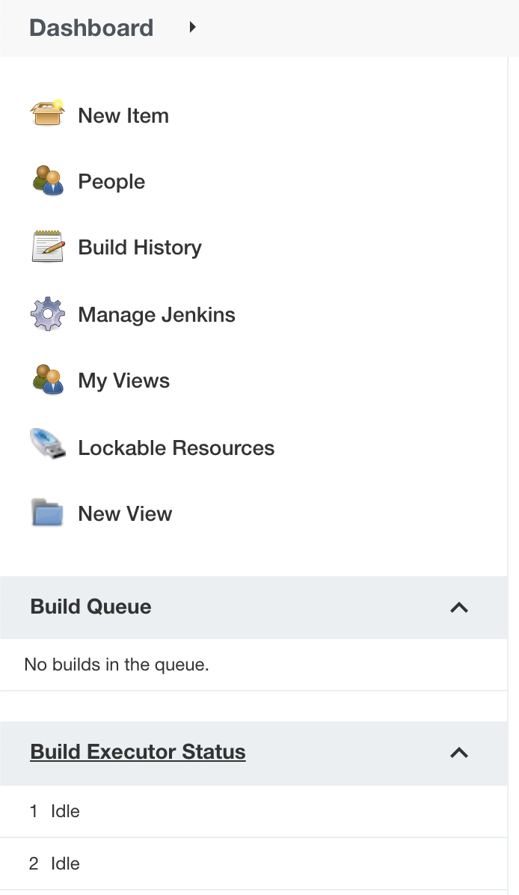

# 3 - Introducción rápida a Jenkins UI

Daremos una breve explicación sobre cada opción perteneciente al dashboard para irnos familizarizando con la herramienta.

<p align = "center">

</p>

1. **New Item:** Utilizado para crear nuevos elementos, nuevas tareas y mucho más, iremos viendo durante este laboratorio la gran mayoría de las opciones disponibles.

2. **People:** Personas que se les tiene permitido el ingreso a la herramienta para hacer alguna tarea en específico.

3. **Build History:** Todas las tareas tienen históricos, en esta opción del dashboard es donde se vera el rendimiento de las mismas, cuantas fallaron, cuantas fueron éxitosas y mucho más.

4. **Manage Jenkins:** Acá se maneja toda la configuración de la herramienta, desde configuraciones del sistema hasta la instalación de nuevos plugins para utilizar.

5. **Build Queue:** Acá se visualizan las ejecuciones de tareas que se encuentran encoladas y van a realizarse próximamente.

6. **Build Executor Status:** Acá se visualizan los estados de las tareas se que estan ejecutando en este momento.

## 3.1 - Generar nuestro primero trabajo

- Vamos a ir a **New item** y generaremos nuestro primer **Freestyle project** con el nombre **my-first-job**.
- A continuación, obtendrá toda la configuración disponible a parametrizar para nuestro trabajo.
- Sobre la parte de **Build** seleccionamos la opción de **Execute Shell**
- Escribimos el comando `echo Hello World` y guardamos el job.
- Usar la opción **Build Now** y luego visualizar en el **Build History** que fue lo que paso.

## 3.2 - Modificar nuestro primer trabajo

Vamos a hacer nuestro primer trabajo un poco más dinámico, para ello debemos ir a editar el trabajo anterior y agregaremos que se ejecute el siguiente comando `echo "El día y hora es: $(date)"`

## 3.3 - Redireccionar la salida de nuestro trabajo

Vamos a ver como redireccionar la salida de nuestro trabajo a un archivo. Para ello vamos a realizar las siguientes modificaciones en nuestro trabajo.
- Agregar la variable NAME=(Sustituir por mi nombre)
- modificar el comando por `echo "Hola $NAME. El día y hora es: $(date)" > /tmp/info`
- Verificar en el archivo info dentro del servidor que la salida del comando se encuentra escrita en el archivo.

>**Nota:** El carácter > en linux redirecciona la salida de un comando, en este caso lo estamos redireccionando a un archivo info dentro de la ruta /tmp

## 3.4 - Ejecutar bash script en nuestro trabajo (arreglar, problema de permisos en container)

Vamos a generar un bash script dentro de nuestro contenedor de Jenkins y lo ejecutaremos llamandolo desde nuestro trabajo.

Ingresar al contenedor y generar un archivo llamado script.sh sobre la carpeta /tmp y copiamos el siguiente código:
```
#!/bin/bash

NAME=$1
LASTNAME=$2

echo "Hola, $NAME $LASTNAME"
```

- Recordar sobre que ruta fue guardado el script.sh.

- Ejecutar el siguiente comando sobre el script para darle permisos de ejecución `chmod +x script.sh`

- Validar que script.sh funciona correctamente, llamarlo con su nombre y apellido de la siguiente manera `sh script.sh Federico Barceló`

- Si reciben la siguiente salida con su nombre y apellido, podremos seguir.

```
federico.barcelo@UY-IT00770 Practicos % sh script.sh Federico Barceló
Hola, Federico Barceló
```

- Vamos a ir a nuestro trabajo y modificaremos, agregando en el **Execute Shell** la ruta en donde se encuentra el script.sh y los parametros que debe de recibir.

- Si realizaron todo lo anterior, al visualizar la ejecución de trabajo, deberan de ver que el script.sh se invoca y realiza el print de mensaje.


## 3.5 - Agregar parámetros a nuestro trabajo

Vamos a ver de que manera utilizamos parámetros en nuestro trabajo.

- Vamos a ir a la configuración de nuestro trabajo y buscamos la opción **This project is parameterized**
- Vamos a agregar 2 parámetros, los dos de tipo String.
- Uno sera FIRST_NAME y el otro sera SECOND_NAME.
- Dejar el **Default Value** de ambos con su nombre y apellido.
- Cambiar el comando a ejecutar en nuestro trabajo por `echo "Hola, $FIRST_NAME $SECOND_NAME"`.
- Guardar y visualizar como el botón de **Build** paso a nombrarse **Build with Parameters**.
- Ejecutar el comando con varios FIRST_NAME y SECOND_NAME y visualizar las salidas.

Con esto nuestro trabajos pueden recibir valores antes de ejecutarse.

## 3.6 - Crear lista de parametros para nuestro trabajo

Vamos a ver de que manera agregamos una lista de posibles parametros para nuestro trabajo.

- Vamos a la configuración de nuestro trabajo y agregamos un parametro de tipo **Choice Parameter**
- Le ponemos de nombra **LASTNAME** y agregamos tres entradas de nuestra elección, separadas por salto de linea.
- Cambiar el comando a ejecutar en nuestro trabajo por `echo "Hola, $FIRST_NAME $SECOND_NAME $LASTNAME"`.
- Ejecutar la construcción nuevamente con los parametros anteriores y ver que se visualiza la lista de parametros para el LASTNAME.

## 3.7 - Crear lógica básica y booleanos

Vamos a ver de que manera utilizamos lógica básica y booleanos para nuestro trabajo.

Vamos a modificar el script.sh utilizado en el paso 2.3 con el codigo que se muestra a continuación (si, ya se que tengo arreglar lo del copiado/edición del archivo dentro del container :), editen directamente en el volumen que se les monto o pueden usar el comando docker cp script.sh jenkis:/tmp/script.sh).

```
#!/bin/bash

NAME=$1
LASTNAME=$2
SHOW=$3

if [ "$SHOW" = "true" ]; then
  echo "Hola, $NAME $LASTNAME"
else
  echo "Si quieres ver el nombre, porfavor marca la opción SHOW"
fi
```

- Agregar un nuevo parametro a nuestro trabajo que sea de tipo Boolean.
- De nombre **SHOW** y poner check en el **Default Value**
- Cambiar el comando a ejecuta en el trabajo por `/tmp/script.sh $FIRST_NAME $SECOND_NAME $LASTNAME$SHOW"`.
- Ejecutar el comando con el check y sin el check para validar el funcionamiento del script.sh.

## Próximos pasos
Para el siguiente paso del laboratorio, diríjase a [4 - Jenkins y Docker](04-Jenkins_y_Docker.md)