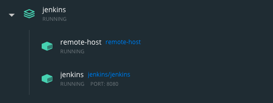

# 4 - Jenkins + Docker

Vamos a generar un nuevo servidor en Docker, en el cual ejecutaremos comandos mediante conexión SSH desde nuestro servidor Jenkins, con el fin de visualizar que las cargas de trabajo generadas en nuestro servidor pueden ser derivadas para ejecutar en otros equipos.

## 4.1 Generar Docker de centos7

- Sobre la carpeta jenkins (en el mismo nivel donde se encuentra el **docker-compose.yml**), vamos a generar una carpeta nueva llamada centos7
- Vamos a pararnos sobre el directorio generado.
- Vamos a generar un archivo **Dockerfile** con el cual generaremos nuestra propia imagen.

>**Nota:** Ver en este punto, que estaremos escribiendo nuestra propia imagen de Docker, ya que vamos a instalar algunas dependencias en la misma.

- El código a poner en el archivo DockerFile es el siguiente:
```
FROM centos:7

RUN yum -y install openssh-server

RUN useradd remote_user && \
    echo "1234" | passwd remote_user  --stdin && \
    mkdir /home/remote_user/.ssh && \
    chmod 700 /home/remote_user/.ssh

COPY remote-key.pub /home/remote_user/.ssh/authorized_keys

RUN chown remote_user:remote_user   -R /home/remote_user && \
    chmod 400 /home/remote_user/.ssh/authorized_keys

RUN ssh-keygen -A

RUN yum -y install mysql

RUN yum -y install epel-release && \
    yum -y install python3-pip && \
    pip3 install --upgrade pip && \
    pip3 install awscli

CMD /usr/sbin/sshd -D
```

>**Nota:**: Observar los comandos utilizados para generar nuestra imagen con las dependencias que nosotros queremos.

- Generar ssh-key para realizar la conexión a este nuevo host.
- Ejecutar el comando `ssh-keygen -t rsa -m PEM -f remote-key` dentro de la carpeta centos7 y seguir las instrucciones hasta generar las claves pública/privada.
- Verificar que se contengan en el directorio centos7 los archivos correspondientes a las claves generadas.

- Editar el archivo **docker-compose.yml** y agregar el siguiente bloque de código, al mismo nivel de jenkins: (como un service más):
```
remote_host:
    container_name: remote-host
    image: remote-host
    build:
      context: centos7
    networks:
      - net
```

- Ejecutar el comando `docker-compose build` y observar que es lo que ocurre.
- Validar con un `docker images` las imagenes que se tienen luego que se ejecuto el comando anterior.
- Validar con un `docker ps` si la imagen generada se encuentra corriendo.

>**Nota:** Nuestra nueva imagen generada no se encuentra corriendo, ¿verdad?, esto se debe a que tenemos que ejecutar un nuevo comando, ya que es necesario volver a validar el contenido de nuestro archivo **docker-compose.yml** para que el mismo se inicie.

- Ejecutar el comando `docker-compose up -d`, van a tener que obtener lo siguiente, de todos modos, volver a validar con `docker ps`.
```
federico.barcelo@UY-IT00770 Jenkins % docker-compose up -d
jenkins is up-to-date
Creating remote-host ... done
```

>**Nota:** Ver también que el remote-host se encuentra corriendo dentro de la misma red que el servidor de Jenkins

<p align = "center">

</p>

### 4.2 Verificar conexión sobre el remote-host

Vamos a validar que desde nuestro contenedor de Jenkins podemos realizar conexión por ssh hacía nuestro remote-host generado.

- Iniciar una terminal interactiva en nuestro servidor de Jenkins.
- Dentro de la consola del servidor, ejecutar el comando `ssh remote_user@remote_host`
- Van a recibir el siguiente mensaje, poner que si.
```
jenkins@fb9550228a8e:/$ ssh remote_user@remote_host
The authenticity of host 'remote_host (172.21.0.3)' can't be established.
ECDSA key fingerprint is SHA256:ydMzOZHUMHWpOeuY6xacHZWV45e650MaIM070MHDmjY.
Are you sure you want to continue connecting (yes/no/[fingerprint])? 
```
- Ingresar la constraseña definida para el servidor remote_host en nuestro Dockerfile.

## 4.2 Verificar conexión sobre el remote-host con remote-key

Validamos la conexión por ssh mediante contraseña desde nuestro sevidor Jenkins hacía el remote-host, ahora valideramos la misma conexión pero utilizando la clave remkte-key generada anteriormente.

- Posicionarse en la carpeta centos7
- Copiar el archivo remote-key hacía el servidor Jenkins (mediate docker cp o como prefieran :D, conserven el nombre del archivo cuando lo copian hacía el servidor...)
- Conectarse nuevamente a la consola del servidor Jenkins (ejecutar el comando de conexión con el parametro `-u root` para poder editar permisos).
- Posicionarse sobre el directorio /tmp
- Validar permisos sobre el archivo remote-key, deben de tener el siguiente permisos **jenkins:jenkins** sobre el archivo.
- Ejecutar la conexión ssh utilizando el archivo remote-key.
- Verificar que no fue solicitada la contraseña para ingresar al equipo remote_host por utilizar la clave privada generada anteriormente.

## 4.3 Instalar plugin de SSH sobre el servidor Jenkins

Vamos a instalar el plugin de ssh en nuestro servidor Jenkins para poder realizar conexiones contra este nuevo equipo desde la herramienta.

- Ingresar en la interfaz gráfica de nuestro servidor Jenkins.
- Ir al menú de **Manage Plugins**.
- Buscar el plugin de SSH e instalarlo con la opción **Install without restart**
- Una vez instalado, hacer click en el check para reiniciar el servidor, el mismo se reiniciara de manera automática.
- Cuando el servidor se vuelva a iniciar, verificar que el plugin de instalo correctamente validando en el menu de **Manage Plugins**.

## 4.4 Configurar autenticación SSH desde Jenkins a nuestro remote-host

Vamos a configurar la conexión desde nuestro servidor a nuestro remote-host por ssh.

- Ingresar en la interfaz gráfica de nuestro servidor Jenkins.
- Ir al menú de **Credentials** y agregar una nueva credencial de **SSH Username with private key**.
- Ir al menú de **Configure System**.
- Encontrar la opción de **SSH remote hosts** y seleccionar el botón **Add**
- Completar los campos requeridos para establecer la conexión SSH con nuesro servidor remote-host.
- Validar la conexión con la opción **Check connection**

## 4.5 Ejecutar nuestro Jenkins trabajo sobre nuestro remote-host

Vamos a ejecutar nuestro trabajo sobre nuestro servidor remoto.

- Generar un nuevo **Freestyle project** llamado remote-task.
- En la opción de **Build** elegir la opción de **Execute shell script on remote host using ssh**
- Definir la variable **NAME** y escribir el siguiente comando `echo "Hola $NAME. El día y hora es: $(date)" > /tmp/remote-file`
- Guardar y ejecutar, observar el log para ver que paso, donde se va a crear el archivo, etc.
- Una vez analizado el log, conectarse sobre el contenedor remote-host y validar la existencia del archivo y con que información cuenta.


## Próximos pasos
Para el siguiente paso del laboratorio, diríjase a [5 - Jenkins y AWS](05-Jenkins_y_AWS.md)