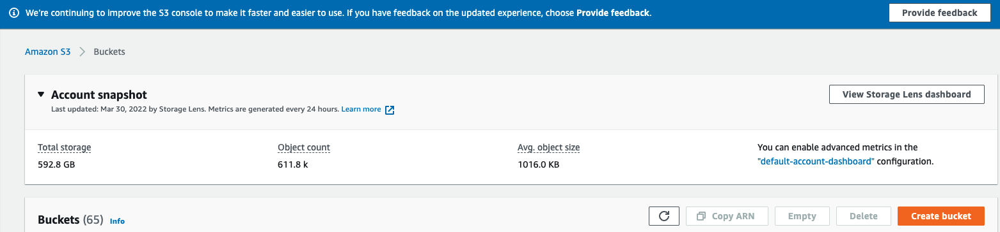

# 5 - Jenkins + MySQL + AWS

Vamos a generar un servidor MySQL en docker, el cual vamos a utilizar como nuestro servidor de base de datos, también instalaremos la AWS CLI, ya que vamos enviar el respaldo generado a partir de nuestra base de datos a un servicio de almacenamiento en AWS llamada S3 Bucket.

## 5.1 Generar Docker de MySQL

- Sobre la carpeta jenkins (en el mismo nivel donde se encuentra el **docker-compose.yml**), vamos a editar el archivo y agregar lo siguiente (al mismo nivel que jenkins y remote_host):
```
db_host:
    container_name: db
    image: mysql:5.7
    environment:
      - "MYSQL_ROOT_PASSWORD=1234"
    volumes:
      - "$PWD/db_data:/var/lib/mysql"
    networks:
      - net
```

- Ejecutar el comando `docker-compose up -d` y observar que es lo que ocurre.
- Validar con un `docker images` las imagenes que se tienen luego que se ejecuto el comando anterior.
- Validar con un `docker ps` si la imagen generada se encuentra corriendo.
- Hacer un ls sobre la carpeta jenkins y validar la existencia de la carpeta db_data.
- Verificar con el comando `docker logs -f db` los logs y visualizar que el servicio motor de MySQL se inicializo sin problemas.
- Verificar conectividad sobre el contenedor de MySQL con una bash interactiva, con el comando `docker exec -it db bash`.
- Una vez que nos conectamos al contenedor, conectarse al motor de base de datos utilizando el comando `mysql -u root -p`.
- Conectados sobre el motor, ejecutar el comando `show databases;`
- Con el comando `exit` cerramos la conexión sobre el motor de base de datos.

## 5.2 Instalar cliente para conexión MySQL y AWS CLI

- Conectarse al remote-host mediante una consola interactiva.
- Una vez conectado, utilizar el comando `mysql` y también `aws`, verificar que los mismos se encuentren instalados.
> Nota: en caso contrario deberíamos de ver unos mensajes como estos: 
> - `bash: mysql: command not found`.
> - `bash: aws: command not found`.
> - vamos a tener que realizar modificaciones en el Dockerfile correspondiente al remote-host para instalar los paquetes (si modificamos el Dockerfile, vamos a tenre que ejecutar un `docker-compose build` y luego `docker-compose up` para que los cambios se vean impactados, no alcanza solamente con agregar los paquetes en el mismo).

## 5.3 Crear MySQL database

- Conectarse a la base de datos desde remote-host con una consola interactiva.
- Conectarse al motor de base de datos MySQL con el comando `mysql -h db_host -u root -p`.
- Crear una base de datos llamada testdb con el comando `create database testdb;`.
- Comenzar a trabajar con la base de datos testdb, usar el comando `use testdb;` y luego crear una tabla con el comando `create table info (name varchar(20), lastname varchar(20), age int(2));`.
- Verificar con el comando `show tables;` y `desc info;` que la misma fue creada correctamente.
- Insertar un registro registro en la tabla anterior con nuestros datos (el ejemplo esta con mis datos, cambiarlos por los de ustedes) con el comando `insert into info values ('federico', 'barceló', 28);`
- Verificar que el registro fue ingresado correctamente con el comando `select * from info;`

## 5.4 Crear nuestro almacenamiento bucket S3 en AWS

>Nota: En caso de no poder buscar en la barra buscadora, ir directamente por la opción de service a Storage > S3.

- Para este paso vamos a necesitar acceder a nuestras cuentas de amazon para generar el servicio, no vamos a estar trabajando sobre amazon ahora, pero necesitamos de esta servicio para poder.
- Seguir los pasos de la guía para ingresar a la consola de AWS, la guía se encuentra en Extras/Jenkins
- Una vez generado el login, deberíamos de visualizar una interfaz muy parecida a la siguiente:
<p align = "center">

</p>
- Dentro de la barra buscadora de la consola, escribimos s3 y elegimos la opción que muestra la imagen:
<p align = "center">

</p>
- Generaremos un nuevo bucket s3 con el botón de Create bucket
- <p align = "center">

</p>
- Le ponemos un nombre, dejamos todas las opciones por defecto y lo generamos:
- <p align = "center">

</p>
- Una vez generado, realicemos una busqueda para verificar que el almacenamiento s3 bucket fue generado correctamente:
<p align = "center">

</p>

### 5.4 Obtener ACCESS_KEY_ID y SECRET_ACCESS_KEY para subir archivos al bucket s3


- Por estar en una cuenta de laboratorio, no se generar las credenciales de manera normal, las mismas se obtienen desde el portal que terminamos cada vez que hacemos inicio de sesión, verificar en las siguientes imágenes que existe una opción arriba a la derecha que dice AWS Details, debemos clickear dicha opción y ahí obtenemos el aws_access_key_id, aws_secret_access_key y aws_session_token correspondientes a nuestra cuenta.
<p align = "center">

</p>
<p align = "center">

</p>


## 5.5 Generar backup de la base MySQL y subirlo de manera manual al S3

>Nota1: En caso de tener problemas para subir el respaldo, verificar la manera de cargar el archivo `~/.aws/credentials` como muestra la imagen y luego especificar el profile que fue denifido en el comando aws s3 cp con el flag `--profile`.
>Nota2: En caso e tener problemas de permisos

- Vamos a generar un respaldo de nuestra base de datos y luego subirlo al bucker s3 generado anteriormente.
- Conectarse al remote-host, en donde instalamos el conectos de MySQL y AWS Cli.
- Ejecutar el comando `mysqldump -u root -h db_host -p testdb > /tmp/db.sql`
- Verificar que en la carpeta `/tmp` se encuentra en backup generado recientemente. Ejecutar el comando `cat` sobre el archivo para visualizar su contenido.
- Ahora tendremos que agregar dos variables de entorno, una correspondiente a nuestro ACCESS_KEY_ID y otra al SECRET_ACCESS_KEY, agregar las variables de la siguiente manera con nuestros valores obtenidos cuando generamos el usuario de IAM de la siguiente manera:
  - `export AWS_ACCESS_KEY_ID=<KEY_ID_DE_MI_USER>`
  - `export AWS_SECRET_ACCESS_KEY=<SECRET_ACCESS_DE_MI_USER>`
- Una vez cargadas las variables, utilizar el siguiente comando para subir el respaldo a nuestra bucket s3:
  - `aws s3 cp /tmp/db.sql s3://<NOMBRE_DE_SU_BUCKET>/db.sql`
- Verificar en la consola de AWS sobre la opción de bucket s3 que el respaldo se haya subido correctamente.

## 5.6 Automatizar el proceso de respaldo y subida de mismo con un shell script

- Vamos a generar un script para que lo anterior se ejecute de manera automática en un cierto horario.
- Conectarnse al remote-host.
- Generar un archivo llamado script.sh en /tmp.
> Nota: Agregar lo necesario para que el mismo sea interpretado como un script y pueda ser ejecuta (revisar permisos).
- En el script agregar lo siguiente:
```
DATE=$(date +%H-%M-%S)
DB_HOST=$1
DB_PASSWORD=$2
DB_NAME=$3

mysqldump -u root -h $DB_HOST -p$DB_PASSWORD $DB_NAME > /tmp/db-$DATE.sql
```
- Probar ejecutar el script pasandole los parametros correspondientes, ejecutar varias veces para validar que se generan multiples respaldos.

## 5.7 Automatizar el proceso de respaldo y subida de mismo con un shell script

- Vamos a agregar los comandos necesarios a nuestro script.sh de AWS CLI para que el respaldo se suba al bucket s3 en el instante que fue generado.
- Modificar el script.sh y agregar lo siguiente:
```
DATE=$(date +%H-%M-%S)
BACKUP=db-$DATE.sql

DB_HOST=$1
DB_PASSWORD=$2
DB_NAME=$3
AWS_SECRET=$4
AWS_TOKEN=$5
BUCKET_NAME=$6

mysqldump -u root -h $DB_HOST -p$DB_PASSWORD $DB_NAME > /tmp/$BACKUP && \
export AWS_ACCESS_KEY_ID=<KEY_ID_DE_MI_USER> && \
export AWS_SESSION_TOKEN=$AWS_TOKEN && \
export AWS_SECRET_ACCESS_KEY=$AWS_SECRET && \
echo "Uploading your db backup - $BACKUP" && \
aws s3 cp /tmp/$BACKUP s3://$BUCKET_NAME/$BACKUP
```
- Llamar al script y verificar su funcionamiento.

## 5.8 Como manejar data sensible en Jenkins (contraseñas, tokens, etc.)

- Vamos a alojar la data sensible en Jenkins para ser utilizada en nuestros diferentes jobs.
- Vamos a ir a Credentials > System > Global Credentials y luego a Add Cretendials.
- Agregar las contraseñas de `MYSQL_PASSWORD` y `AWS_SECRET_KEY`
- Al finalizar debemos visualizar las siguientes claves almacenadas:
<p align = "center">

</p>

## Próximos pasos
Para el siguiente paso del laboratorio, diríjase a [6 - Jenkins y Ansible](06-Jenkins_y_Ansible.md)