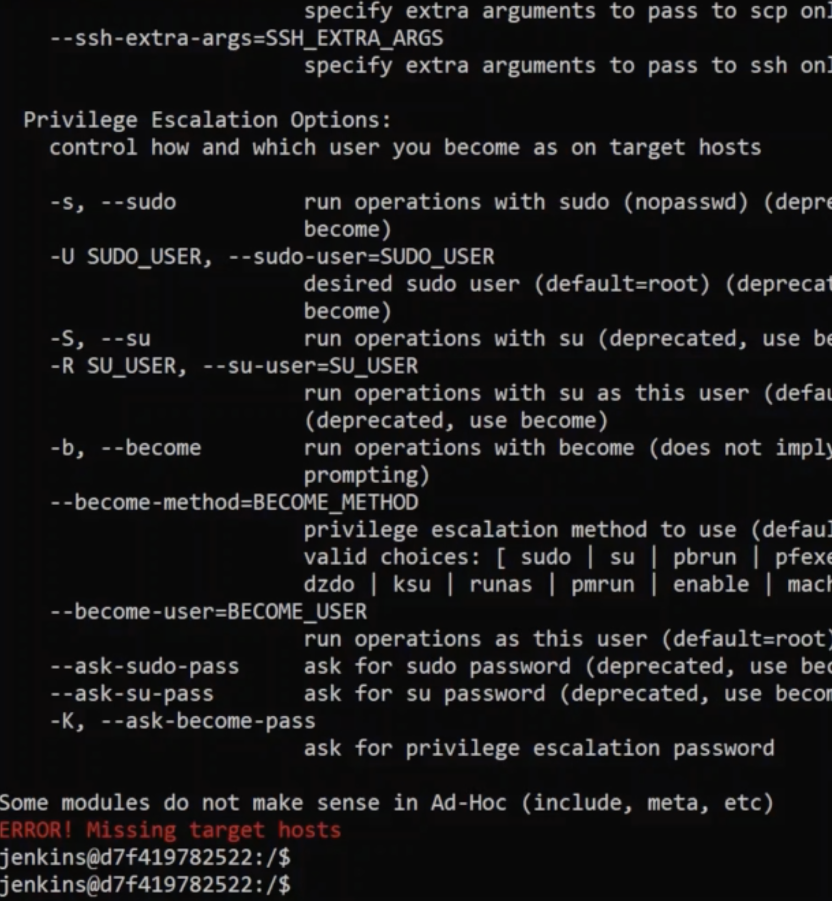
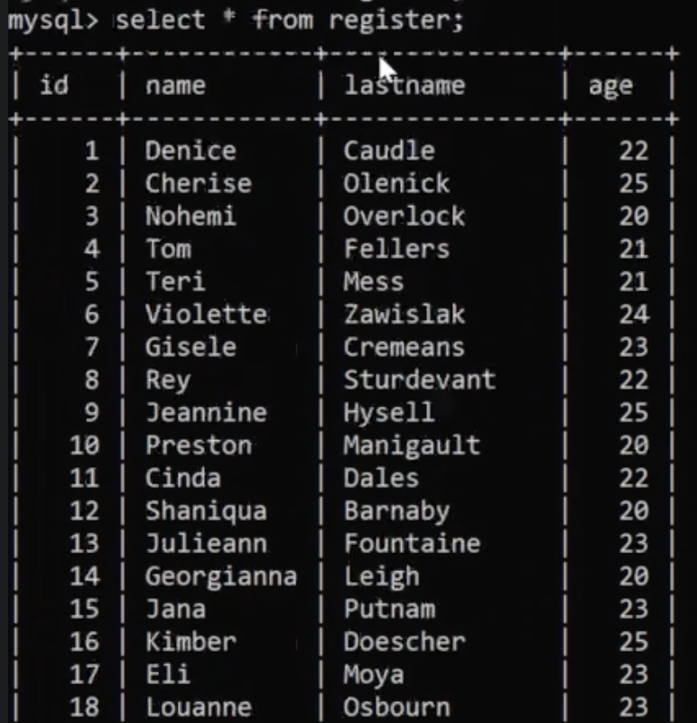

# 6 - Jenkins + Ansible

Vamos a agregar Ansible sobre nuestro servidor de Jenkins, que es una herramienta open source que se utiliza como parte de configuration managment.

## 6.1 - Instalar Ansible

Vamos a generar otro directorio en la carpeta de jenkins llamada `jenkins-ansible`, posicionarnos en la carpeta generada anteriormente y generar un nuevo `Dockerfile` que contenga lo siguiente:

```
FROM jenkins/jenkins

USER root

RUN apt-get update && apt-get install -y iputils-ping telnet && \
    apt-get install -y python3-pip && apt-get install -y ansible && \
    pip3 install --upgrade pip && pip3 install awscli

USER jenkins
```

Modificar el docker-compose en la parte de jenkins de la siguiente manera:
```
jenkins:
    image: jenkins-ansible
    container_name: jenkins
    build:
        context: jenkins-ansible
    ports:
      - "8080:8080"
    volumes:
      - "./jenkins:/var/jenkins_home"
    networks:
      - net
```

Ejecutar un `docker-compose build` validar que se genera la nueva imagen de Jenkins con Ansible y luego ejecuta un `docker-compose up -d` para recrear los contenedores. Ingresar con contenedor de jenkins y ejecutar el comando ansible para validar que todo se haya instalado de manera correcta, en ese caso deberíamos de recibir mensajes como los siguientes:

<p align = "center">

</p>

## 6.2 - Dejar las llaves SSH como permanentes en el contenedor de Jenkins

- Vamos a generar un directorio llamado `ansible` sobre la carpeta `jenkins_home`
- Copiar el archivo `remote-key` que se encuentra en la carpeta centos7 al directorio generado anteriormente `jenkins_home/ansible/`
- Con esto nos aseguramos que la `remote-key` va a persistir en el jenkins, ya que se encuentra alojada en la carpeta que se monta como el volumne en el `docker-compose`, nuestro jenkins puede ser regenerado que de ahora en más el archivo va a existir siempre en el contenedor (al no ser que sea eliminado el volumen o se elimine de manera manual el mismo).

## 6.3 - Crear nuestro primer inventory con Ansible

Vamos a generar una tarea en Ansible para realizar un inventario de los equipos.

- Posicionarse en el directorio `jenkins-ansible`.
- Copiar el archivo `remote-key` que se encuentra en la carpeta centos7 al directorio `jenkins-ansible`.
- Generar un archivo `hosts` con el siguiente contenido:
```
[all:vars]

ansible_connection = ssh

[test]
test1 ansible_host=remote_host ansible_user=remote_user ansible_private_key_file=/var/jenkins_home/ansible/remote-key
```
- Copiar el archivos `hosts` a la ruta `/jenkins_home/ansible/`.
- Verificar que se encuentra en la ruta anterior el archivos `hosts` y la `remote-key`.
- Verificar conectividad hacía el remote_host desde el jenkins con ping.
- Ejecutar el comando de Ansible `ansible -i hosts -m ping test1` y verificar que pasa.

## 6.4 - Crear nuestro primer Ansible playbook

Vamos a definir nuestro primer Ansible playbook, el cual es utilizado para definir un script y los comandos que el mismo ejecutara.

- Posicionarse sobre la ruta `/jenkins-data/jenkins-ansible/`.
- Generar sobre la ruta anterior un archivo llamado `play.yml` que contenga el siguiente código:
```
- hosts: test1
  tasks:

    - shell: echo Hello World > /tmp/ansible-file
```
- Copiar el archivo `play.yml` a la ruta `/jenkins_home/ansible/`
- Conectarse al servidor de Jenkins, verificar sobre el directorio `/ansible` la existencia de los archivos `hosts, play.yml y remote-key`.
- Ejecutar el comando de Ansible `ansible-playbook -i hosts play.yml` y verificar que pasa.
- Una vez visualizado lo que paso, verificar en el contenedor `remote-host` que fue escrito el archivo en `/tmp/ansible-file` con el string Hello World.

## 6.5 - Integrar Ansible + Jenkins (Ansible plugin)

Vamos a integrar Ansible con Jenkins mediante el uso de un plugin.

- Ir a los plugins por interfaz gráfica de Jenkins e instalar el plugin de Ansible.

## 6.6 - Ejecutar playbooks de Ansible desde Jenkins

Ya instalado el plugin, vamos a ejecutar los playbooks desde el Ansible.

- Vamos a generar un `Freestyle project` llamado `ansible-test`.
- Agregamos en la sección de `Build` un `build step` del tipo `Invoke Ansible Playbook` y le asignamos los datos que se nos solicitan:
  - Playbook path: [RutaCompleta_del_archivo_play.yml]
  - Inventory:
    - File or host list [RutaCompleta_del_archivo_hosts]
  - Los demás campos se dejan por defecto.

- Guardar, ejecutar el trabajo y verificar que pasa.

## 6.7 - Agregar parámetros a Ansible y Jenkins

Vamos a aprender como pasar parametros a nuestro playbook de Ansible y llamar desde Jenkins a nuestro playbook que recibe parámetros.

- Modificar el archivo `play.yml` con lo siguiente:
```
- hosts: test1
  tasks:
    - debug:
        msg: "{{ MSG }}"
```

- Modificar el job `ansible-test` y ponerle la opción de `this project is parameterized` y agregar un parametro de tipo `String parameter` con el nombre `ANSIBLE_MSG`.
- Modificar en la parte de `build` y modificar la opción de `extra variables` con los valores:
  - Key : MSG
  - Value : $ANSIBLE_MSG
- Ejecutar el job y pasarle algún parámetro de preferencia, validar que todo se haya ejecutado de manera correcta.

## 6.8 - Poner colores al output de Jenkins como se visualizaba en la terminal del contenedor

Vamos a modificar la salida del Jenkins para visualizarla con colores como se veía en la salida del contenedor cuando ejecutabamos directamente los comandos de Ansible.

- Vamos a los plugins e instalamos `AnsiColor`.
- Vamos a modificar nuestro job `ansible-test`.
- En la parte de `build triggers` seleccionamos la opción de `Color ANSI Console Output` y dejamos el valor en `ANSI color map` como `xterm`.
- Vamos a la parte de `Build`, seleccionamos `Advanced` y activamos la opción de `Colorized stdout`.
- Volveremos a ejecutar el job y verificamos que la salida tenga colores.

## 6.9 - Challenge! - Jenkins + Ansible + MySQL + PHP + NGINX + Shell Scripting

Vamos a combinar todos los puntos anteriores pero sobre un caso práctico, en donde tendremos una página web hosteada en la cual vamos a querer tener algunos botones que realicen algunas acciones, actualizaciones de datos, contadores, etc.

### 6.9.1 - Crear la base de datos para alojar los usuarios

Vamos a generar la estructura de base de datos para persistir los datos necesarios para realizar el challenge.

- Ingresar al contenedor de la base de datos.
- Ingresar al motor de base de datos.
- Crear una base de datos llamada `people` con la siguiente sentencia `create database people;`.
- Verificar con el comando `show databses;` que la misma fuera generada correctamente.
- Seleccionar la base generada con la sentencia `use people;`.
- Crerar una tabla llamada `register` con la sentencia `create table register (id int(3),name varchar(50), lastname varchar(50),age int(3));`.
- Verificar con los comandos `show tables;` y `desc register;` que se encuentra todo generado correctamente.

### 6.9.2 - Generar script para popular nuestra base de datos

Vamos a generar un script para que nuestra base de datos cuenta con datos de prueba y no tengamos que realizar el ingreso de datos de manera manual.

- Alojar el archivo `people.txt` que se encuentra en el repositorio de practico bajo la carpeta `Jenkins` en la carpeta `$HOME/jenkins/jenkins-data/jenkins-ansible`.
- Generar un archivo en la misma ruta llamado `feedDb.sh` y poner el siguiente código:
```
#!/bin.bash

counter=0

while [ $counter -lt 50 ]; do
  let counter=counter+1

  name=$(nl people.txt | grep -w $counter | awk '{print $2}' | awk -F ',' '{print $1}')
  lastname=$(nl people.txt | grep -w $counter | awk '{print $2}' | awk -F ',' '{print $2}')
  age=$(shuf -i 20-25 -n 1)

  mysql -u root -p1234 people -e "insert into register values ($counter, '$name', '$lastname', $age)"
  echo "$counter, $name $lastname, $age was correctly imported"
done
```
>Nota:  
>- Dar permisos de ejecución al script generado con `chmod +x feedDb.sh`.
>- Verificar tener instalado el comando `shuf`, ejecutar el comando shuf -i 20-25 -n 1 y verificar si se obtienen números aleatorios.
>- En caso de tener problemas con el while

### 6.9.3 - Copiar los archivos necesarios para probar el script en el contenedor de base de datos

Copiar todos los archivos necesarios para probar el script y verificar que se realizaron las inserciones en la base de datos.

- Utilizar el comando `docker cp` para copiar los archivos en `db:tmp`.
- Verificar que en el contenedor sobre el directorio `/tmp` se encuentran los archivos necesarios para utilizar el script.
- Ejecutar el script `feedDb.sh` y verificar en la base de datos que se encuentran los registros.
- Verificar que los datos fueron cargados correctamente, ejecutando las sentencias `use people;` y `select * from register;`
<p align = "center">

</p>

### 6.9.4 - Construir Docker Nginx web server + php - 1

Vamos a generar un contenedor con Nginx que cual vamos a utilizar como servidor web para nuestro challenge.

- Generar un directorio llamado `web` en la ruta `$HOME/jenkins/jenkins-data/jenkins-ansible`.
- Generar un `Dockerfile` con el siguiente contenido:
```
FROM remote-host

COPY ./conf/nginx.repo /etc/yum.repos.d/nginx.repo

RUN  yum -y install https://repo.ius.io/ius-release-el7.rpm && \
     yum -y install nginx-1.12.2 openssl --enablerepo=nginx

RUN yum -y install \
     php74-fpm \
     php74-cli \
     php74-mysqlnd \
     php74-soap \
     php74-xml \
     php74-json \
     php74-mbstring \
     php74-gd \
       --enablerepo=ius && yum clean all

EXPOSE 80 443

VOLUME /var/www/html /var/log/nginx /var/log/php-fpm /var/lib/php-fpm

RUN setfacl -Rm u:remote_user:rwx /var/www/html

COPY ./conf/nginx.conf /etc/nginx/conf.d/default.conf

COPY ./bin/start.sh /start.sh

RUN chmod +x /start.sh

RUN mkdir -p /var/run/php-fpm

CMD /start.sh
```
- Generar la carpeta `conf` y alojar en ella los siguientes archivos con su respectivo contenido.
- `nginx.repo`:
```
[nginx]
name=nginx repo
baseurl=http://nginx.org/packages/centos/7/$basearch/
gpgcheck=0
enabled=1
```
- `nginx.conf`:
```
server {
  listen      80;
  server_name jenkins.local;
  root        /var/www/html;
  index       index.php;
  access_log  /var/log/nginx/localhost-access.log;
  error_log   /var/log/nginx/localhost-error.log;

  location / {

    try_files $uri $uri/ /index.php?$args;

  }

  location ~ \.php$ {

    try_files $uri =404;
    include /etc/nginx/fastcgi_params;
    fastcgi_pass 127.0.0.1:9000;
    fastcgi_index index.php;
    fastcgi_param SCRIPT_FILENAME $document_root$fastcgi_script_name;
    fastcgi_param PATH_INFO $fastcgi_script_name;
    fastcgi_intercept_errors on;

  }

}
```

- Generar la carpeta `bin` y alojar en ella los siguientes archivos con su respectivo contenido.
- `start.sh`;
```
#!/bin/bash

# Starts ssh

/usr/sbin/sshd

# Starts php process in background

php-fpm -y /etc/php-fpm.conf -R &

# Starts nginx daemon

nginx -g 'daemon off;'
```

### 6.9.5 - Construir Docker Nginx web server + php - 2

Vamos a modificar los archivos necesarios para generar nuestro nuevo contenedor.

- Modificar el `docker-compose.yml` y agregar debajo de `db_host` el siguiente código:
```
web:
  container_name: web
  image: ansible-web
  build:
    context: jenkins-ansible/web
  ports:
    - "80:80"
  networks:
    - net
```
- Realizar un `docker-compose build` y verificar que se ejecuta el mismo sin ningún problema, luego ejecutar `docker-compuse up -d`.
- Si no se recibieron errores, ejecutar una consola sobre el contenedor web y generar un archivo llamado `index.php` sobre la ruta `/var/www/html` con el siguiente código:
```
<?php

// Show all information, defaults to INFO_ALL
phpinfo();

?>
```
- >Nota: En caso de querer acceder como `jenkins.local` es necesario hacer cambio en el archivo de resolución del equipo que esten usando, que de seguro es el `hosts`, en caso contrario solamente abrirmen el browser como `localhost`.
- Si realizamos todos los pasos correctamente, abrimos un navegador y vamos a `jenkins.local` deberíamos de visualizar la siguiente imagen, que nos muestra nuestro servidor web funcionando de manera correcta:
<p align = "center">

</p>

### 6.9.6 - Generar tabla usando HTMl, CSS y PHP para mostrar los usuarios

Vamos a generar una página básica en HTML para mostrar con un poco de estilo de CSS y PHP los usuarios que alojamos en la base de datos.

- Generar un archivo table.j2 en la carpeta `$HOME/jenkins/jenkins-data/jenkins-ansible` con el siguiente contenido:
```
<!DOCTYPE html>
<html>
<head>
  <title>Table with database</title>
  <style>
    table {
      border-collapse: collapse;
      width: 100%;
      color: #588c7e;
      font-family: monospace;
      font-size: 25px;
      text-align: left;
    }
    th {
      background-color: #588c7e;
      color: white;
      } 
    tr:nth-child(even) {background-color: #f2f2f2}
  </style>
</head>
<body>
  <table>
  <tr>
    <th>id</th>
    <th>name</th>
    <th>lastname</th>
    <th>age</th>
  </tr>
  <?php
   $conn = mysqli_connect("db", "root", "1234", "people");
   // Check connection
   if ($conn->connect_error) {
     die("Connection failed: " . $conn->connect_error);
   }
   $sql = "SELECT id, name, lastname, age FROM register where age = 25";
   $result = $conn->query($sql);
   if ($result->num_rows > 0){
    // output data of each row
    while($row = $result->fetch_assoc()) {
      echo "<tr><td>" . $row["id"]. "</td><td>" . $row["name"] . "</td><td>" . $row["lastname"]. "</td><td>" . $row["age"]. "</td></tr>";
    }
      echo "</table>";
  }  else { echo "0 results"; }
   $conn->close();
?>
</table>
</body>
</html>
```
- Copiar dicho archivo con la siguiente sentencia `docker cp table.j2 web:/var/www/html/index.php`
- Verificar yendo a un navegador en la URL `jenkins.local` si se visualiza algo de estilo:
<p align = "center">

</p>

### 6.9.7 - Integrar Nginx web server al Ansible Inventory

Vamos a agregar este nuevo a nuestro inventario de Ansible.

- Agregar una nueva linea en el archivo hosts que se encuentra en el directorio `jenkins_home/ansible` con los datos necearios para poder utilizar el ansible ping hacía el nuevo servidor web.
- Verificar desde el servidor de Jenkins con los comandos `ansible -m ping /i hosts <nombreDelHostQuePusieron>` y `ansible -m ping -i hosts all` que se tiene coenctividad en ambos casos.

### 6.9.8 - Crear un playbook de Ansible para actualizar la tabla web

Vamos a generar un playbook que envie por nosotros el archivo correspondiente a la tabla.

- Generar un archivo `people.yml` con el siguiente contenido:
```
- hosts: web1
  tasks:
    - name: Transfer template to web server
      template: 
        src: table.j2
        dest: /var/www/html/index.php
```
- Modificar en el archivo `table.js` la linea correspondiente a la query SQL con lo siguiente:
```
$sql = "SELECT id, name, lastname, age FROM register  where age = {{ PEOPLE_AGE }} ";
```

### 6.9.9 - Utilizar nuestro playbook de Ansible
Vamos a utilizar el playbook generado anteriormente y verificar que todo funcione de manera correcta.

- Copiar el archivo `table.js` a la ruta de /jenkins_home/ansible
- Conectarse al servidor de Jenkins.
- Verificar que el archivo fue copiado de manera correcta.
- Ejecutar el playbook generado con los comandos `ansible-playbook -i hosts people.yml` y `ansible-playbook -i hosts people.yml -e "PEOPLE_AGE=<edadEntre20-25>"` 

>Nota: Se pueden dar problemas de permisos, de ser así solventarlos para que puedan ejecutar el playbook.

### 6.9.10 - Crear un Jenkins job para realizar la actualización

Vamos a integrar todo en un job de Jenkins para que realice todo por nosotros.

- Ir a la interfaz gráfica del Jenkins y generar un nuevo `freestyle project` llamado `ansible-users-db`.
- Elegir la opción `This project is parameterized`.
- Agregar un parámetro `AGE` con los valores 20,21,22,23,24,25.
- En la opción de `BUILD` elegir `Invoke Ansible Playbook` y especificar en `Playbook path` la ruta en donde se encuentra el archivo `people.yml` y en `File path or comma separated host list` la ruta del archivo `hosts`.
- Agregar en `Extra Variables` una key `PEOPLE_AGE` con value `$AGE` (este es un combo choice)
- Ejecutar el job generado y verificar que funciona todo de manera

## Próximos pasos
Para el siguiente paso del laboratorio, diríjase a [7 - Jenkins y Seguridad](07-Jenkins_y_Seguridad.md)