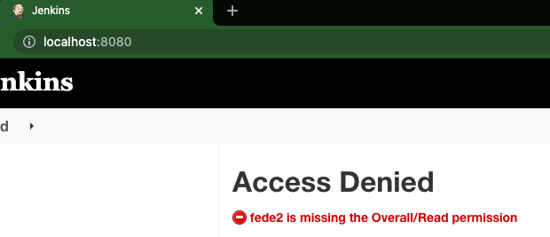

# 7 - Jenkins + Seguridad

Vamos a ver temas relacionados con la seguridad por ser uno de los mayores puntos dentro de las empresas y sus aplicaciones.

## 7.1 Permitir usuarios que hacen sign in

Vamos a permitir que nuevos usuarios que quieran acceder al servidor puedan realizar el proceso de registro.

- Ir a la opción **Configure Global Security**
- Habilitar la opción **Allow users to sign up**
- Abrir una ventana de incognito o sobre otro browser y probar ingresar realizando el proceso de registro.
- Verificar que una vez que ingresamos con el usuario, el mismo tiene todos los permisos como si fuera un administrador.
- Validado lo anteror, deshabilitar la opción **Allow users to sign up**

## 7.2 Instalar plugin para manejo de seguridad

Vamos a instalar un plugin para realizar un robusto manejo de seguridad, con el fin de poder aplicar una buena politica de permisos.

- Ir al **Plugin Manager** y instalar el plugin de **Role-based Authorization Strategy**
- Reiniciar el servidor como lo hicimos con el plugin anterior instalado.
- Verificar que el plugin fue instalado correctamente.
- Cambiar el access control a **Role-Based Strategy**
- Verificar que en el menú de **Manage Jenkins** figura la opción **Manage and Assign Roles**.

## 7.3 Configurar plugin instalado para manejo de seguridad

Vamos a realizar la configuración sobre nuestro plugin instalado en el paso anterior.

- Generar un usuario nuevo para realizar login.
- Realizar login con el usuario generado y verificar que se valida pero no tiene permisos.

- Generar un nuevo role llamado **read-only** con el permisos solo de **read** en todas las opciones.
- Asignarle el role al usuario generado anteriormente.
- Realizar login con el usuario al que se la acaba de asignar el role y verificar que solamente cuenta con permisos de solo lectura sobre los items que fue asignado el mismo.

## 7.4 Generar role para permitir ejecución de trabajos

Vamos a realizar la configuración de un role que permita realizar la ejecuciones de trabajos.

- Generar un nuevo role llamado **execution** que permita realizar el build de nuestros trabajamos configurados.
- Asociarlo a un nuevo usuario o al usuario que fue generado anteriormente.
- Ingresar con el usuario y validar que puede realizar los builds de nuestros trabajos.

## Próximos pasos
Para el siguiente paso del laboratorio, diríjase a [8 - Jenkins y Email](08-Jenkins_y_Email.md)