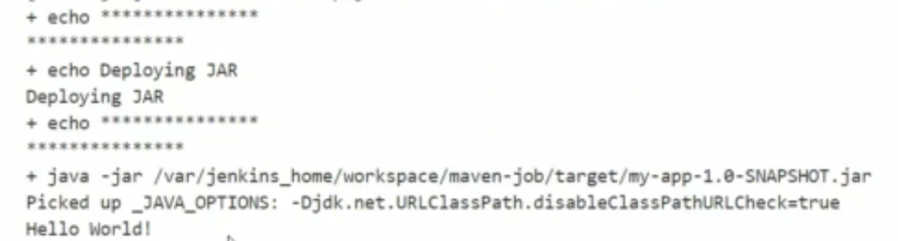

# 9 - Jenkins + Maven

Vamos a configurar y instalar maven para poder construir aplicaciones Java, vamos a generar un proyecto por completo, con sus pruebas, etc. Por lo cual, este ejercicio va a ser su primer acercamiento con la integración continua.

## 9.1 Instalar plugin de Maven

>**Nota** En caso de ya tenerlo instalado, obviar los siguientes pasos y continuar.

- Ir a los plugins y instalar **Maven Integration**
- Realizar los mismos pasos anteriores luego de instalar un plugin.

## 9.2 Instalar plugin GIT

>**Nota** En caso de ya tenerlo instalado, obviar los siguientes pasos y continuar.

- Ir a los plugins y instalar **Git Client** y **Git Plugin**
- Realizar los mismos pasos anteriores luego de instalar un plugin.

## 9.3 Como clonar un repositorio usando Jenkins

- Generar un nuevo trabajo llamada **maven-job** de tipo **Freestyle project**
- Sobre el sub menú de **Source Code Management** especificar la opción
  Git y utilizar la URL del siguiente repositorio [Maven app example](https://github.com/jenkins-docs/simple-java-maven-app.git)
- Ver que otros datos son necesarios para poder completar esta parte.
- Ejecutar el trabajo y verificar que el repositorio se clono, también verificar dentro del contenedor de Jenkins que los files a los que se os hizo pull desde el git, existen en el mismo. Para esto tienen que ir al directorio `workspace` dentro de su contenedor y ahí dentro buscan la carpeta con el nombre de su trabajo.

## 9.4 Como construir un JAR utilizando maven

- Primero ir a las configuraciones de Jenkins sobre la opción **Global Tool Configuration**
- Agregar una instalación de tipo **Maven** con el nombre **jenkins-maven** y la versión **3.6.0**
- Modificar el trabajo anterior que clona el repo, en el sub menú **Build Environment** seleccionar la opción **Invoke top-level Maven targets**
- Poner la instalación realizada en el paso anterior.
- Ver cual es el comando que deben de utilizar para realizar el build, pueden mirar en los archivos del repositorio :) .
- Guardar y ejecutar, analizar el output de nuestro trabajo y ver que fue lo que ocurrio.
- Verificar dentro de nuestro contenedor que existe el archivo `my-app-1.0-SNAPSHOT.jar`

## 9.5 Como ejecutar pruebas unitarias sobre nuestro código

>**Nota:** Se pueden presentar problemas cuando se ejecuten las pruebas, en ese caso avisar para buscar la solución, puede llegar a ser necesario agregar alguna variable de entorno perteneciente a Java.

- Modificar el trabajo con el que venimos trabajando y agregar un **Add build step** de tipo **Invoke top-level Maven targets**
- Poner la instalación realizada en el paso anterior.
- En **Goals** `test`
- Guardar y ejecutar, analizar el output de nuestro trabajo y ver que fue lo que ocurrio.

## 9.6 Desplegar localmente nuestro JAR

>**Nota**: Para ejecutar los siguientes pasos, vamos a necesitar la ruta de donde queda alojado nuestro archivo `my-app-1.0-SNAPSHOT.jar`, ir a buscar la ruta y tenerla a mano para utilizarla a continuación.

- Modificar el trabajo con el que venimos trabajando y agregar un **Add build step** de tipo **Execute shell**
- Agregar el siguiente código:
```
echo *****************
echo "Deploying JAR"
echo *****************

java -jar <path completo del archivo my-app-1.0-SNAPSHOT.jar>
```
- Si todo funciono correctamente, deberiamos de visualizar en la consola el sigueinte mensaje al final de la ejecución del trabajo:

<p align = "center">

</p>

## 9.7 Archivar nuestro JAR construido correctamente

Vamos a archivar el jar construido correctamente.

- Modificar el trabajo con el que venimos trabajando y agregar en el sub menú de **Post-build Actions** y agregar un **Add post-build action** 
- Agregar **Archives to artifact** `target/*.jar`
- Ejecutamos el trabajo y veamos que pasa.

## 9.8 Agregar envio de notificación con status

- Modificar el trabajo con el que venimos trabajando y agregar en el sub menú de **Post-build Actions** y agregar un **Add post-build action**  como se realizo en el punto de probar el correo electronico.
- Guardar y verificar que llega el link con los resultados de nuestro trabajo por correo.

## Próximos pasos
Para el siguiente paso del laboratorio, diríjase a [10 - Jenkins y GIT](10-Jenkins_y_GIT.md)