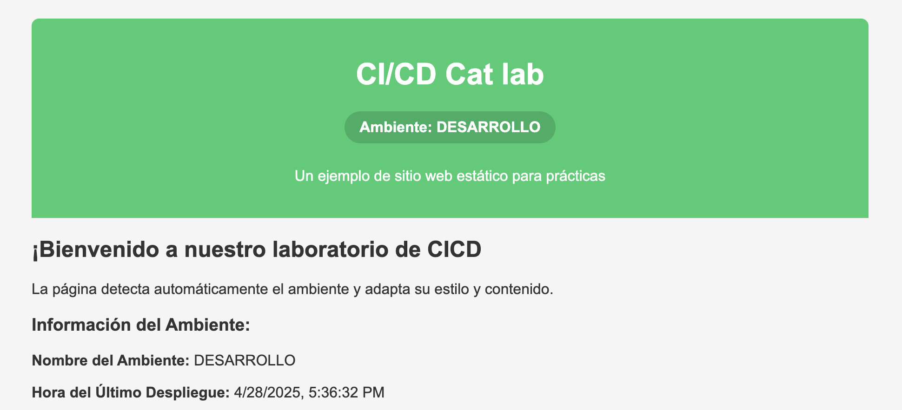

## Laboratorio

### 2.1 Generar repositorio de Github

- Crear un repositorio de GitHub con un nombre a elección, como por ejemplo `lab-githubactions` y generar las ramas `develop`, `staging` y `main`:

```bash
git clone https://github.com/ort-student/lab-githubactions.git
git branch develop
git branch staging
git config user.email "ort-student@domain.com"
git config user.name "ORT Student"
```

- Subir, sobre la rama `develop`, el código de la aplicación que se encuentra en siguiente `.zip`:


<a href="./lab-githubactions.zip" download>
  <span>lab-githubactions.zip</span>
  
</a>

### 2.2 Generar S3 buckets en AWS

- Generar 3 S3 buckets en la cuenta de AWS:
    - Utilizar nombres que reflejen el ambiente al que pertenecen, por ejemplo:
        - `dev-gha-webapp`,`stg-gha-webapp`, `gha-webapp`.
        - **NOTA**: agregar sufijos al final de los nombres para que no se repitan de forma global dentro del servicio de S3.
    - Verificar que los buckets quedan con la opción de `Block all public access` desactivada.
    - Verificar luego de una vez creados los buckets, que en la pestaña de `Properties` quede `Enabled` la opción de `Static website hosting`.

### 2.3 Analizar la carpeta .github

- Analizar los archivos que se encuentran dentro de la carpeta `.github`, el objetivo es entender qué es lo que realizan, cuál es su relación entre sí y que tipos de `SECRETS` se manejan.

### 2.4 Agregar secrets necesarios y ejecutar

- Agregar todos los secrets necesarios para que el build and deploy funcionen, una vez agregados, ejecutar manualmente (se puede llegar a ejecutar automático por tener trigger configurado los archivos) desde la consola de github actions el flujo para la rama `develop`, si se ejecuto correctamente.

- Si fue correcto el resultado del actions, buscar la URL de nuestro S3 bucket (la misma se encuentra en la ventana de properties y en el apartado de `Static website hosting`).
- Si podemos llegar al sitio y obtenemos un error 403 como la imagen, estamos en lo correcto: 

<p align = "center">

</p>

- La tarea siguiente es poder investigar como solucionar el error 403, para ello, vamos a buscar en la documentación de AWS como solucionar el error 403 en un S3 bucket como website, una vez que lo solucionen, deberían de visualizar la siguiente imagen:

<p align = "center">

</p>

> 💡 **PISTA:** La solución del problema está asociado a un problema con la política de acceso al bucket.

- Repetir los pasos para las ramas de `staging` y `main`, el pasaje de código realizarlo mediante pull request, pero previamente deben de haber cargado las variables.
