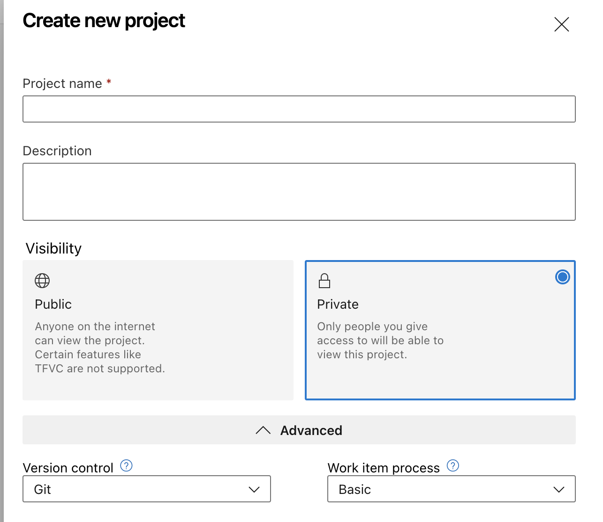

## 2 - Generar nuestro primer proyecto

Vamos a generar un nuevo proyecto dentro de nuestra cuenta de Azure DevOps el cual usamos para generar todos los componentes que se van pidiendo en el laboratorio para lograr CI/CD

- Ingresar en nuestra cuenta de **Azure DevOps**
- Generar un nuevo proyecto, con las opciones que muestra la imagen:

- Ingresamos al proyecto y validamos que podamos ver las siguientes opciones:

## Próximos pasos
Para el siguiente paso del laboratorio, diríjase a [3 - Clonar repositorio de ejemplo para realizar build and deploy](3-Clonar_repo_de_ejemplo.md)