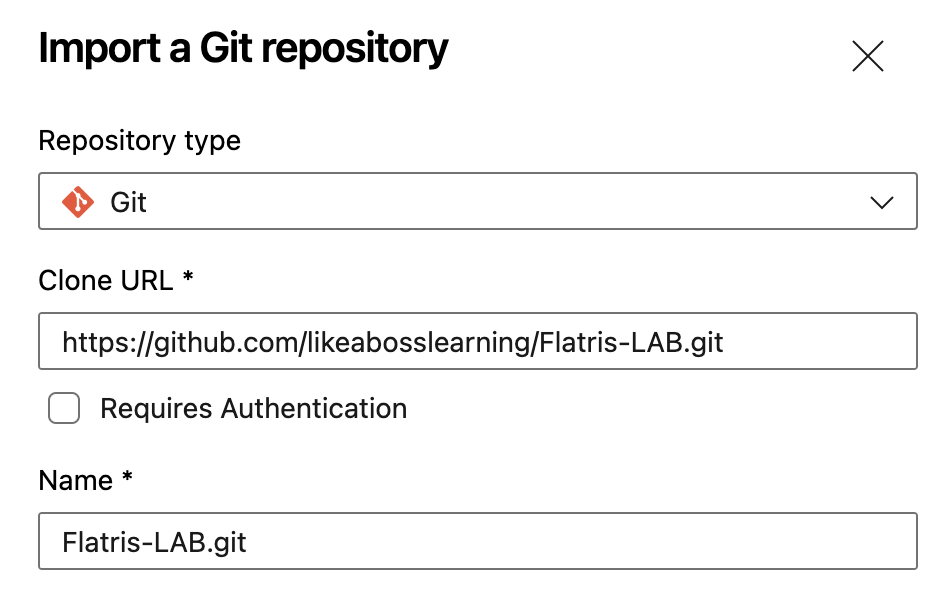
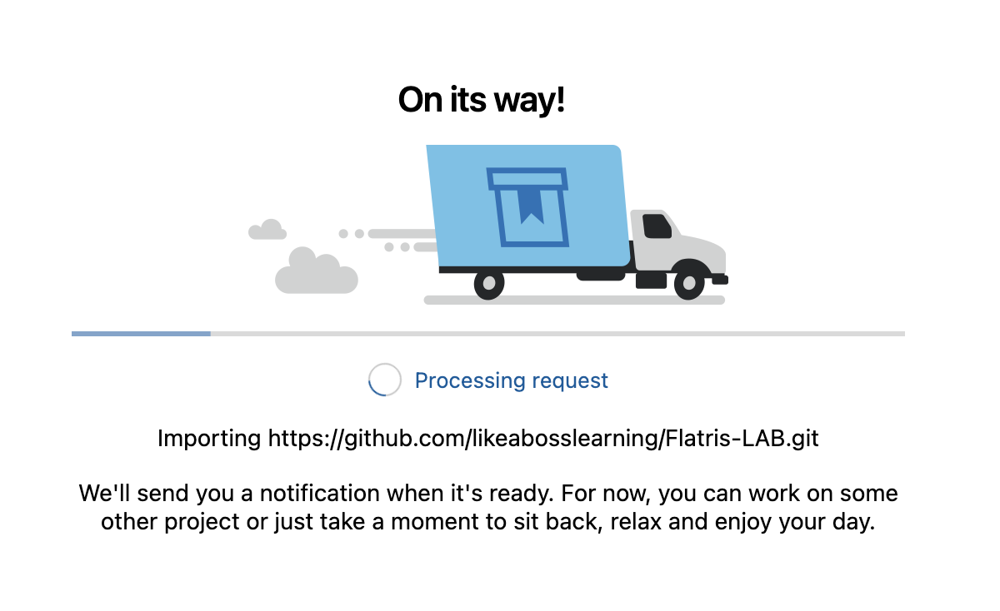
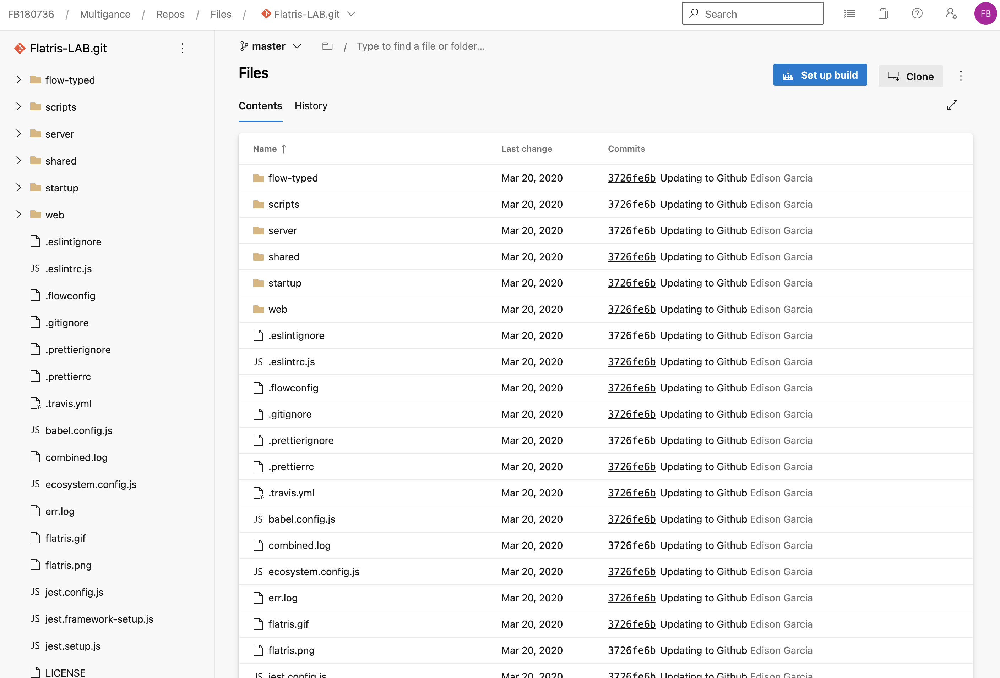

## 3 - Clonar repositorio de ejemplo

Vamos a clonar un repositorio de ejemplo público, el cual consiste en el código de un juego desarrollado en JavaScript, el cual usaremos para realizar su construcción y despliegue sobre un servicio de **Microsoft Azure** para que el mismo quede disponible.

- Dentro de nuetro proyecto generado en el punto anterior, ir a la opción de **Repos**
- Vamos a utilizar la opción de **Importa a Git repository**
- La Clone URL a utilizar es la siguiente `https://github.com/likeabosslearning/Flatris-LAB.git`
- Si llegamos a tener la siguiente imagen, podemos realizar la importación del repo:

## Próximos pasos
Para el siguiente paso del laboratorio, diríjase a [3 - Clonar repositorio de ejemplo para realizar build and deploy](4-Generar_build_and_deploy.md)