## 4 - Generar pipeline completo de build and deploy

Vamos a generar todos los pasos para que nuestro código clonado en el paso anterior se construya y sea deplegado sobre un servicio de **Microsoft Azure**.


### 4.1 Crear Webapp en Microsoft Azure

Vamos a ingresar en nuestra cuenta de **Microsoft Azure** y generaremos los recursos necesarios para poder dejar disponible nuestra aplicación luego de realizar el despliegue.

- Una vez que ingresamos, le damos a **Create a resource**
- Buscamos **Resource group** y lo seleccionamos:
  
<p align = "center">
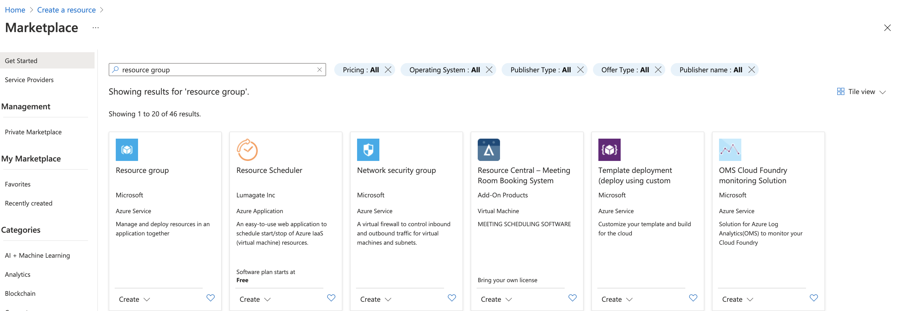
</p>

- Le ponemos el nombre que nos guste:
  
<p align = "center">
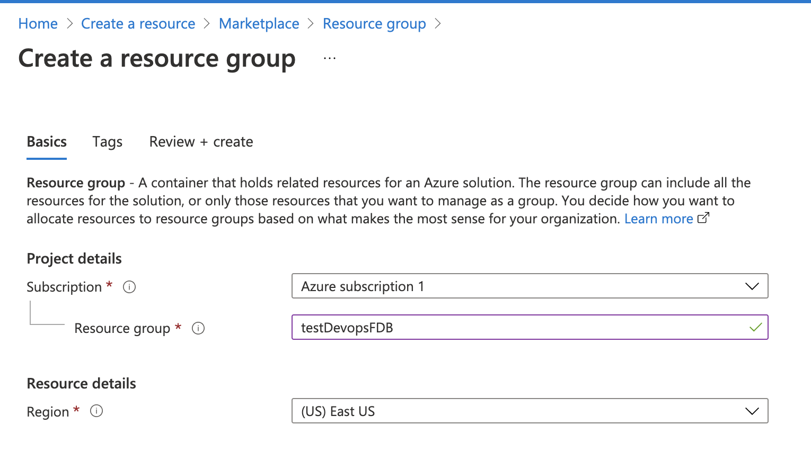
</p>

- Una vez creado, ingresamos al mismo.
- Una vez ingresado le damos al botón **Create**.
- Buscamos **web app** y lo seleccinamos el primero:
<p align = "center">
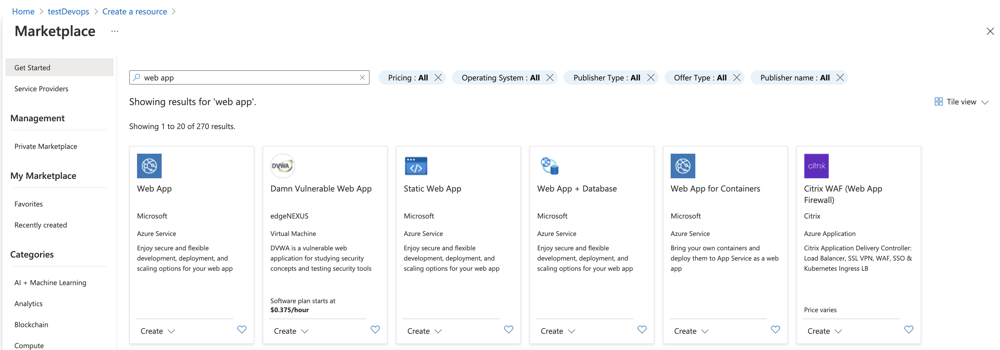
</p>

- Dejar los valores como figuran en la imagen, cambiando solamente **Name**:
- 
<p align = "center">
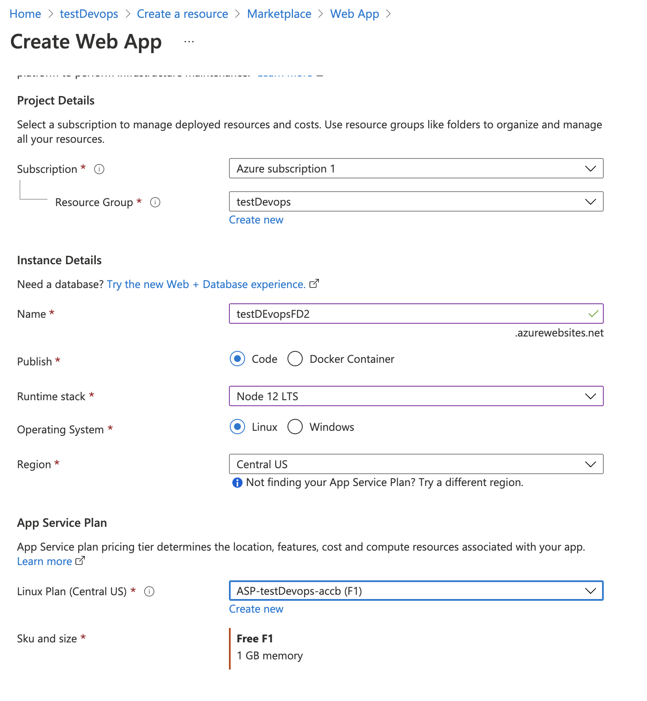
</p>

- Si volvemos al **Resource group** y vemos lo siguiente, hicimos los pasos de manera correcta:

<p align = "center">
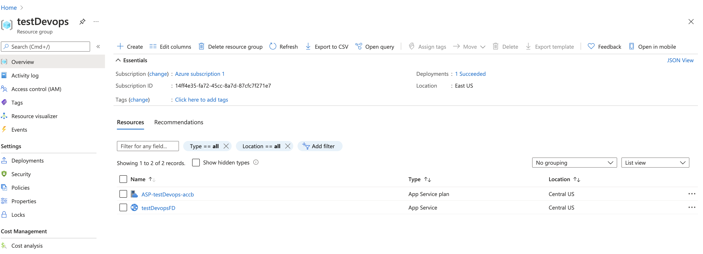
</p>

### 4.2 Instalar Azure Agent

Por tema de retricción, hay que solicitar con anticipación un **free agent** en Azure Devops, pero se puede instalar gratis un agente para realizar las contrucciones.

Vamos a generar una **Virtual Machine** en nuestra cuenta de **Microsoft Azure** para esto. 

- Ir dentro de nuestra cuenta de **Microsoft Azure** al **Resource group** generado en el paso anterior.
- Ir a la opción **create**
- Buscar por **centos** y apretar en la primera opción `CentOS-based` como muestra la imagen:

<p align = "center">
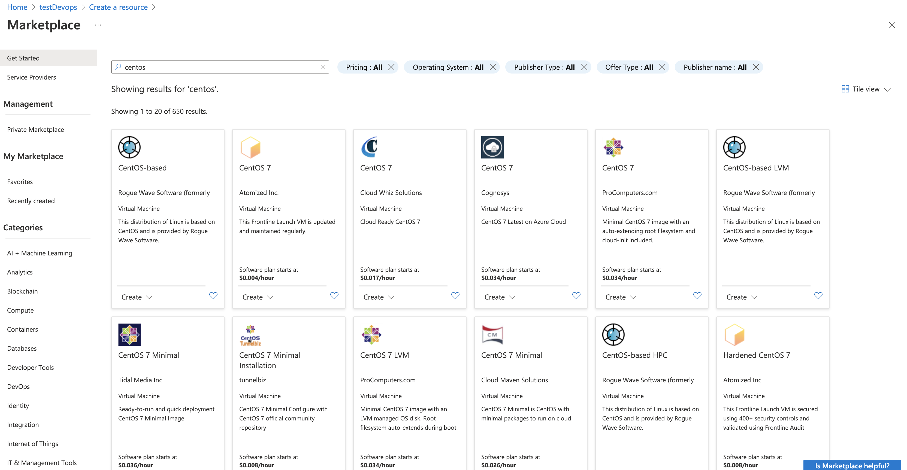
</p>

<p align = "center">
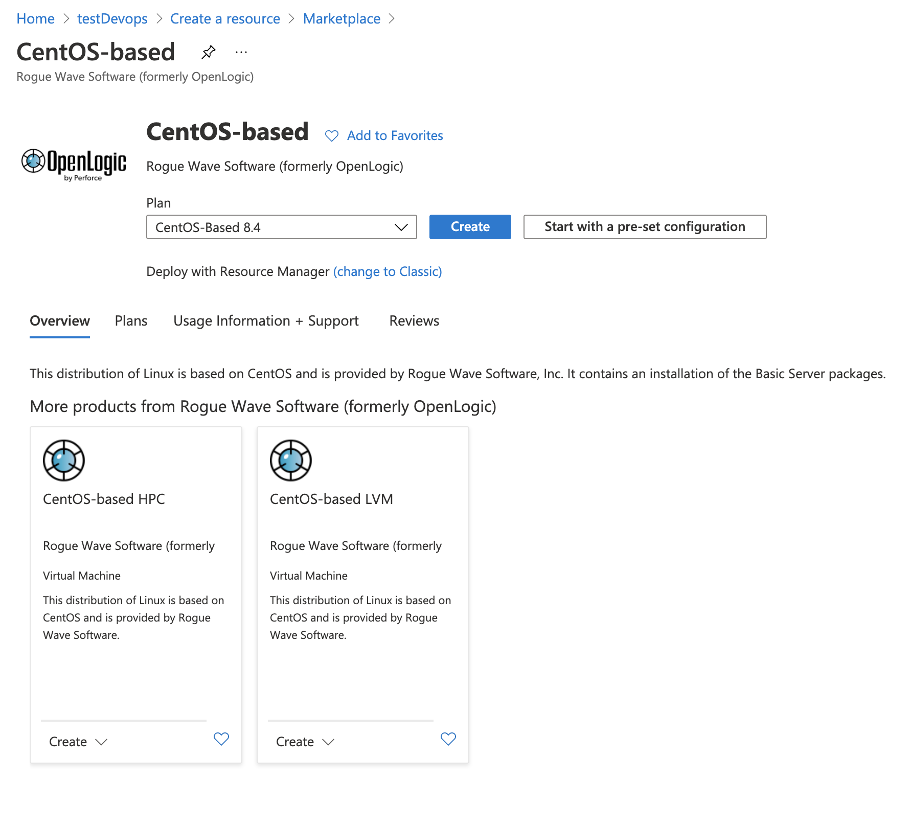
</p>

- Le ponemos nombre, dejamos los valores por defecto como muestra la imagen y le damos **Review + create**
- Vamos a recibir el siguiente mensaje, selecionar la opción de **Download private key and create resource**, esta clase es la **privada** que vamos a utilizar para conectarnos al servidor, como hicimos en el laboratorio de Jenkins con el remote-host y las claves pública/privada.

<p align = "center">
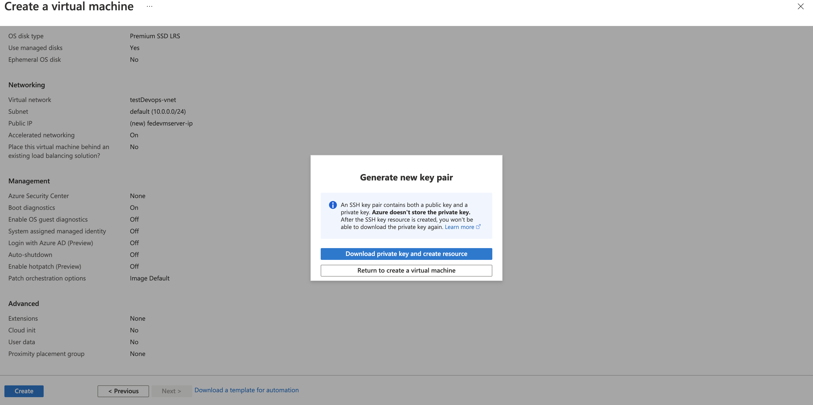
</p>

- Una vez generado el recurso, vamos a ver en el centro de notificaciones como muestra la imagen que el mismo termino, una vez finalizada la creación, vamos al grupo de recursos y seleccionamos la **virtual machine**:

<p align = "center">
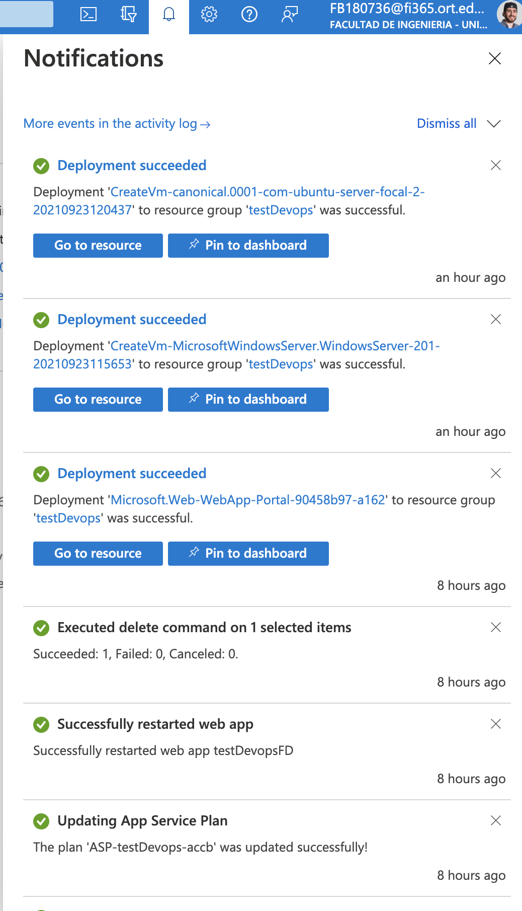
</p>

<p align = "center">
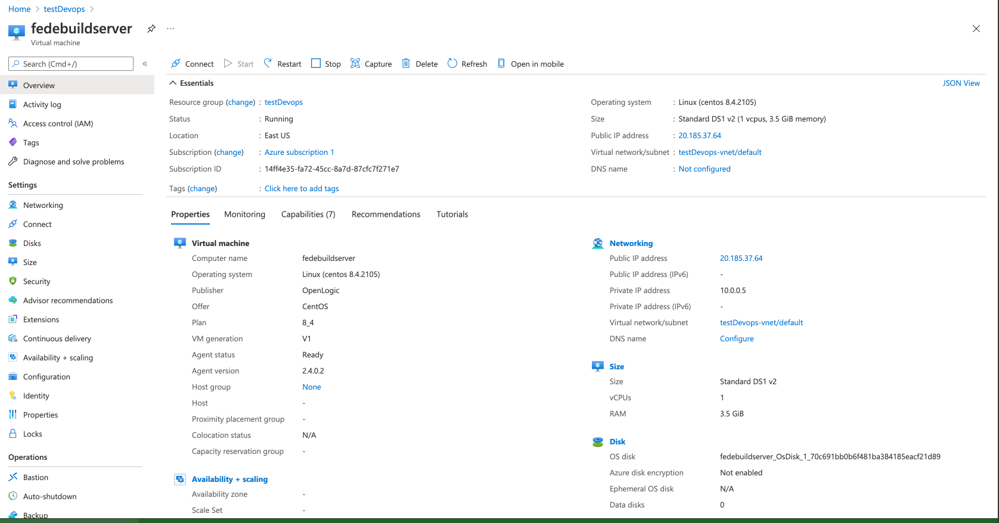
</p>

- Vamos a la opción que dice **connect** y le damos en la pestaña de **ssh**, validamos la información que nos proporciona y aplicamos los comandos sugeridos.
- Una vez conectados a nuestro servidor, vamos a instalar **git** con el comando `yum -y install git`.

Realizado esto, vamos a ir al Azure DevOps para poder realizar los pasos para instalar el **Azure Self Agent**

>**Nota:** De todas formas, solicitar un free agent en el siguiente [LINK](https://aka.ms/azpipelines-parallelism-request) para disponer de uno y no tener que utilizar una máquina siempre.

- Ir a **Project settings**.
- Dentro de **Pipelines**.
- Ir a **Agent pools**.
- Ir a **Default**.
- Ir a **New agent**.
- Seleccionar el sistema operativo de preferencia **RECOMIENDO USAR LINUX o WINDOWS**.
- Seguir la guía para intalar el agente, les dejo las documentaciones para algunas configuraciones extras que van a necesitar:
  - [Self-hosted Linux agents](https://docs.microsoft.com/en-us/azure/devops/pipelines/agents/v2-linux?view=azure-devops)
  - [Self-hosted Windows agents](https://docs.microsoft.com/en-us/azure/devops/pipelines/agents/v2-windows?view=azure-devops)
  - [Self-hosted macOS agents](https://docs.microsoft.com/en-us/azure/devops/pipelines/agents/v2-osx?view=azure-devops)

Una vez instalado, dejar el agente encendido para que pueda recibir jobs.

Validar luego que el agente se encuentra bien configurado y encendido.

- Ir nuevamante a **Pipelines**
- Dentro de **Pipelines** ir a **Agent pools**
- Ir a la prestaña de **Agents**
- Debemos de visualizar una imagen parecida a la siguiente:
<p align = "center">
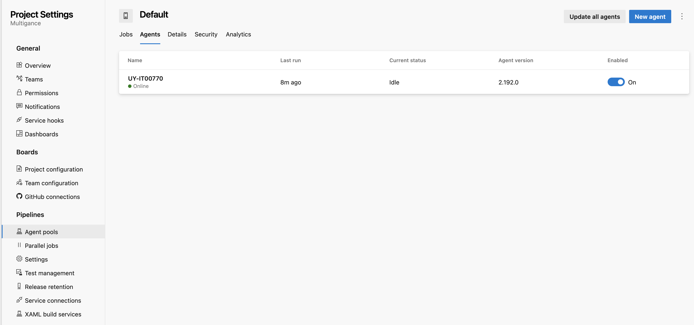
</p>

- Hacer click en nuestro agente.
- Ir a la pestaña de **Capabilities**.
- Agregar una nueva **User-defnided capabilities** con el nombre **default** y **value** 2.

### 4.3 Crear service connection

Vamos a tener que enlazar nuestra cuenta de **Microsoft Azure** con nuestra cuenta de **Azure DevOps**.

- Ir a **Pipelines** y ir a la opción **Releases**
- Seleccinamos **New pipeline**
- Seleccionar la primer opción como muestra la imagen de **Azure App Service Deployment**
  
<p align = "center">
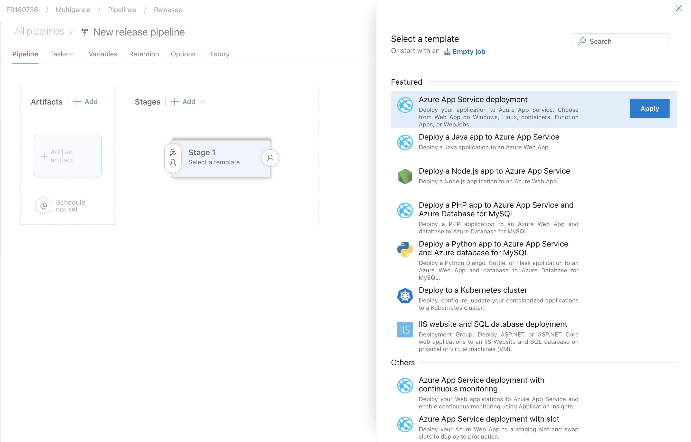
</p>

- Seleccionar donde dice **1 job, 1 task** debajo de **Stage 1**.
- Llegaremos a esta parte, en donde dice **Azure subscription** apretar y visualizar la cuenta, seleccionarla y darle **Authorize**.

<p align = "center">
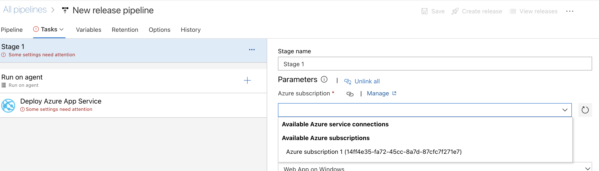
</p>

- Ir a **Project Settings** y luego a **Service connections**.
- Cambiarle el nombre a la conexión a uno más amigable, que se usara luego en el archivo `.yml` para la construcción y deploy y dar click en el check de **Grant access permission to all pipelines** como muestra la imagen:

<p align = "center">
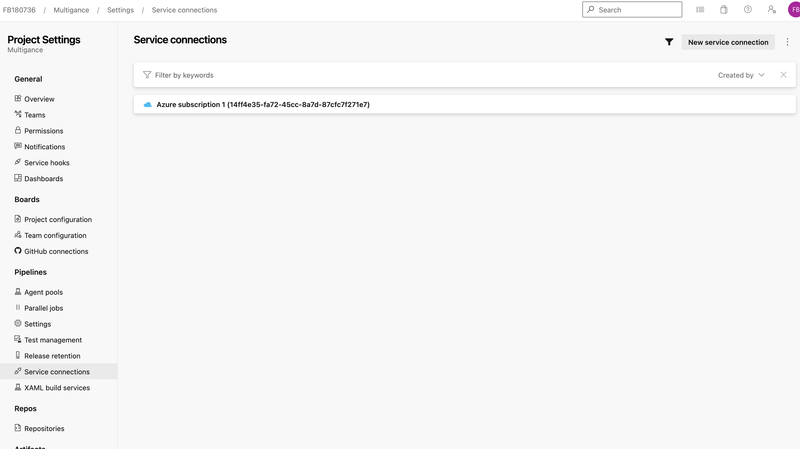
</p>

<p align = "center">
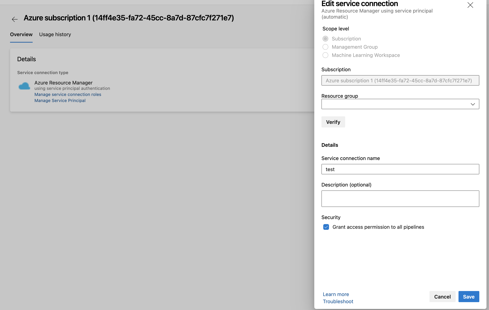
</p>


### 4.4 Crear build pipeline

- Vamos a ir a la opción **Pipelines** y iremos denuevo a **Pipelines**.
- Crearemos un nuevo pipeline con la opción **Create Pipeline**.
- Seleccionamos la opción **Azure Repos Git**.
- Seleccionamos el git que clonamos en el paso anterior **Flatris-LAB.git**
- Seleccionamos la opción **Starter pipeline** y pegamos el siguiente código:
> **Nota:** Van a tener que modificar las variables por les correspondan a sus recursos.
```
trigger:
- master
 
variables:
 
  # Azure Resource Manager connection created during pipeline creation
  azureSubscription: 'test'
  
  # Web app name
  webAppName: 'testfd22'
  
  # Resource group
  resourceGroupName: 'testDevops'
 
  # Environment name
  environmentName: 'test'
 
  # Agent VM image name
  vmImageName: 'default'
  
stages:
- stage: Archive
  displayName: Archive stage
  jobs:  
  - job: Archive
    displayName: Archive
    pool: default
    steps:   
    - task: AzureAppServiceSettings@1
      inputs:
        azureSubscription: $(azureSubscription)
        appName: $(webAppName)
        resourceGroupName: $(resourceGroupName)
        appSettings: |
          [
            {
              "name": "SCM_DO_BUILD_DURING_DEPLOYMENT",
              "value": "true"
            }
          ]
    - task: ArchiveFiles@2
      displayName: 'Archive files'
      inputs:
        rootFolderOrFile: '$(System.DefaultWorkingDirectory)'
        includeRootFolder: false
        archiveType: zip
        archiveFile: $(Build.ArtifactStagingDirectory)/$(Build.BuildId).zip
        replaceExistingArchive: true
 
    - upload: $(Build.ArtifactStagingDirectory)/$(Build.BuildId).zip
      artifact: drop
 
- stage: Deploy
  displayName: Deploy stage
  dependsOn: Archive
  condition: succeeded()
  jobs:
  - deployment: Deploy
    timeoutInMinutes: 0
    displayName: Deploy
    environment: $(environmentName)
    pool: default
    strategy:
      runOnce:
        deploy:
          steps:
          - task: AzureRmWebAppDeployment@4
            displayName: 'Azure App Service Deploy: {{ webAppName }}'
            inputs:
              azureSubscription: $(azureSubscription)
              appType: webAppLinux
              WebAppName: $(webAppName)
              packageForLinux: '$(Pipeline.Workspace)/drop/$(Build.BuildId).zip'
              RuntimeStack: 'NODE|10.14'
              StartupCommand: 'npm run start'
              ScriptType: 'Inline Script'
              InlineScript: |
                npm install
                npm run build --if-present
```

>**Nota:** En caso de obtener problema de timeout durante el deploy, revisar el siguiente [Link](https://github.com/yarnpkg/yarn/issues/6115#issuecomment-406623932)


- Visualizar los pasos que se van a ejecutar y darle a **Save and run**.
- Si llegamos a la siguiente imagen, volver a darle **Save and run** y visualizar que es lo que pasa. Presionar sobre el trabajo para poder visualizar el log.

<p align = "center">
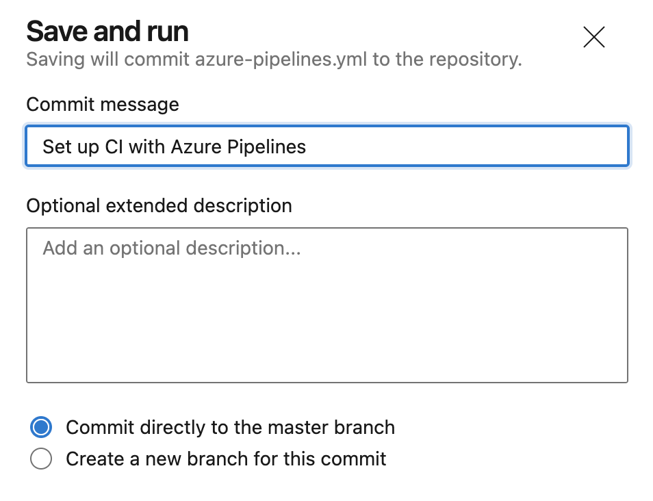
</p>

### 4.4 Crear release pipeline

Vamos a generar el release pipeline para poder enganchar el build pipeline con el recurso que generamos en Azure en el paso anterior y poder desplegar el código en el mismo para que quede disponible y podamos utilizar nuestra aplicación.

- Ir a **Pipelines** en **Azure DevOps**.
- Dentro de **Pipelines** ir a **Releases**.
- Generar un **New Pipeline**.
- En la opción **Stage 1** selecionar **Azure App Service deployment**.
- Cambiar el nombre por **deploy**.
- Seleccionar la opción que se muestra en la pantalla:

<p align = "center">
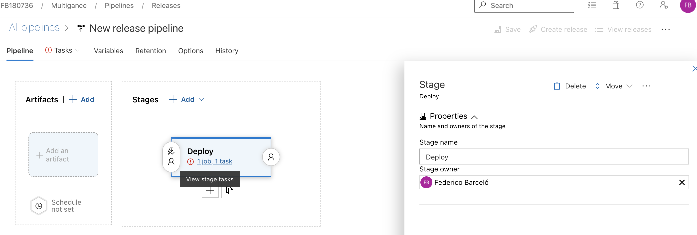
</p>

- Dejar las opciones con sus sucripción y su recurso generado anteriormente:

<p align = "center">
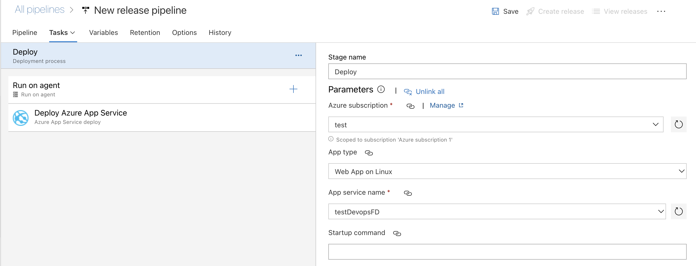
</p>

- En la parte de **Run on agent** cambiar el **Agent pool** a **Default** como muestra la imagen:

<p align = "center">
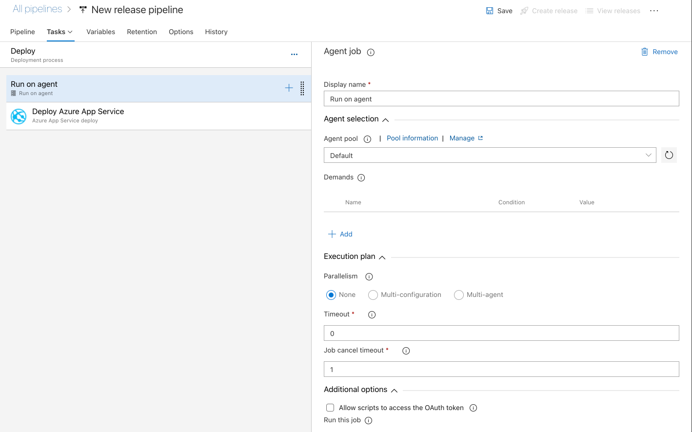
</p>

- Guardar y volver volver al pipeline para editarlo en la parte de **Artifacts**
  
<p align = "center">
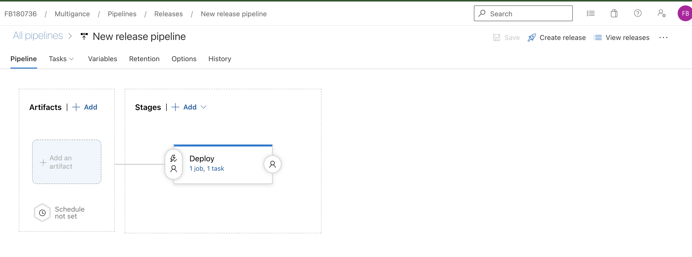
</p>

- Configurar las partes como muestran las imagenes a continuación:

<p align = "center">
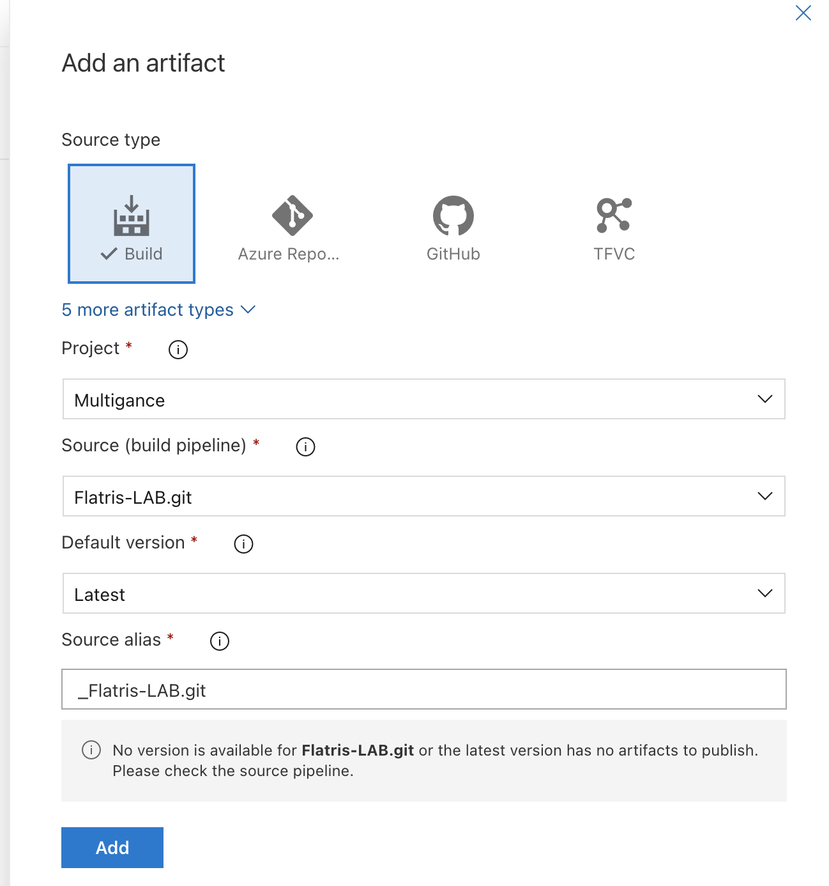
</p>

<p align = "center">
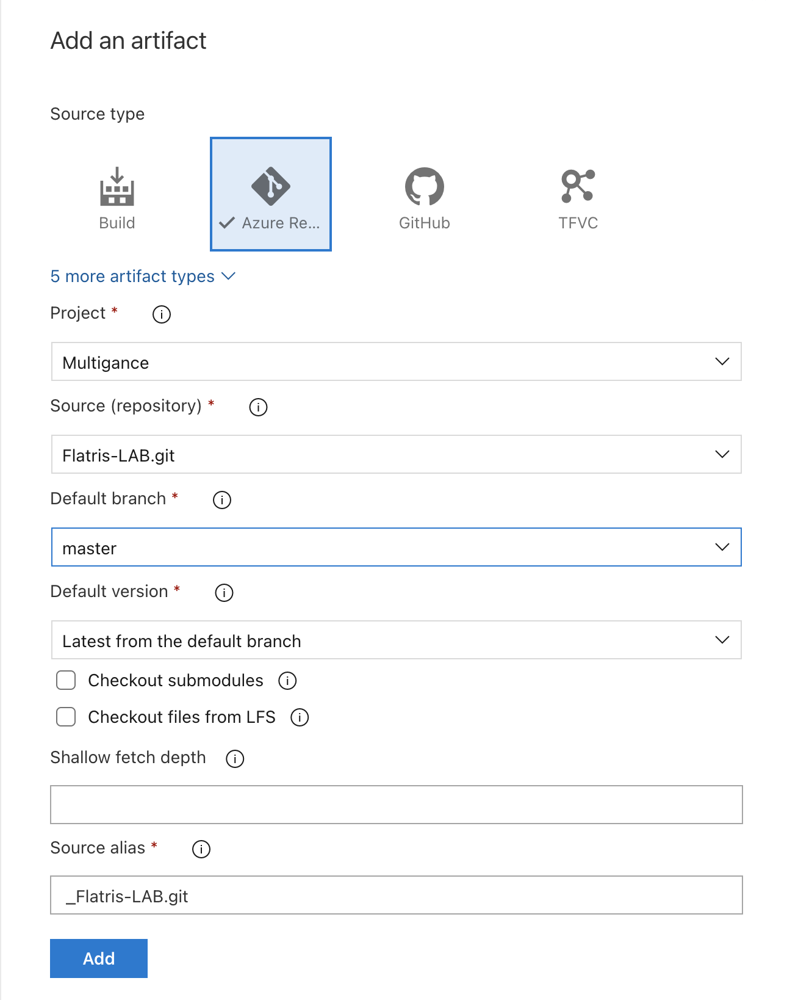
</p>

- Guardar y ejecutar el pipeline. Verificar que es lo que pasa.
- Ir a la URL de la Web App, la cual figura en los logs del release y validar que la app se encuentra funcionando.

<p align = "center">
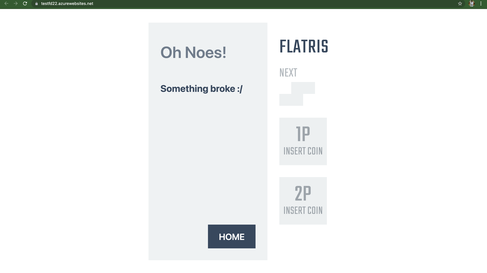
</p>

>**Nota:** En caso de obtener timeout por los yarn, hacer la solución que se dice en el sigiuiente [Link](https://stackoverflow.com/questions/54818471/react-native-init-gives-esockettimedout-error)

### 4.5 Eliminar el resource group

Vamos a eliminar el resource group con todos los recursos generados para no consumirnos todo el crédito gratis que tenemos disponible.

- Iremos al **Resource Group** que creamos.
- Y seleccionaremos **Delete resource group**
- Escribimos el nombre de **Resource Group** y presionamos **delete**

<p align = "center">
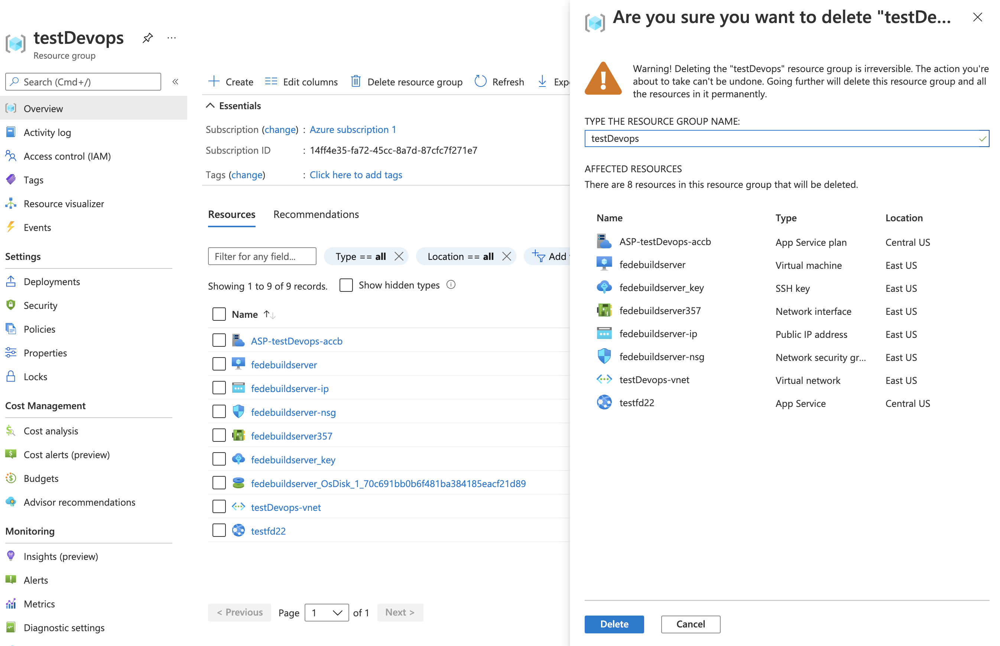
</p>