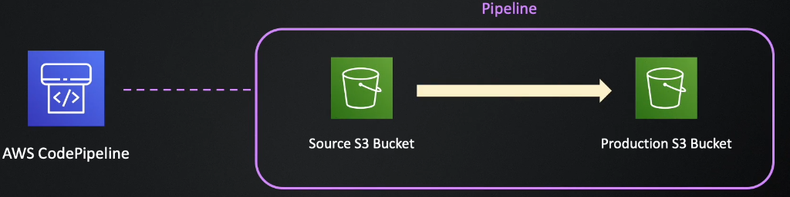
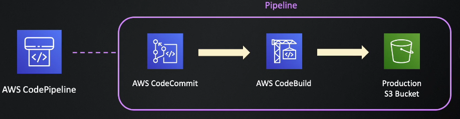

## Instalación

### Prerrequisitos
No se necesitan habilidades específicas para este laboratorio más allá de un manejo básico con la línea de comandos y el uso de un editor de texto.

Vamos a necesitar tener nuestra cuenta AWS, que no sea la de AWS academy ya que tenemos restricción.

Vamos a ver el uso de la herramienta CodePipeline, Codecommit, CodeBuild y CodeDeploy en diferentes situaciones:

### Situación 1

Primer pipeline que se ejecutara sobre dos buckets de S3 y desplegara una simple aplicación web.

### Situación 2

Segundo pipeline que utilizara AWS CodeCommit para desplegar de manera automatica nuestro código a partir de un repositorio.

### Situación 3

Tercer pipeline que utilizara AWS CodeBuild en conjunto a los servicios anteriores para realizar la construcción y testeo de nuestro código de manera automática.

### Situación 4

Cuarto pipeline que utilizara AWS CodeDeploy en conjunto a los servicios anteriores para realizar el deploy de nuestra aplicación sobre una instancia EC2, que luego sera utilizada por un grupo de autoescalado (ASG).

### Situación 5

Quinto pipeline que utilizara AWS CloudFormation en conjunto a los servicios anteriores para crear algunos ambientes y desplegar nuestras aplicaciones, también agregaremos un manual approval entre las instancias de staging y production, se veran como configurar algunas notificaciones.

## Próximos pasos
Para el siguiente paso del laboratorio, diríjase a [2- Situación 1](2-Section1.md)