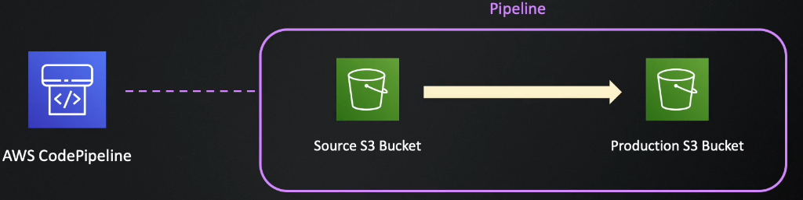
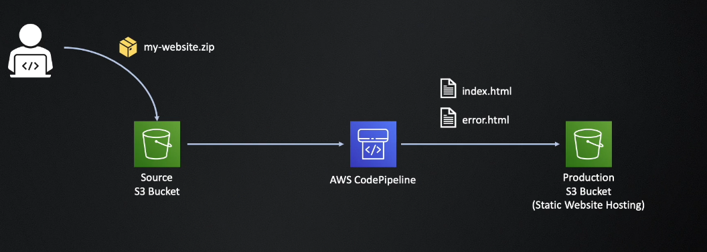
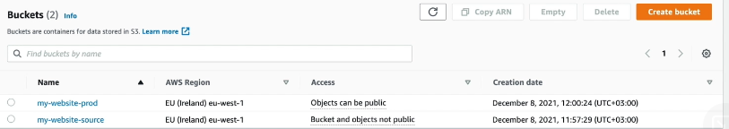
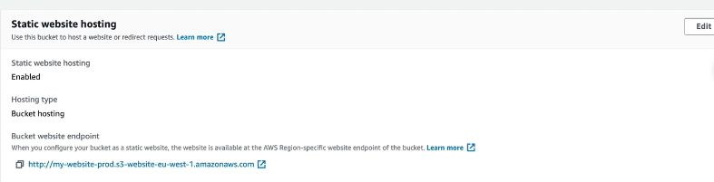
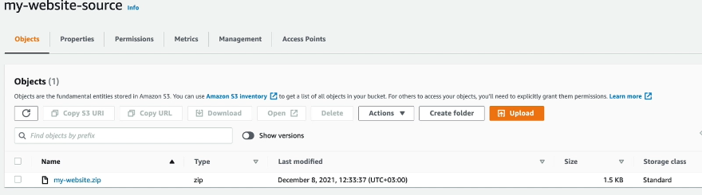
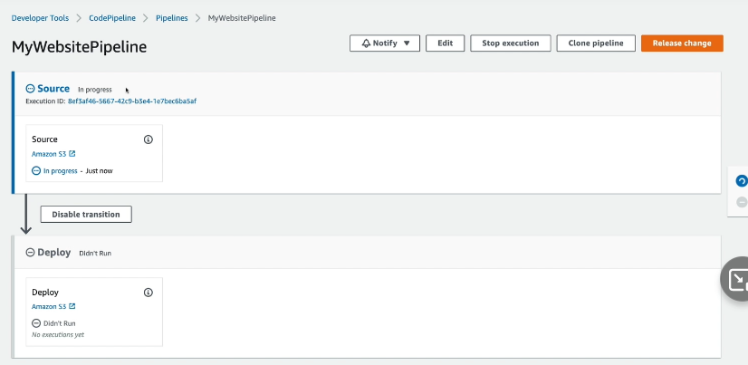
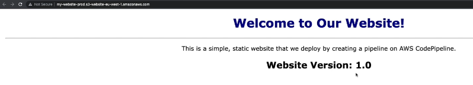
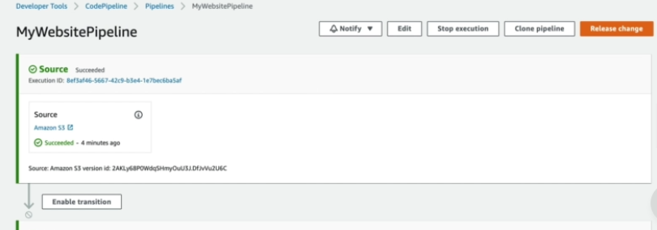
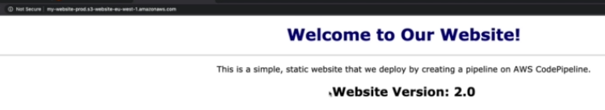

## Situación 1

Vamos a configurar nuestro pipeline:

<p align = "center">

</p>

Buscando obtener el siguiente comportamiento:

<p align = "center">

</p>

A continuación, haremos los pasos desde la interfaz gráfica para lograr el cometido y visualizar el resultado, el código de la aplicación a desplegar se encuentra dentro de la carpeta del laboratorio con el nombre `my-website.zip`

### 1 - Generación de source y production bucket

- Vamos a ir a la consola de AWS y generaremos un bucket S3 que sera nuestro Source bucket. En este primer bucket dejaremos por defecto la configuración y bloqueado el acceso a todo público.
- Generaremos ahora otro bucket S3 que sera nuestro Production bucket. En esta segundo bucket debemos de dejar el acceso para todo público disponible, ademas en este bucket agregamos la siguiente policy en el bucket policy:
```
{
    "Version": "2012-10-17",
    "Statement": [
        {
            "Sid": "PublicReadGetObject",
            "Effect": "Allow",
            "Principal": "*",
            "Action": [
                "s3:GetObject"
            ],
            "Resource": [
                "arn:aws:s3:::<BUCKET_PROD>/*"
            ]
        }
    ]
}
```
- Finalizada la creación de ambos buckets, debemos de tener dos recursos de S3 como se muestran en la imagen:

<p align = "center">

</p>

- Sobre el bucket de production, tendremos que habilitar en las properties para que pueda alojar static website hosting, al momento de especificar las páginas poner `index.html` para el index document y `error.html` para el error document.
- Finalizada la configuración, deberíamos de visualizar algo como la siguiente imagen:

<p align = "center">

</p>

### 2 - Subir el código al source bucket

- Subiremos el código correspondiente a nuestra página al S3 bucket que definimos en el punto anterior como source.
- Subimos el .zip completo como lo tenemos en la carpeta del practico.
- Finalizado el upload, debemos de obtener algo parecido a lo de la imagen:

<p align = "center">

</p>

### 3 - Crear el pipeline

- Vamos a generar nuestro pipeline con AWS CodePipeline.
- En el step 1 solamente especificamos el nombre y dejamos todas las configuraciones por defecto.
- En el step 2, vamos a elegir que el source provider es un S3 Bucket, elegimos nuestro source bucket y especificamos el S3 object key correspondiente al archivo .zip que subimos anteriormente, elegimos la opción de Amazon CloudWatch Events.
- En el step 3, vamos a realizar un skip build stage, ya que no vamos a realizar alguna construcción en este pipeline de ejemplo.
- En el step 4, vamos a elegir como Deploy provider S3 bucket, elegiremos nuestro production bucket, también debemos elegir que se haga un Extract file before deploy y que el ACL sea bucket owner.
- Al finalizar lo anterior, se ejecutara el pipeline por primera vez y realizara lo que evidenciamos en el primer y segundo diagrama.
- Si hicimos todo de manera correcta, deberíamos de visualizar algo parecido a lo de la imagen a continuación:

<p align = "center">

</p>

- Si se ejecuta todo de manera correcta, podremos utilizar la URL que tiene nuestro production bucket y deberíamos de acceder a nuestra página:

<p align = "center">

</p>

### 4 - Desactivar el pipeline y realizar cambios en el código

- Vamos a desactivar el transition entre los steps de nuestro pipeline, para ello debemos de ir a los pipelines y deshabilitar la transition:

<p align = "center">

</p>

- Realizaremos una modificación en el código de nuestra aplicación que se encuentra en el .zip, cambiaremos de que sea 1.0 a 2.0 en el index.html.
- Realizado este cambio, volveremos a zippear el mismo y lo subiremos nuevamente a nuestro bucket source de S3.
- Verificaremos que el pipeline se quiere ejecutar por encontrar cambios en el source bucket, pero el mismo no podra lanzarse porque deshabilitamos anteriormente.
- Habilitamos nuevamente el transition que deshabilitamos y verificamos el comportamiento del pipeline.
- Una vez que el mismo haya finalizado, verificar la web nuevamente y deberíamos de visuliazar nuestra página actualizada con la version 2.0:

<p align = "center">

</p>

### 5 - Verificar detalles y history del pipeline
- Vamos a ver algunos detalles sobre la ejecución y el history de nuestro pipeline.

### 6 - Generar un segundo production bucket y agregar un nuevo step al pipeline
- Vamos a generar un nuevo segundo production bucket y adicionaremos en step de Deploy para que se despliegue la misma aplicación web sobre dos buckets S3 diferentes.
- Validar que todo funcione de manera correcta y se visualice el mismo código en ambos buckets.

### 7 - Eliminar todos los recursos generados
- Para no incurrir en costos, vamos a eliminar todos los recursos que generamos anteriormente.


## Próximos pasos
Para el siguiente paso del laboratorio, diríjase a [2- Situación 1](2-Section2.md)