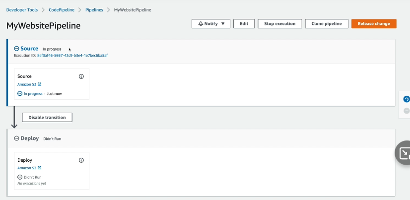

## Situación 2

Vamos a configurar nuestro pipeline:

Vamos a tratar de simular lo mismo que la situación anterior, pero en lugar de estar mirando si hay cambios sobre un S3 bucket, estaremos mirando directamente sobre un repositorio git de CodeCommit:

### 1 - Generación de repositorio de AWS CodeCommit

- Vamos a ir por consola y generaremos un repositorio de CodeCommit como muestra la imagen.

- Visualizar las opciones disponibles para clonar el repositorio de CodecCommit generado y también visualizar las opciones para el recurso de CodeCommit disponibles.

### 2 - Conectarse al AWS CodeCommit utilizando HTTPS

- Para poder utilizar CodeCommit tenemos que configurar sobre algun usuario el acceso mediante alguna de las formas que vimos anteriormente, esto se activa desde las opciones del usuario. Activar la opción de `HTTPS Git credentials`

- Guardar las credenciales, porque no vamos a poder volver a ver la `SECRET_KEY` generada, en caso de perderla, tendremos que regenerarla nuevamente.
- Agregamos los dos archivos anteriores en el nuevo repositorio generado anteriormente, se puede realizar de la manera que más oportuna crean, en mi caso voy a utilizar los siguientes pasos:
  - git init sobre carpeta con archivos a subir al repo.
  - git add .
  - git status para validar que esten agregados estos nuevos files correctamente.
  - git commit -m "mensaje"
  - git remote add origin https://<URL_DEL_REPO>
  - git push origin master, en este paso se me deberian de pedir las credenciales generadas anteriormente.
  - Verificar en el repo centralizado de CodeCommit que se encuentren subidos los archivos.
  - Visualizar un poco en la interfaz todas las opciones disponibles e información respectiva.

### 3 - Crear el pipeline

- Vamos a generar nuestro pipeline con AWS CodePipeline.
- En el step 1 solamente especificamos el nombre y dejamos todas las configuraciones por defecto.
- En el step 2, vamos a elegir que el source provider AWS CodeCommit, elegimos nuestro repo generado y especificamos la rama master, elegimos la opción de Amazon CloudWatch Events.
- En el step 3, vamos a realizar un skip build stage, ya que no vamos a realizar alguna construcción en este pipeline de ejemplo.
- En el step 4, vamos a elegir como Deploy provider S3 bucket, elegiremos nuestro production bucket, también debemos elegir que se haga un Extract file before deploy y que el ACL sea bucket owner.
- Al finalizar lo anterior, se ejecutara el pipeline por primera vez y realizara lo que evidenciamos en el primer y segundo diagrama.
- Si hicimos todo de manera correcta, deberíamos de visualizar algo parecido a lo de la imagen a continuación:

- Si se ejecuta todo de manera correcta, podremos utilizar la URL que tiene nuestro production bucket y deberíamos de acceder a nuestra página:

### 4 - Ejecutar el pipeline utilizando Git local

- Realizaremos una modificación en el código de nuestra aplicación, cambiaremos de que sea 1.0 a 2.0 en el index.html.
- Commiteamos el cambio y enviamos un push al repositorio.
- Verificamos como se ejecuta el pipeline y se despliega la nueva versión de la página con el cambio que realizamos.

### 5 - Ejecutar el pipeline utilizando CodeCommit console

- Realizaremos una modificación en el código de nuestra aplicación, cambiaremos de que sea 2.0 a 3.0 en el index.html utilizando la CodeCommit console.
- Commiteamos el cambio y enviamos un push al repositorio.
- Verificamos como se ejecuta el pipeline y se despliega la nueva versión de la página con el cambio que realizamos.

