## Situación 3

Vamos a configurar nuestro pipeline:

<p align = "center">
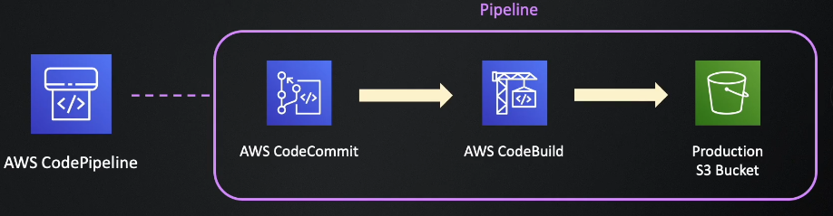
</p>

Vamos a tratar de simular un pipeline que este verificando cambios sobre una cierta rama de un repo de CodeCommit pero ahora vamos a agregar el step de AWS CodeBuild para construir un artefacto que se alojara en un bucket S3 intermedio y luego se desplegara el artefacto sobre un bucket S3 productivo:

<p align = "center">
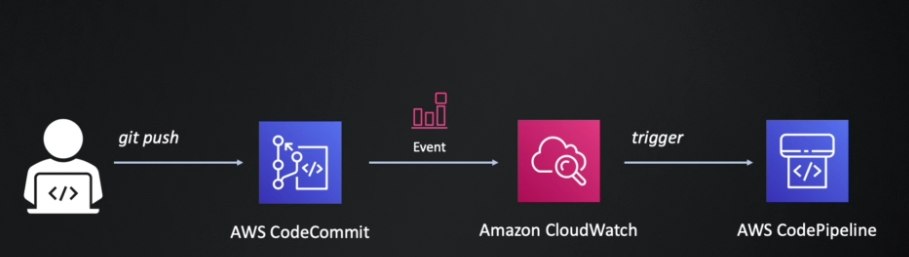
</p>

<p align = "center">
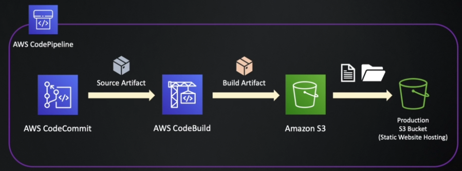
</p>

### 1 - Generación de repositorio de AWS CodeCommit

- Vamos a ir por consola y generaremos un repositorio de CodeCommit como muestra la imagen.

<p align = "center">
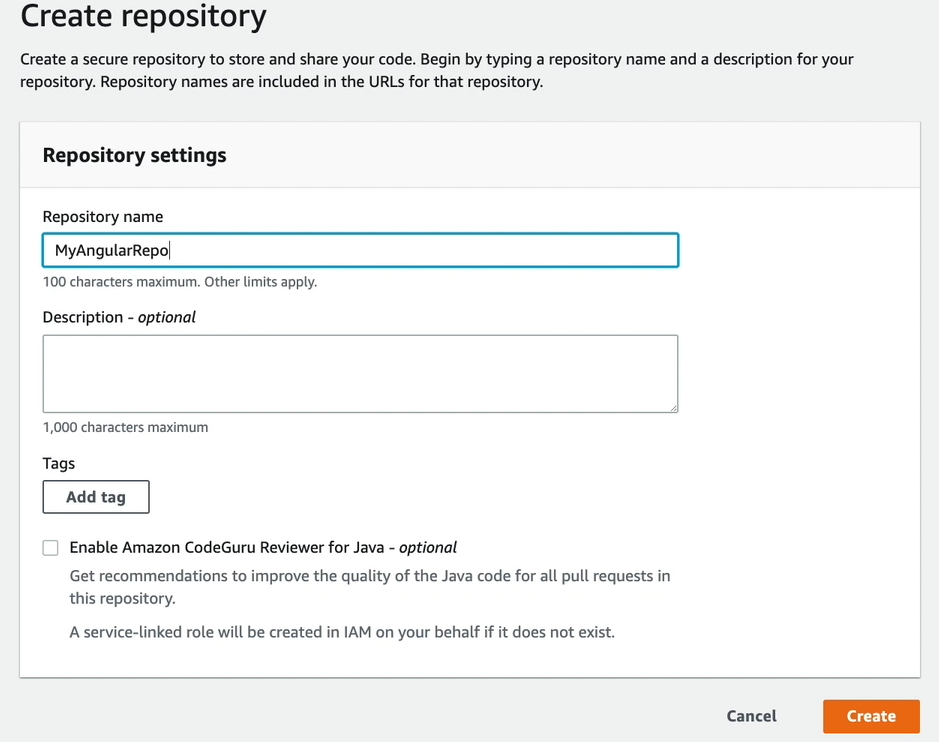
</p>

- Visualizar las opciones disponibles para clonar el repositorio de CodecCommit generado y también visualizar las opciones para el recurso de CodeCommit disponibles.

### 2 - Conectarse al AWS CodeCommit utilizando HTTPS

- Agregamos los dos archivos correspondientes `my-angular.project.zip` en el nuevo repositorio generado anteriormente, se puede realizar de la manera que más oportuna crean, en mi caso voy a utilizar los siguientes pasos:
  - git init sobre carpeta con archivos a subir al repo.
  - git add .
  - git status para validar que esten agregados estos nuevos files correctamente.
  - git commit -m "mensaje"
  - git remote add origin https://<URL_DEL_REPO>
  - git push origin master, en este paso se me deberian de pedir las credenciales generadas anteriormente.
  - Verificar en el repo centralizado de CodeCommit que se encuentren subidos los archivos.
  - Visualizar un poco en la interfaz todas las opciones disponibles e información respectiva.

### 3 - Crear S3 bucket

- Vamos a generar un S3 bucket para alojar nuestra aplicación Angular.
- Elegimos la opción de ACL Enabled.
- Dejamos el acceso al bucket público (uncheck Block all public access).
- Dejamos la demas configuración por defecto.
- Dejamos el bucket para que pueda almacenar statis hosting y en index document y error document especificamos index.html.
- Agregamos la siguiente bucket policy:
```
{
    "Version": "2012-10-17",
    "Statement": [
        {
            "Sid": "PublicReadGetObject",
            "Effect": "Allow",
            "Principal": "*",
            "Action": [
                "s3:GetObject"
            ],
            "Resource": [
                "arn:aws:s3:::<BUCKET_PROD>/*"
            ]
        }
    ]
}
```

### 4 - Crear el pipeline

- Vamos a generar nuestro pipeline con AWS CodePipeline.
- En el step 1 solamente especificamos el nombre y dejamos todas las configuraciones por defecto.
- En el step 2, vamos a elegir que el source provider AWS CodeCommit, elegimos nuestro repo generado y especificamos la rama master, elegimos la opción de Amazon CloudWatch Events.
- En el step 3, vamos a elegir la opcion de AWS CodeBuild y le damos a la opción de Create Project:
  - Ponemos nombre, descripción y elegimos managed image.
  - Elegimos Operatin System Ubuntu, runtime Standard y la Image la más reciente, lo demas lo dejamos por deecto.
  - Verificar las demas opciones disponibles, incluido la aditional configuration.
- En el step 4, vamos a elegir como Deploy provider S3 bucket, elegiremos nuestro production bucket, también debemos elegir que se haga un Extract file before deploy y que el ACL sea bucket owner.
- Al finalizar lo anterior, se ejecutara el pipeline por primera vez y realizara lo que evidenciamos en el primer y segundo diagrama.
- Si hicimos todo de manera correcta, deberíamos de visualizar algo parecido a lo de la imagen a continuación:

<p align = "center">
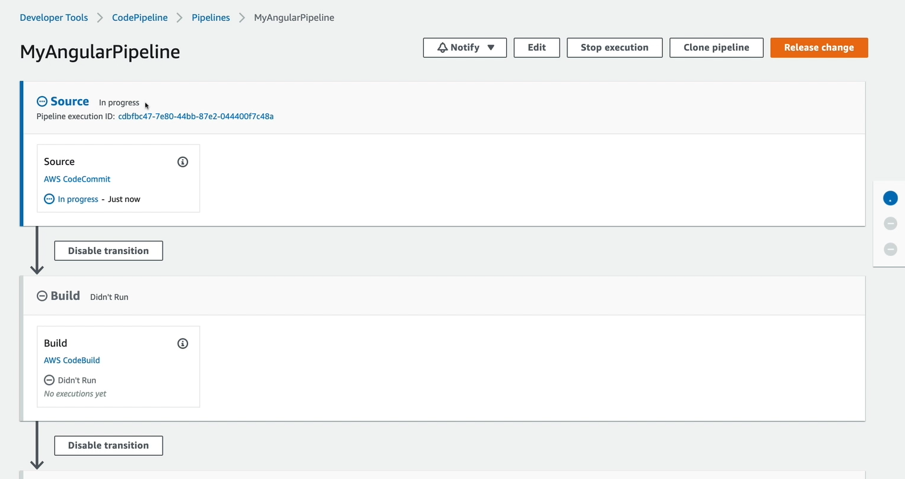
</p>

- Si se ejecuta todo de manera correcta, deberíamos de ver la siguiente falla:

<p align = "center">
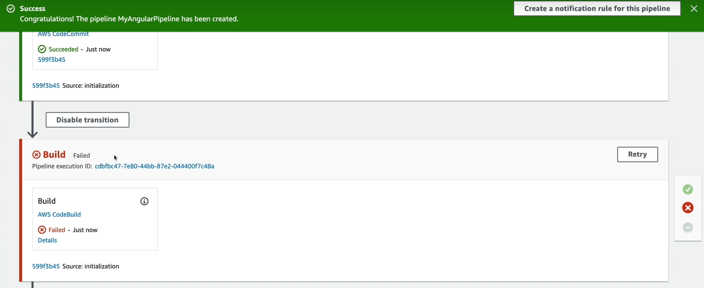
</p>

- Esto se debe a que no configuramos el archivo buildspec.yml, necesario para la etapa de build, ya que en este archivo es donde especificamos los pasos que se tienen que realizar al momento del build.

### 5 - Agregar buildspec.yml al repositorio

- El buildpsec.yml se encuentra en la raíz de la carpeta del practico, vamos a mirarlo y luego lo agregamos en la raíz de nuestro repositorio y mandaremos un commit al repositorio centralizado.
- Se debería de ejecutar el pipeline de manera automatica y no fallar, viendo lo siguiente:
<p align = "center">
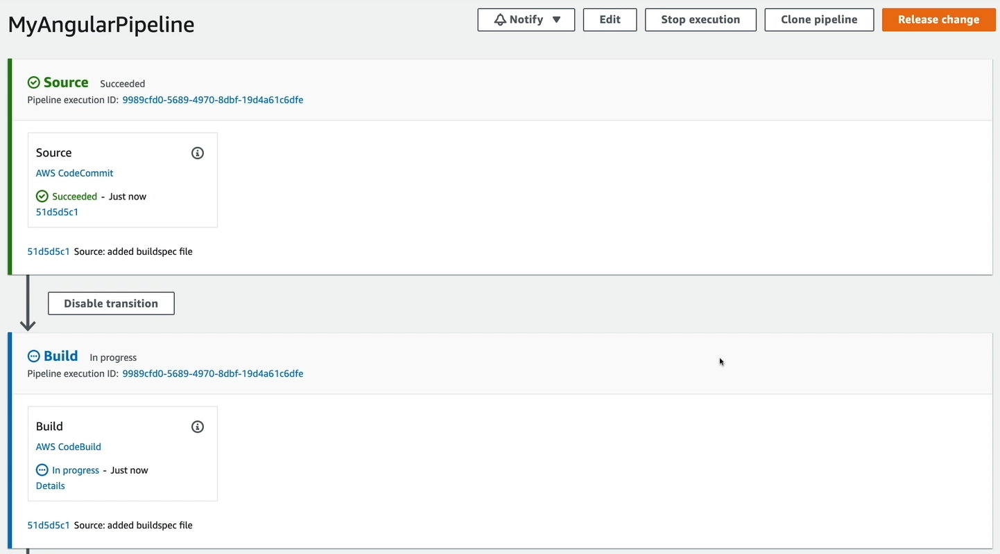
</p>

- Si todo se ejecuto de manera correcta, deberiamos de ver nuestra aplicación desplegada y funcionando:
<p align = "center">
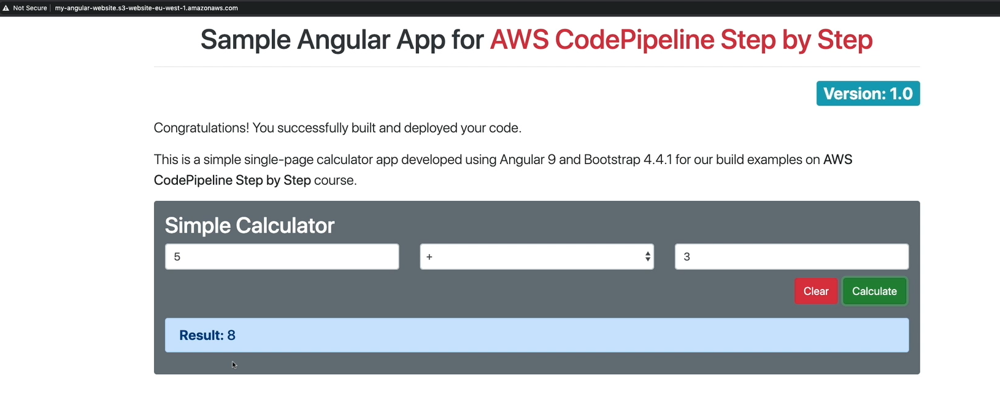
</p>

### 6 - Agregar tests unitaros al pipeline

- Vamos a modificar nuestro pipeline para que antes de realizar el build de la aplicacion, realice los tests unitarios, revisar en el archivo `calculator.component.spec.ts` en el repositorio para verificar los tests en cuestión.
- Realizar un cambio en la linea 37 `calculator.component.ts` por una operación diferente a la que se debe de realizar en el caso de la suma (ej poner un / en lugar de +).
- Mandar el cambio al repo y verificar que se ejecuta el pipeline correctamente.
- Esto es lo correcto que suceda? se debe de tener un artefacto compilado de una versión así de la aplicación?
- Mirar el buildspec unit-test-buildspec.yml en la carpeta del practico, que vamos a utilizar en un step dentro del build para realizar los tests.
- Modificar nuestra pipeline agregando un Action group en el step de Build:
  
<p align = "center">
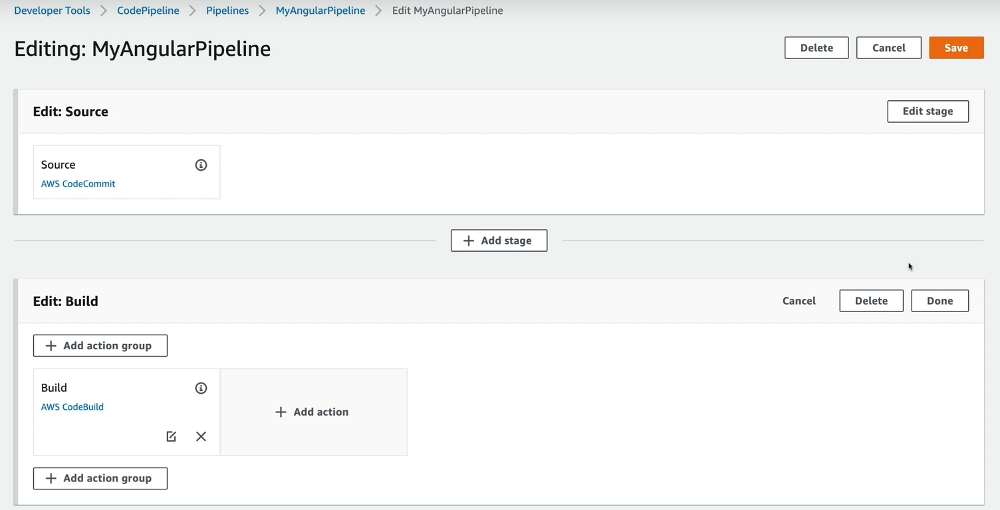
</p>

- LLamar esta etapa UnitTest, el action provided es AWS CodeBuild, el input artifacts es el SourceArtifact y creamos un nuevo project:
  - Escribir nombre y descripción.
  - Elegir los mimso valores que el CodeBuild generado anteriormente, menos el nombre del buildspec (nombrado unit-test-buildspec.yml).
- Terminar de editar y guardar, verificar que se obtiene algo parecido a la imagen:

<p align = "center">
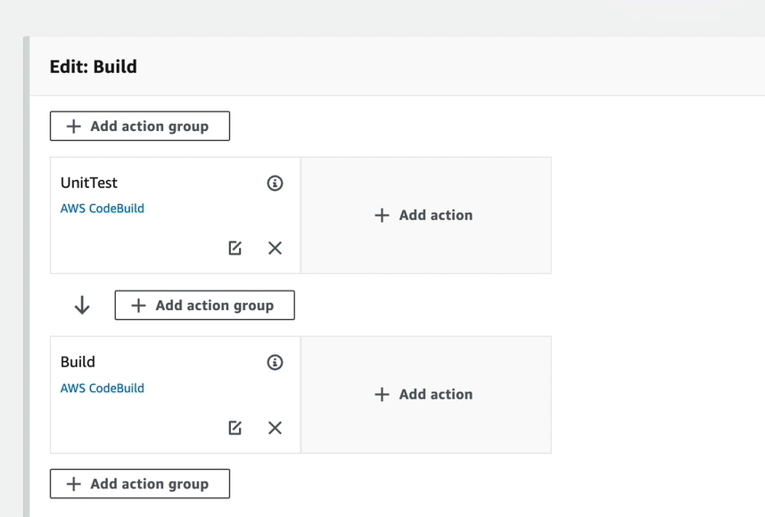
</p>

- Agregar el nuevo buildspec al repositorio y verificar que es lo que pasa.
- Si todo se hizo correctamente, deberiamos de ver que fallo en la etapa de UnitTest, a qué se debe esto?
  
<p align = "center">
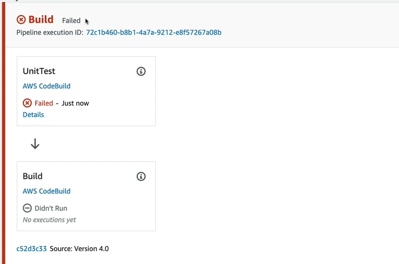
</p>

- Verificar los logs para ver que fue lo que paso.
- Alterar el cambio realizado para que se ejecute de manera correcta el pipeline.
