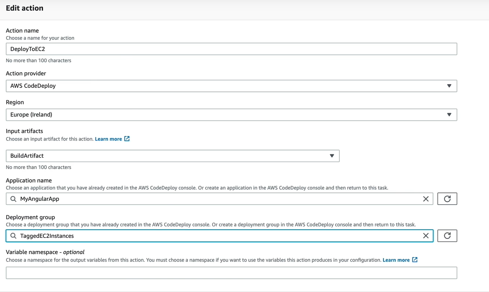

## Situación 4

Vamos a configurar nuestro pipeline:

<p align = "center">

</p>

Vamos a agregar que la intancia de deploy se realice mediante AWS CodeDeploy sobre una instancia EC2 que cuenta con un servidor web instalado.

### 1 - Generación de role para EC2

- Vamos a ir por consola y generaremos el role necesario para que nuestra instancia EC2 pueda comunicarse con el servicio de CodeDeploy:

<p align = "center">

</p>

- Le ponemos el nombre de WebServerRole.
- Verificar una vez creado cuales fueron los permisos que se le asignaron al role.
- Esta role lo asignaremos en el proximo paso en la opción de IAM.
### 2 - Generación instancia EC2

- Vamos a generar una instancia EC2 a la cual le instalaremos algunas dependencias necesarias como el agente de CodeDeploy y un servidor web.
- La instancia a generar va a ser una Amazon Linux 2 AMI, dejar los valores por defecto, IMPORTANTE agregar en los tags (se va a utilizar para desplegar luego, si lo obviamos no nos va a funcionar) la siguiente:
  -  Application : MyAngularProject
- Tambien es importante hacer el attach del role generado anteriormente.
- Dejar expuesto a internet los puertos 22 y 80 en el security group.
- Guardar la Key Pair para poder acceder a la instancia.
- Ejecutar todos los pasos que figuran en el archivo ec2-instance-commands.txt

### 3 - Crear CodeDeployment Application y Deployment Group

- Crear un Application con el nombre MyAngularApp y en compute platform elegir EC2/on-premises.
- Generamos un role que vamos a utilizar para desplegar sobre la instancia EC2, elegimos la policy de CodeDeploy y lo generamos con el nombre CodeDeployEC2ServiceRole.
- Volvemos a nuestro Application generado anteriormente y generamos un Deployment Group.
- Nombre TaggedEC2Instances.
- Le pasamos el role que generamos anteriormente.
- Modificamos el Enviroment configuration y elegimos Amazon EC2 instances y especificamos el tag generado anteriormente, esta es una de las manera para que se utilicen estas instancias para desplegar con CodeDeploy.
- Deshabilitar el Load balancer ya que solamente tenemos una única instancia.

### 4 - Agregar el CodeDeploy a nuestro pipeline

- Modificamos el pipeline y agregamos una nueva instancia de deploy, eliminamos la anterior de bucket S3.
- Debe de configurarse como muestra la imagen:

<p align = "center">

</p>

- Vamos a tener que agregar el appsec.yml al repositorio ya que es el archivo utilizado por el CodeDeploy, también vamos a tener que agregar el directorio deploy-scripts y su contenido en la raíz del directorio.
- Modificar el archivo buildspec.yml modificando el bloque de artifacts con el siguiente:

```
artifacts:
  files:
    - 'dist/my-angular-project/**/*'
    - appspec.yml
    - 'deploy-scripts/**/*'
```

- Mandar los cambios al repositorio y verificar que se haya ejecutado el pipeline de manera correcta, si todo salio bien debemos de ver nuestra aplicacion desplegada en la instancia EC2.