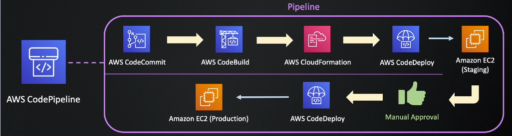
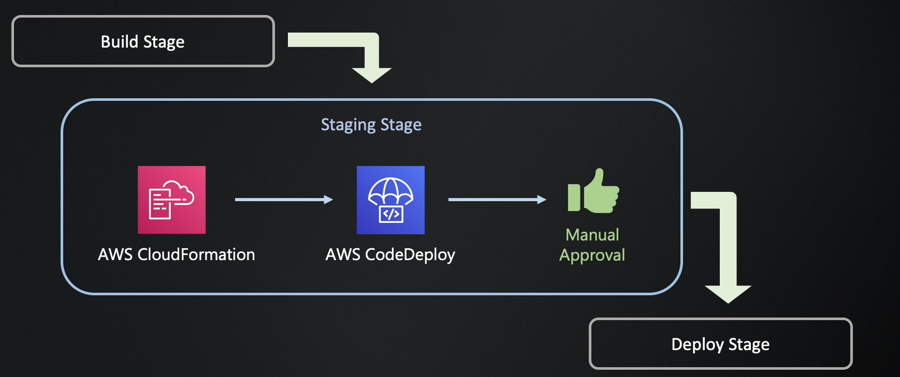
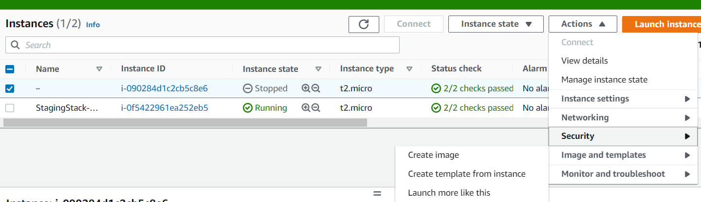
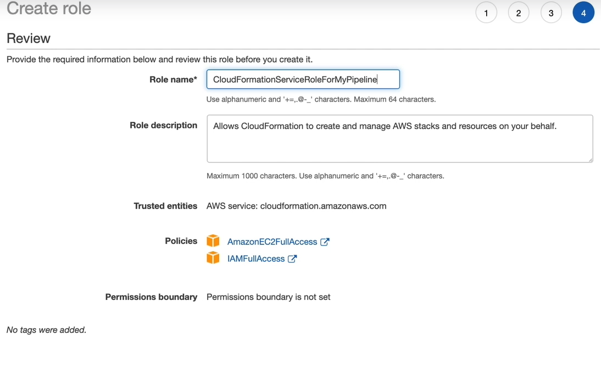
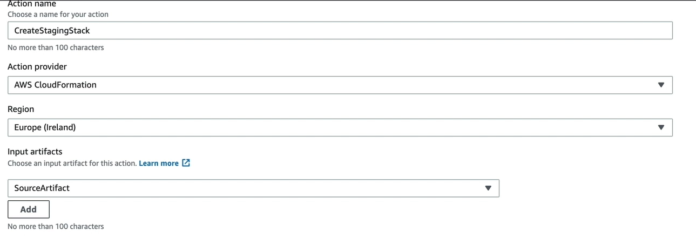
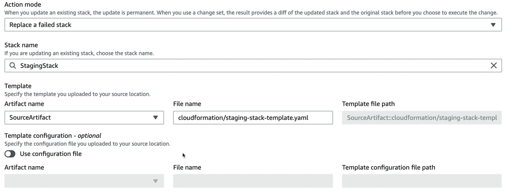
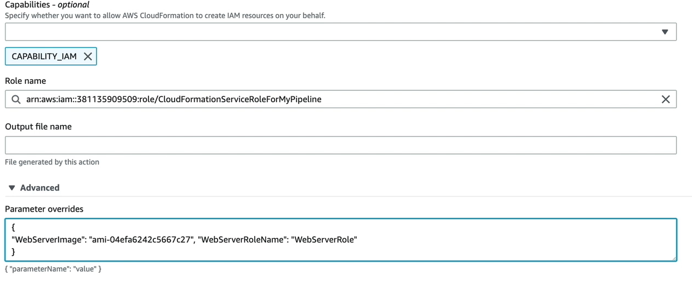
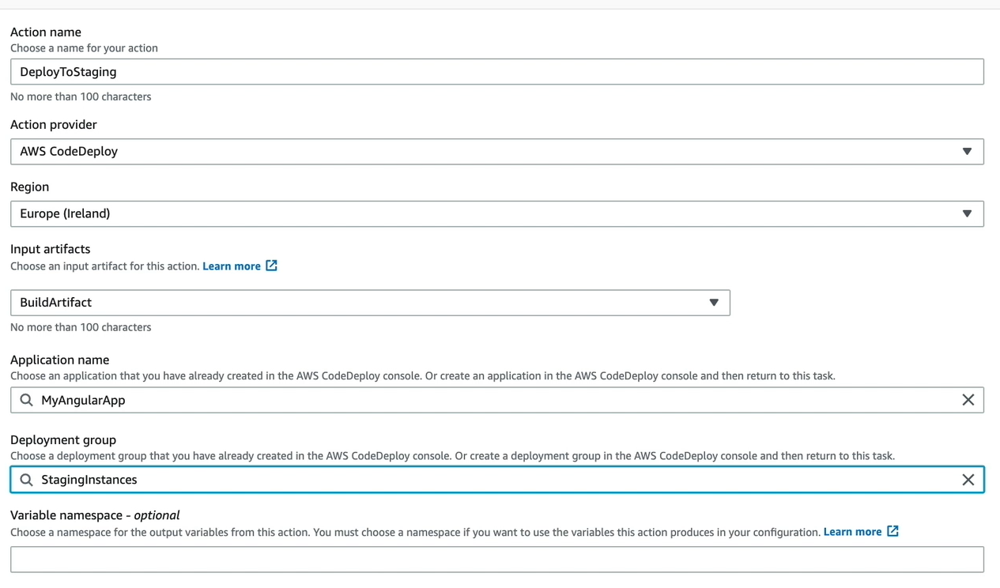
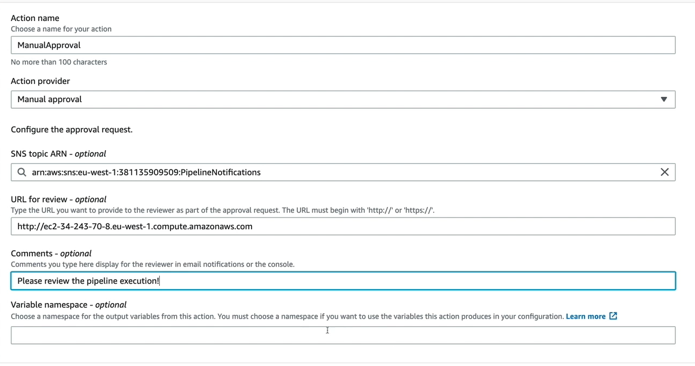

## Situación 5

Vamos a configurar nuestro pipeline:

<p align = "center">

</p>

Vamos a agregar código de ClouFormation para desplegar cierta infraestructura y que el deploy se realice de manera manual, tratando de simular el siguiente comportamiento:

<p align = "center">

</p>


### 1 - Generar una AMI a partir del servidor anterior

- Vamos a apagar la instancia que tenemos y vamos a generar una AMI para utilizarla como imagen base y no tener que configurar nuevamente todas las dependencias que instalamos anteriormente. La instancia tiene que estar apagar para hacer la imagen, si no se encuentra apagada no podremos generar la misma.
- Le especificamos el nombre web-server-ami y dejamos los demas valores por defecto.

<p align = "center">

</p>


### 2 - Generación de role para CloudFormation

- Vamos a ir por consola y generaremos el role necesario para CloudFormation con el nombre CloudFormationRoleServiceForCodePipeline como muestra la imagen:

<p align = "center">

</p>

- Modificar el role quedo con los suiguientes valores en el trusted relationships:

```
{
    "Version": "2012-10-17",
    "Statement": [
        {
            "Effect": "Allow",
            "Principal": {
                "Service": "ec2.amazonaws.com"
            },
            "Action": "sts:AssumeRole"
        },
        {
            "Action": "sts:AssumeRole",
            "Principal": {
                "Service": "cloudformation.amazonaws.com"
            },
            "Effect": "Allow"
        }
    ]
}
```

### 2 - Modificar nuestro pipeline

- Vamos a modificar nuestro pipeline agregando una nueva stage entre los stages de Build y Deploy, llamado Staging.
- Configuramos el step como muestran las imagenes:

<p align = "center">

</p>

<p align = "center">

</p>

- Verificar en la siguiente imagen que se agregan parametros como argumentos, el WebServerImage corresponde a la AMI generada anteriormente y el WebServerRole al role generado para el WebServer anteriormente. Si seguimos todos los pasos, el único valor a cambiar es el de WebServerImage ya que el ID de cada instancia es único.
```
{
"WebServerImage":"<VALOR_DE_AMI_GENERADA>","WebServerRoleName":"WebServerRole"
}
```

<p align = "center">

</p>

- Agregamos un Deployment group en CodeDeploy que vamos a utilizar luego en nuestro pipeline, llamado StagingInstances.
- Elegimos el role de EC2ServiceRole.
- Elegimos Amazon EC2 instances y agregamos el tag:
  - Environment : Staging
- Desactivamos el load balancer.
- Modificamos nuevamente nuestro pipeline en el step generado de Staging y agregamos el Deployment group generado recientemente como muestra la imagen:

<p align = "center">

</p>

- Realizamos cambio en la versión de la app y agregamos la carpeta de cloudformation que se encuentra en la carpeta del laboratorio.
- Verificamos que se ejecute el pipeline, si sale todo de manera correcta se debera de desplegar la infraestructura y desplegar el codigo de la aplicacion sobre esta instancia generada mediante CloudFormation


### 3 - Agregar manual approval al pipeline

- Vamos a generar un recurso de SNS el cual enviara un correo para que la aprobación del deploy se realice de manera manual.
- Vamos a generar un SNS llamado PipelineNotifications, toda la config se deja por defecto.
- Vamos a darle a Create susbcription, elegimos el protocolo de correo y ponemos nuestra direccion de correo, nos va a llegar un mail de confirmación el cual debemos de aceptar para empezar a recibir notificaciones.
- Modificamos nuestro pipeline en el stage de Staging, agregando un action group al final con la configuración como muestra la imagen:

<p align = "center">

</p>

- Enviamos un cambio en el codigo y veamos como se ejecuta el pipeline y luego al llegar a este punto nos va a solicitar aprobación manual para poder seguir.