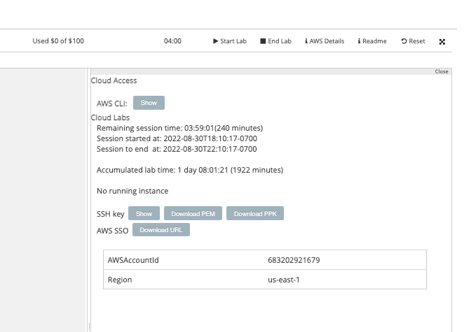
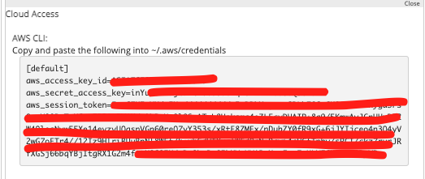

## Trabajando con la Cli de AWS

### Parte 5: Instalación de la Cli

La Cli de `AWS` se puede instalar tanto en Linux como en Windows. Para tener mejor experiencia de usuario e integración, se sugiere usar `WSL` e instalar la Cli dentro de la instancia de Linux.  

```bash
$ curl "https://awscli.amazonaws.com/awscli-exe-linux-x86_64.zip" -o "awscliv2.zip"
$ unzip awscliv2.zip
$ ./aws/install -i /usr/local/aws-cli -b /usr/local/bin
$ aws --version
```
Si quedó bien instalada la cli, la salida del `aws --version` debería ser similar a `aws-cli/2.0.41 Python/3.7.4 Darwin/20.6.0 exe/x86_64`.  

### Configuración de la Cli

Debemos de configurar los datos necesarios para conectarnos a `AWS` usando el acceso programático:  

* aws_access_key_id
* aws_secret_access_key
* aws_session_token

Estos datos los podemos encontrar en la consola de Vocareum, en `AWS Details`, bajo el botón `Show`.  

<p align = "center">

</p>

<p align = "center">

</p>


Luego de que tenemos los datos, debemos de configurarlos usando el comando `aws configure`.  

Este comando va a solicitar que se ingrese, el `aws_access_key_id`, `aws_secret_access_key`, `Default region name` y `Default output format`.  

```aws configure
AWS Access Key ID []: _ingresar string de aws_access_key_id_
AWS Secret Access Key []: _ingresar string de aws_secret_access_key_
Default region name [us-east-1]: us-east-1
Default output format [yaml]: yaml
```

El `aws configure` no solicita el `aws_session_token` por lo que debemos de ingresarlo a mano.  

`aws configure set aws_session_token "_ingresar string de aws_session_token_"`  

Podemos probar hacer un `aws ec2 describe-instances` para validar que las credenciales se ingresaron correctamente. Este comando debería de traer información de todas las instancias, sin importar si su estado es `Running` o `Stopped`. En caso de no haber instancias, debería de mostrar simplemente corchetes (`[]`).  

### Ejemplos

#### Crear una instancia de EC2

`aws ec2 run-instances --image-id ami-identificador --count 1 --instance-type t2.micro --key-name MyKeyPair --security-groups nombre-sg --tag-specifications 'ResourceType=instance,Tags=[{Key=Name,Value=nombre-instancia}]'`  

#### Obtener Info de una instancia de EC2 según su nombre (Tag Name)

`aws ec2 describe-instances --filters "Name=tag:Name,Values=nombre-instancia"`

#### Terminar una instancia

Para esto es necesario mirar el valor de `InstanceId` del comando anterior para poder usarlo.  

`aws ec2 terminate-instances --instance-ids InstanceId`

### Ejercicios

* Crear una instancia:
  * AMI: `ami-0533f2ba8a1995cf9` (Sino está disponible usar cualquier AMI)
  * Tipo: `t2.micro`
  * Nombre: instancia-desde-cli
* Investigar
  * Como crear un Security Group que permita el puerto 80
  * Asociarle el security group a la instancia creada
* Terminar la instancia

#### Spoiler Alert

En caso de trancarse, se puede consultar la [solución](./soluciones/5-Solucion_aws-cli.md).
