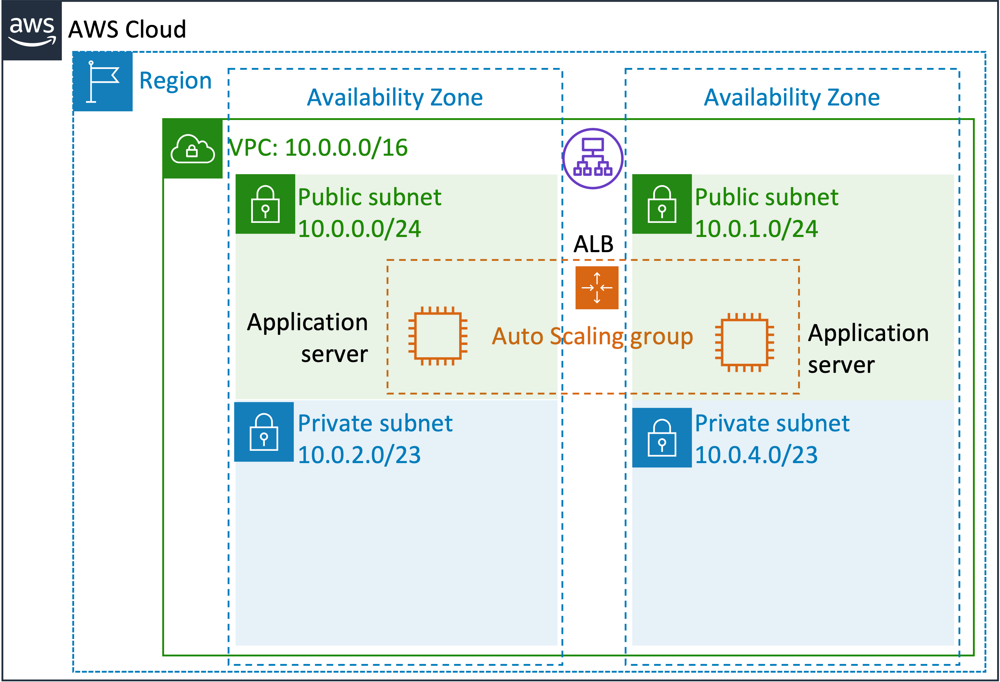
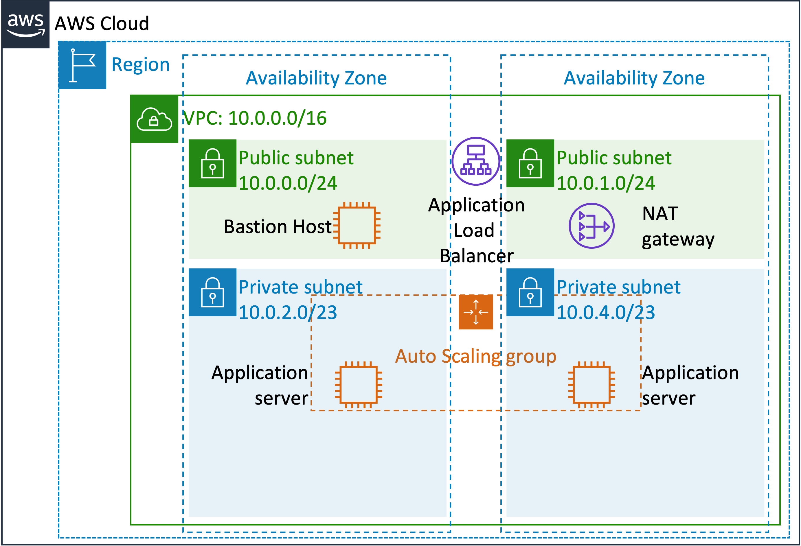

## Ejemplo Integrador

### Parte 7a: Desplegando una arquitectura completa

Bienvenidos al práctico "Desplegando una arquitectura completa". Esto es una recopilación de todos los prácticos y conceptos aprendidos hasta el momento.

* Lo que tendrán que hacer es:
  * Desplegar `dos` instancias a partir de una AMI custom
  * La instancia de EC2, debe desplegarse bajo un `Auto-scaling Group`
  * Debe estar balanceada por un `Application Load Balancer`
  * Ambas instancias deben estar en diferentes `subnets` y con un `vpc` dedicado
  * La aplicación debe estar disponible (es decir, debe cargar)
  
Los recursos desplegados deben ser los siguientes:

### Parte 7b: Desplegando una arquitectura segura

Ahora vamos a usar las redes privadas. La idea es desplegar las instancias en las redes privadas, conectándolas a internet a través de un `Nat Gateway` desplegado en la Red Pública (la que tiene conectividad con el `IGW`). Además, deben desplegar un bastión host para conectarse por SSH a las instancias privadas. 

