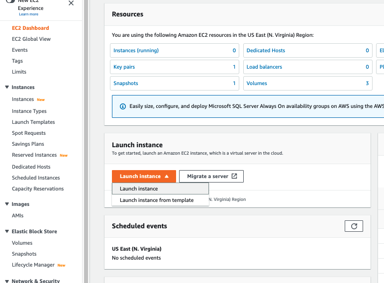
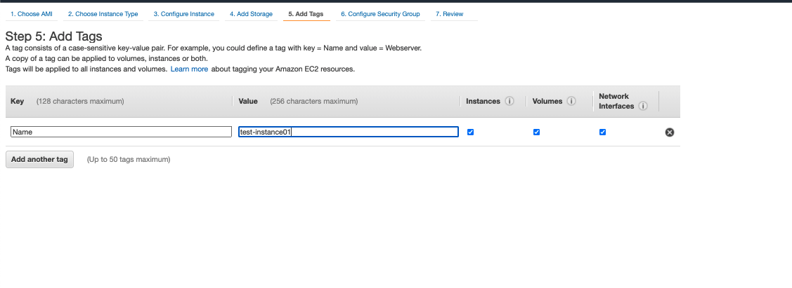

### Solución parte 1

En la consola de EC2 ubicar el botón **_Launch Instance_**  

Seleccionar la AMI: **_Amazon Linux_**  

Seleccionar el tipo de instancia: **_t2.micro_**  

En **_Configure Instance_** desplegar el listado de **_Subnets_** y seleccionar **_us-east-1a_**  

En **_Storage_** dejar como está.  

En **_Tags_** agregar un nuevo Tag con la key **_Name_** y el value **_test-instance01_**.  

Crear un nuevo security group de nombre **_permitir-ssh_** y verificar que la regla esté correcta.  

Seleccionar la opción **_Create a new key pair_** y descargar el archivo .pem en un lugar accesible desde consola y un cliente ssh.  

