### Solución parte 2: "Balanceando Instancias"

En la consola de **EC2** ir a la sección de **_Load Balancers_**  

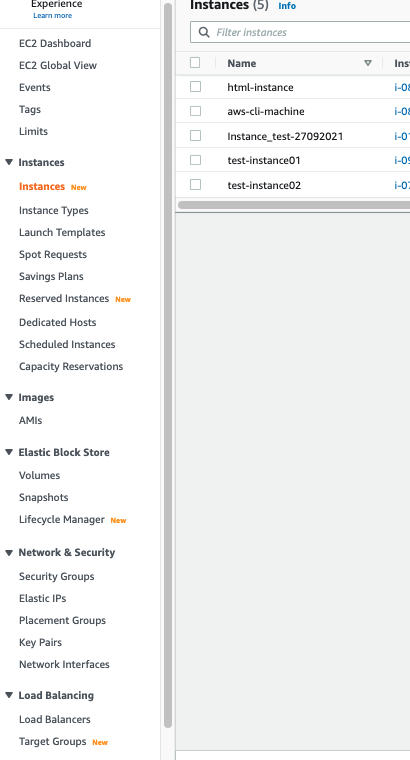

Seleccionar el boton **_Create Load Balancer_**

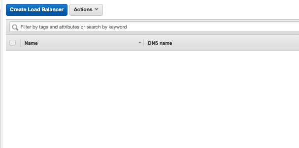

Seleccionar **_Application Load Balancer_**

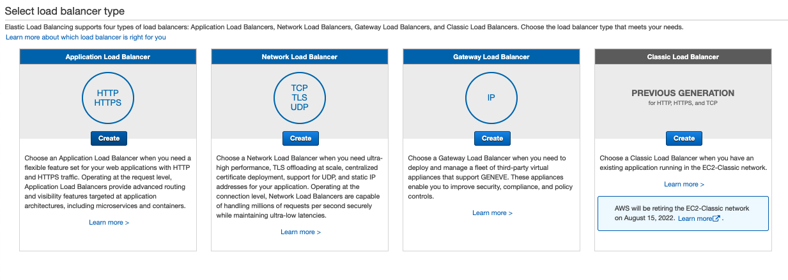

**Step 1: Configure Load Balancer** - Completar los campos necesarios:  

* **_Name_**
* **_Listeners_**: HTTP
* **_Availability Zones_**: Seleccionar las AZs donde esta cada una de las instancias. (us-east-1a y us-east-1b)

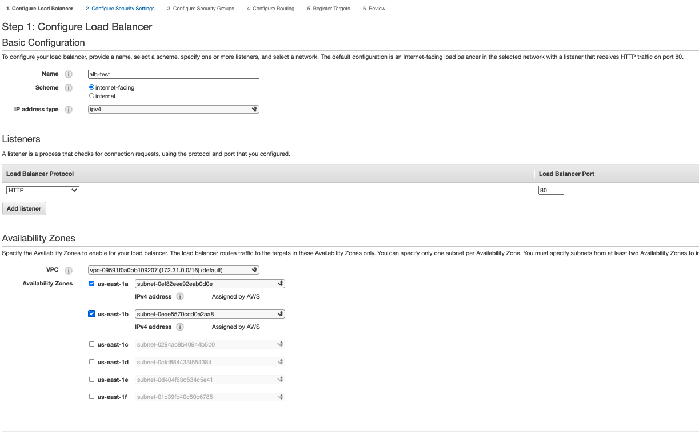

**Step 3: Configure Security Groups** - Crear un Security Group que permita el acceso al puerto HTTP 80.  

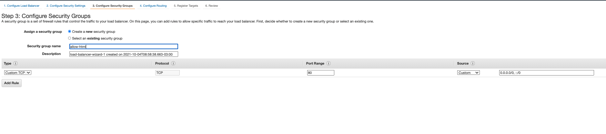

**Step 4: Configure Routing** -  Completar los datos necesarios del formulari.  

* **Nombre del target Group**: 
* **Target Type**: Instance
* Bajo Health Checks, en **Path** agregar **_/index.html_**

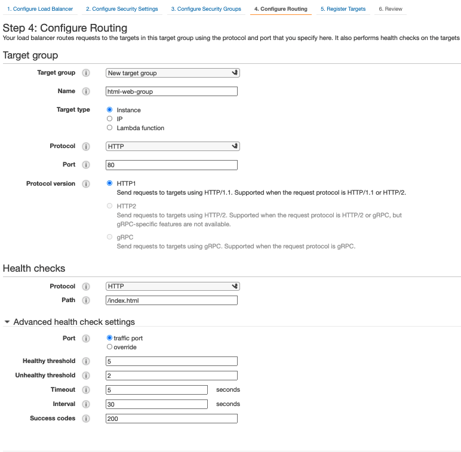

**Step 5: Registrar targets** - Agregar las instancias creadas en el lab anterior.  

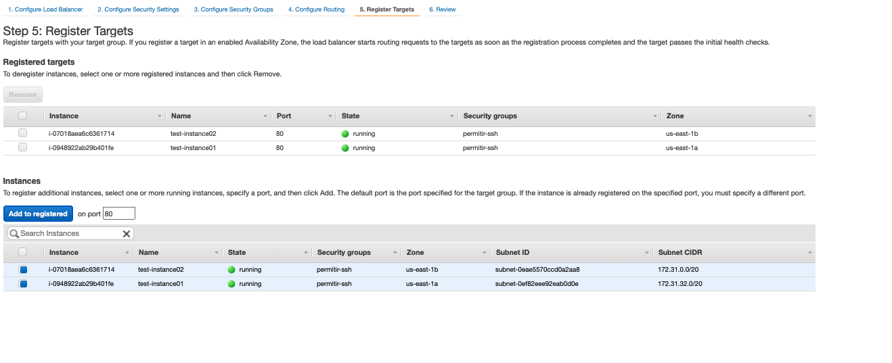

Si todo sale bien deberemos de obtener un mensaje similar al siguiente:  

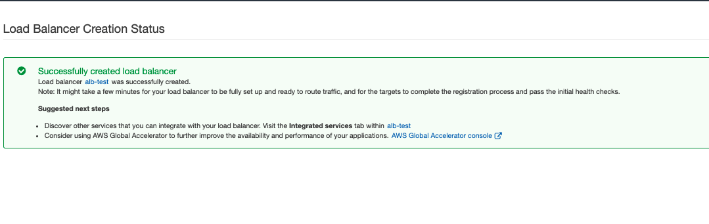

Luego de que volvemos a la consola de Load Balancers debemos de esperar que el estado cambie de **_Provisioning_** a **_Active_** para poder verificar el acceso a la aplicación.  

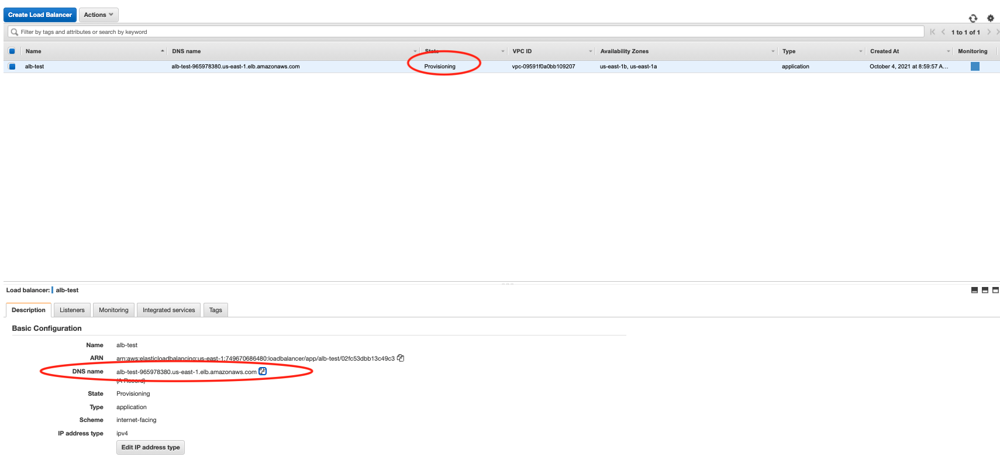

### Permitiendo tráfico HTML a las instancias.

Probablemente no pudieron acceder al contenido web debido a que la instancia no tiene un **Security Group** que permita la entrada al puerto http 80. Para lograr esto, podemos reutilizar el **Security Group** creado para el ALB y agregárselo a la instancia.  
También podemos agregar una regla de **Inbound** al **Security Group** que creamos para la instancia permitiendo el tráfico.  

Para agregar un Security Group a una instancia ya creada hay que seleccionar la Instancia en la consola, ir al menu **Actions**, luego a **Security** y finalmente **Change Security Groups**  

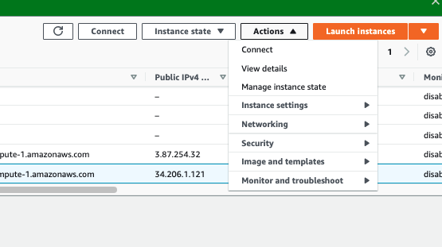

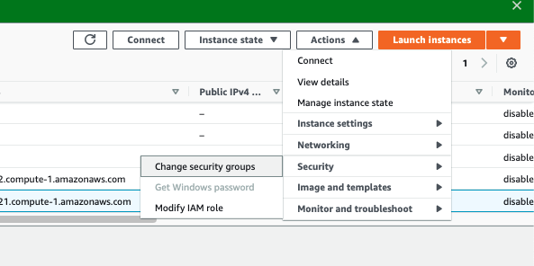

En **Associated Security Groups** buscar el SG creado para el ALB y agregarlo. Luego apretamos el botón **Save**

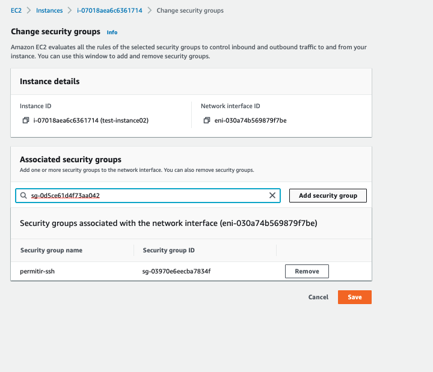

