### Solución parte 3: Auto-scaling Groups

En la consola de `EC2` en el menú drop-down `Instances` podemos encontrar el Feature de `LT`. Luego `Create launch template`.  

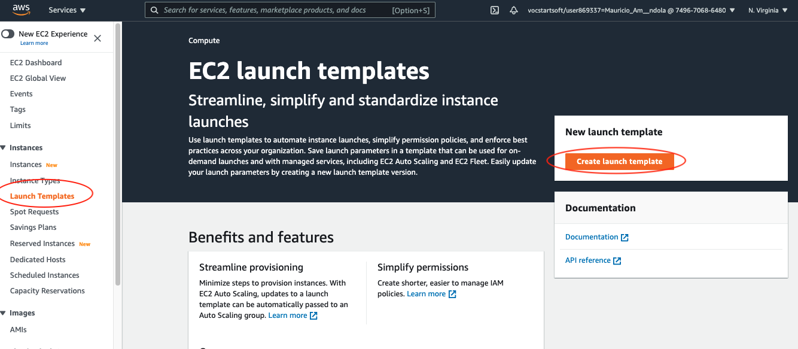

Colocar el nombre del `LT`: `test-lt-devops`  

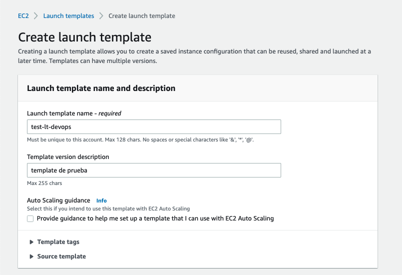

Usar la `AMI` con Id `ami-02f3f602d23f1659d`  

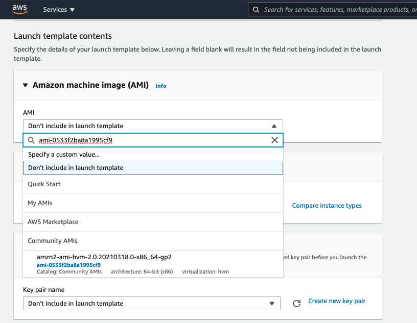

Seleccionar la instancia tipo `t2.micro` y una key que ya hayan creado.  

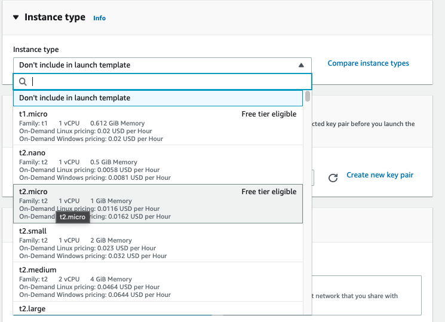

Bajo Network Settings, dejar la opción seleccionada `VPC`  

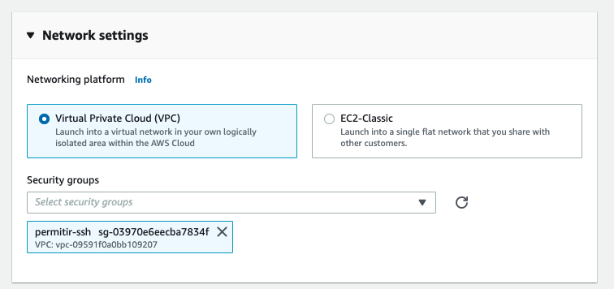

Dejar todas las opciones restantes por omisión.  

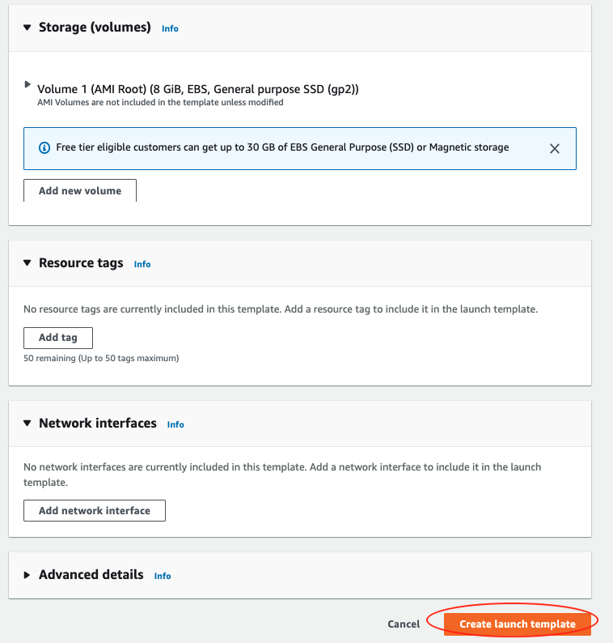

Podemos verificar el `LT` creado, debería de ser similar al siguiente:  

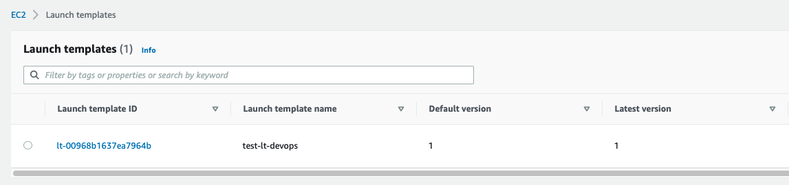

Luego, en el menú de la izquierda, al final de todo tenemos el drop-down para `Auto Scaling`. Ahí seleccionamos `Auto Scaling Groups`.  

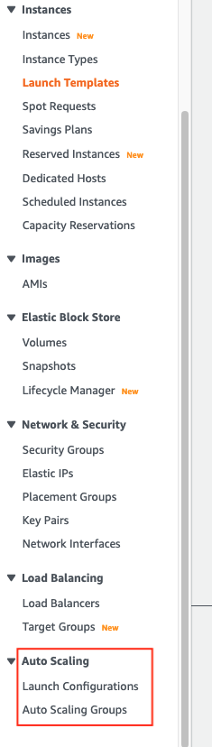

Ir a `Create Auto Scaling Group`  

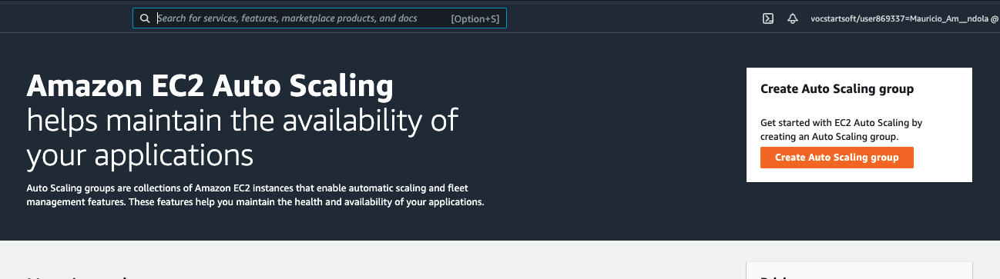

#### Step 1: Choose launch template

Colocar el nombre `asg-devops` y seleccionar el template `test-lt-devops`.  

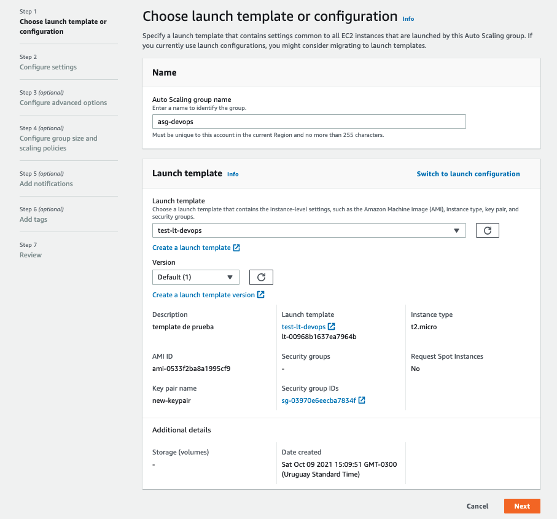

#### Step 2: Configure settings

Seleccionar subnets `us-east-1a` y `us-east-1b`.  

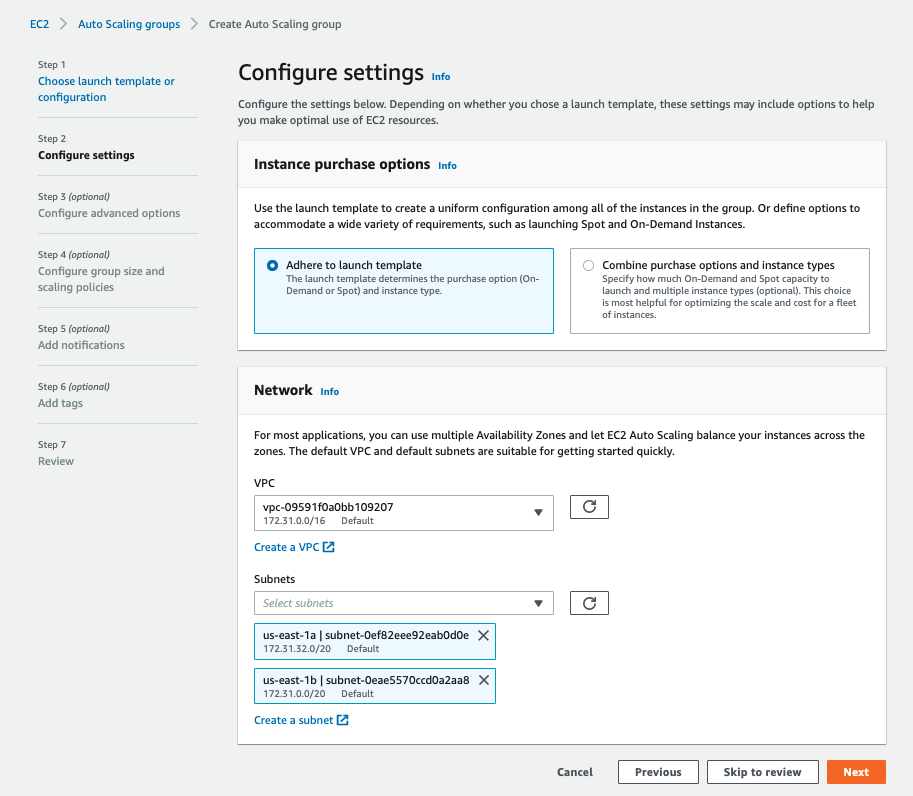

#### Step 3: Configure Advanced options

Acá podemos asociar este `LT` a un `Load Balancer` existente. Este nos permite agregar y sacar del `Load Balancer` aquellas instancias que el `ASG` crea o termina de forma automática.  

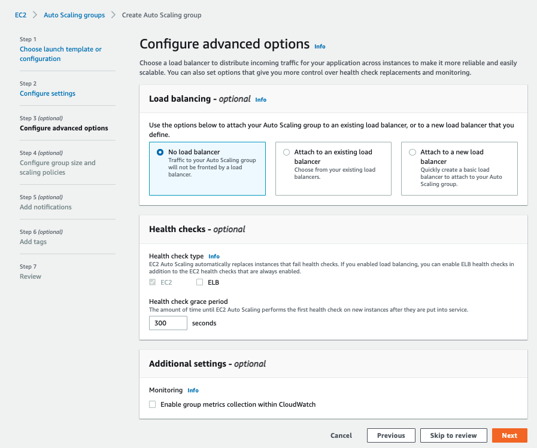

#### Step 4: Configure group size and scaling policies

Aca podemos configurar el comportamiento del `ASG`, es decir, bajo que condiciones escala y hacia que cantidad de instancias lo hace. Por ejemplo, si el `Tracking Scaling Policy` fuese por CPU, podemos configurar para que escale si el consumo de CPU sobre pasa un determinado umbral.  

Acá debemos configurar el `Desired Capacity` y `Minimum Capacity` en 1 y el `Maximum Capacity` en 2.  

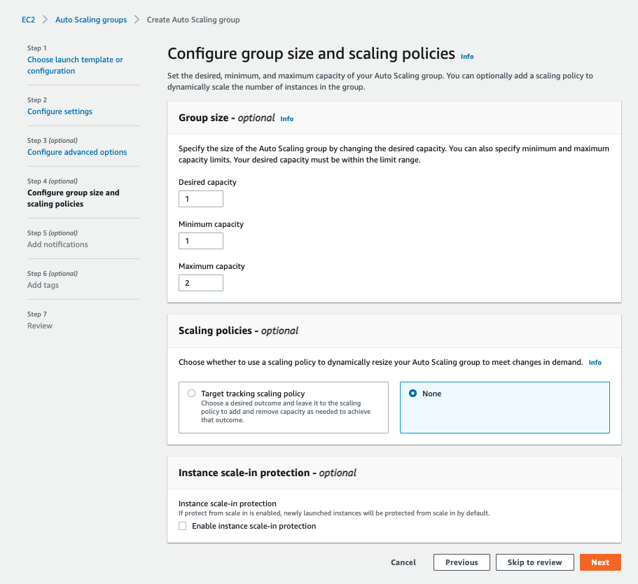

#### Step 5: Add notifications

Podriamos configurar notificaciones a una cuenta de mail en caso de que el `ASG` escale.  

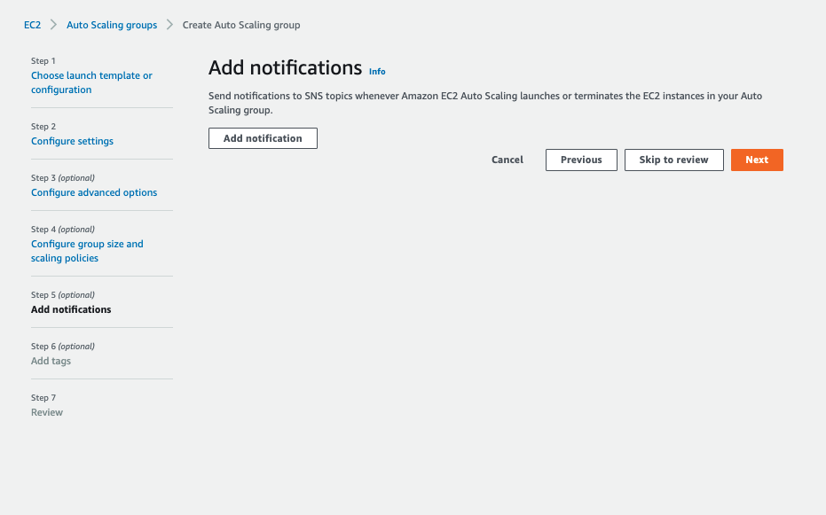

#### Step 6: Add tags

Si queremos podemos agregar un `Tag` para que identifique a la instancia. Por ejemplo:  
* Key: `ASG`
* Value: `true`  

Luego de todos los pasos, debemos de comprobar que el `ASG` comience a crear las instancias. Para eso, deberíamos de ver en el status `Updating capacity`. Podemos verificar si la instancia está en Pending, directamente en la parte de `Instances`.  

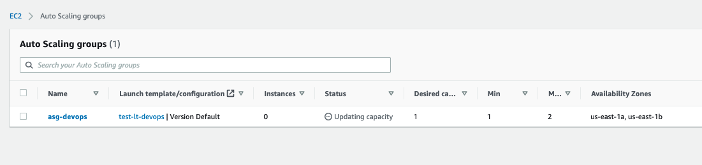

Finalmente podemos verificar que la instancia se haya creado sin inconvenientes.  

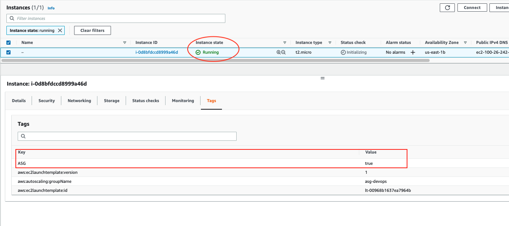

