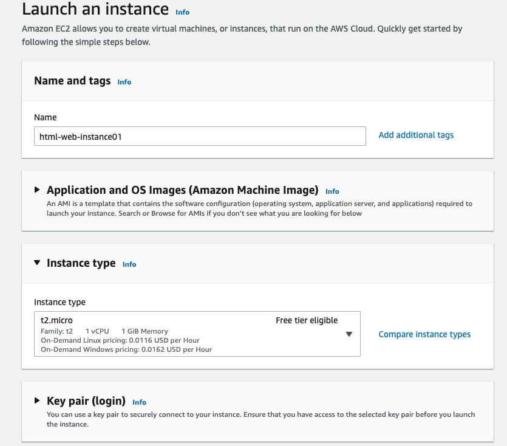
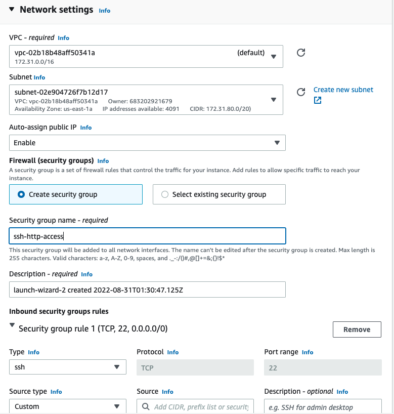
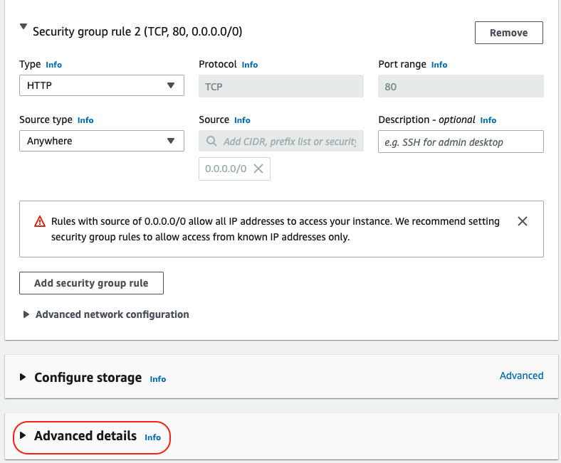
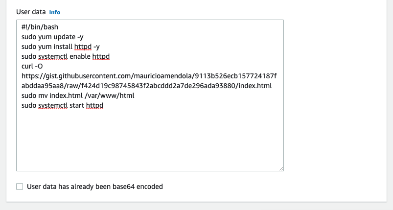
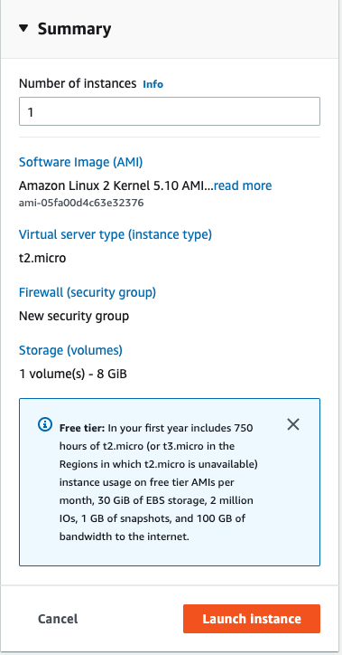
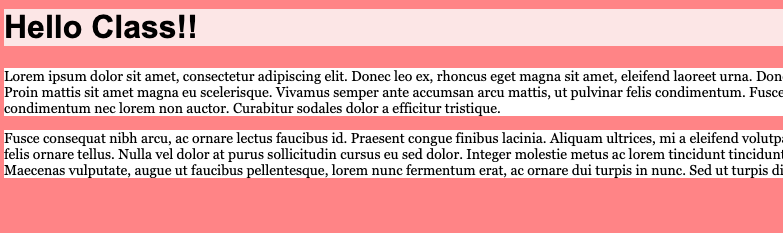
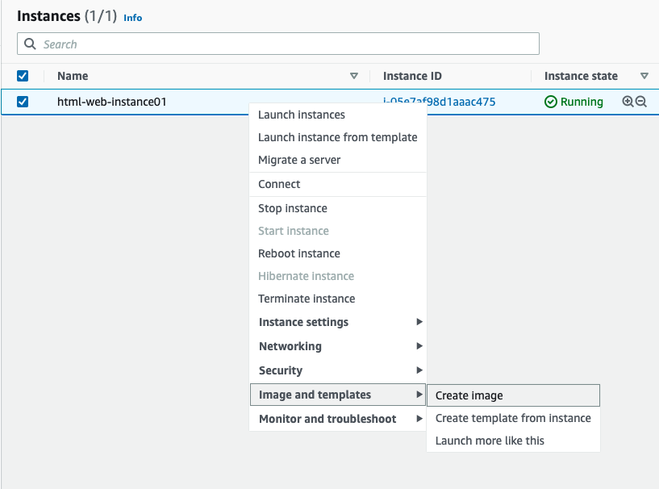
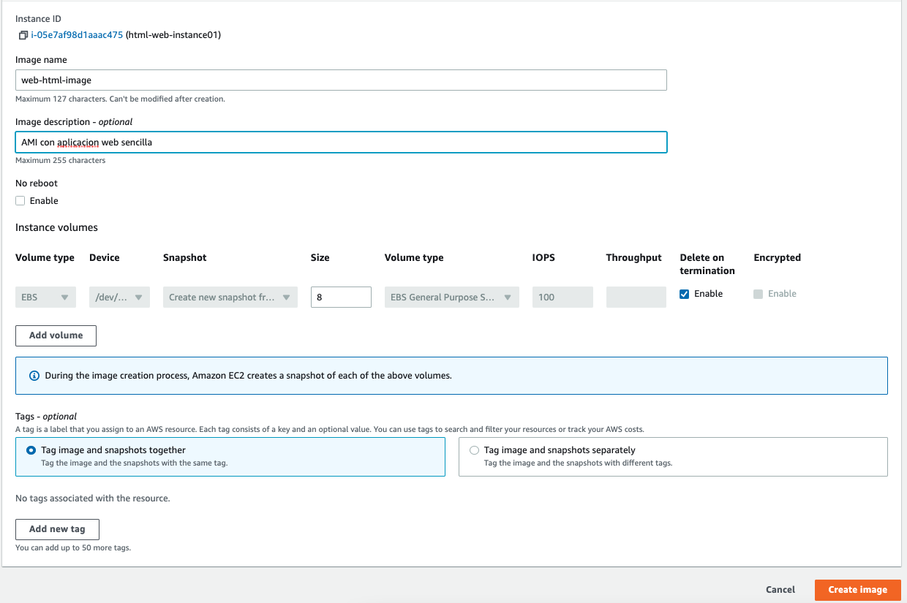
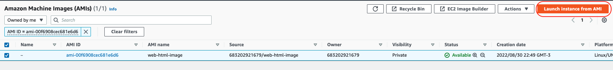

## Solución parte 4: Desplegando instancias Custom

### Parte A

Para modicar la configuración del `Networking` debemos de clikear el botón **Edit**

Debemos de expandir **Advanced details** para colocar el código en el bloque `user-data` al final.

El resultado deberia ser el siguiente:

### Parte B

Sobre la instancia que queremos usar para generar la `AMI` hacemos botón derecho:

Llenamos los datos y le damos **Create image**

Luego, desde la misma ventana de creación de la `AMI`, podemos desplegar una instancia.

