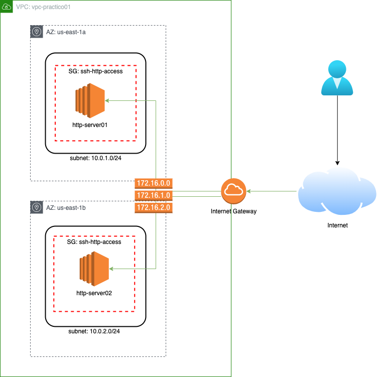

## Parte 1: Configurando un nuevo VPC

### Objetivos

Dado el siguiente diagrama de arquitectura, se deben desplegar todos los componentes que en el se representan.
    

* Crear un nuevo `VPC`
  * Name: vpc-practico01
  * CIDR: 10.0.0.0/16
* Crear dos nuevas `Subnets` asociadas a la AZ `us-east-1a` y `us-east-1b`
  * CIDR Subnet1: 10.0.1.0/24
  * CIDR Subnet2: 10.0.2.0/24
* Crear un `Internet Gateway`
* Crear una default `Route Table`
* Crear un `Security Group` que permita el acceso por **SSH** y **HTTP**
* Crear una instancia para cada subnet creada

#### Spoiler Alert

En caso de trancarse, pueden consultar la ayuda [aquí](./soluciones/1-Solucion_configurando_vpc.md).

