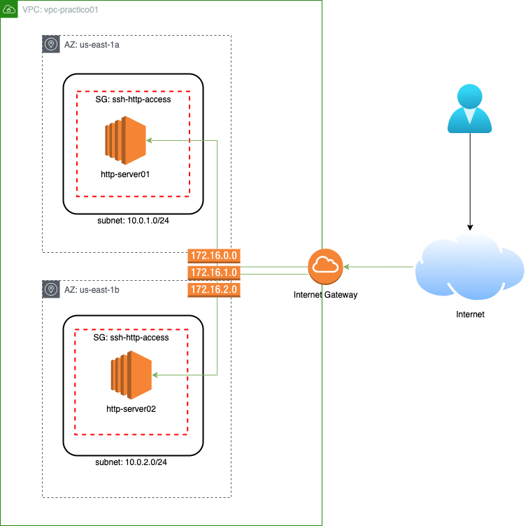

## Parte 2: Trabajando con la cli

### Objetivo: Cli + VPC

Re-utilizando lo aprendido en el práctico anterior, se debe crear los mismos recursos usando la interfaz de línea de comando.
    
<p align = "center">

</p>

* VPC
* Subnet
* Security Group
* Internet Gateway
* Default Route Table
* Instancia de EC2

#### Referencias

Las acciones que involucran la creación de recursos, a menudo comienzan con la palabra `create-` por ejemplo, para crear un VPC el comando sería `aws ec2 create-vpc ...`. Se puede consultar las ***Manpages*** del comando con `aws ec2 create-vpc help` para obtener un listado completo de opciones.

```bash
$ aws ec2 create-vpc
usage: aws [options] <command> <subcommand> [<subcommand> ...] [parameters]
To see help text, you can run:

  aws help
  aws <command> help
  aws <command> <subcommand> help
aws: error: the following arguments are required: --cidr-block
```

#### Spoiler Alert

En caso de trancarse, se puede consultar la [solución](./soluciones/2-Solucion_VPC-Cli.md).