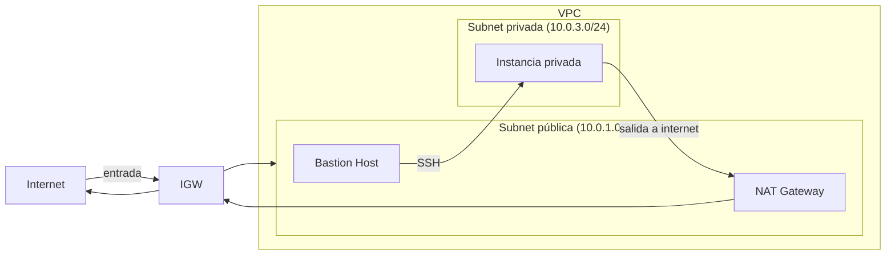

## Subnets Públicas y Privadas

> **Tiempo estimado:** 45 minutos

### Prerequisitos

* Haber completado los labs anteriores (Configurando un VPC, VPC con AWS CLI)

### Objetivos

El patrón más común en AWS es separar los recursos en subnets **públicas** (accesibles desde internet) y **privadas** (solo accesibles internamente). Este lab implementa esa arquitectura desde cero.



### Recursos a crear

**VPC y subnets:**
* VPC: `10.0.0.0/16`, habilitar DNS hostnames
* Subnet pública 1: `10.0.1.0/24` → AZ `us-east-1a` (auto-assign public IP: enabled)
* Subnet pública 2: `10.0.2.0/24` → AZ `us-east-1b` (auto-assign public IP: enabled)
* Subnet privada 1: `10.0.3.0/24` → AZ `us-east-1a` (auto-assign public IP: **disabled**)
* Subnet privada 2: `10.0.4.0/24` → AZ `us-east-1b` (auto-assign public IP: **disabled**)

**Routing para subnets públicas:**
* Internet Gateway → asociar al VPC
* Route Table pública: ruta `0.0.0.0/0 → IGW` → asociar subnets públicas

**NAT Gateway (salida a internet para recursos privados):**
* Crear un **Elastic IP** (`EC2 > Elastic IPs > Allocate`)
* Crear **NAT Gateway** en la subnet pública 1, asignarle el Elastic IP
* Esperar a que el estado sea `Available` (~1 min)
* Route Table privada: ruta `0.0.0.0/0 → NAT Gateway` → asociar subnets privadas

**Security Groups:**
* SG Bastion: inbound SSH (22) desde tu IP pública únicamente
* SG App: inbound SSH (22) **solo desde el SG del Bastion** (no desde 0.0.0.0/0)

**Instancias EC2:**
* **Bastion Host**: en subnet pública 1, SG Bastion, con par de claves
* **Instancia privada**: en subnet privada 1, SG App, con el mismo par de claves

### Verificación

**1. Conectarse a la instancia privada vía Bastion (SSH ProxyJump):**

```bash
ssh -J ec2-user@<bastion-public-ip> ec2-user@<private-ip>
```

En Ubuntu reemplazar `ec2-user` por `ubuntu`.

> El flag `-J` indica que el primer host es un "jump host" — SSH pasa por el Bastion automáticamente sin necesidad de copiar la clave privada al Bastion.

**2. Desde la instancia privada, verificar salida a internet:**

```bash
curl https://checkip.amazonaws.com
```

Debe retornar la IP del NAT Gateway (no la IP privada de la instancia).

**3. Verificar aislamiento:** intentar hacer SSH directo a la IP privada desde tu máquina — debe fallar (timeout), confirmando que no es accesible desde internet.

### Para investigar

* ¿Qué pasa si se elimina el NAT Gateway? ¿La instancia privada puede seguir descargando paquetes?
* ¿Por qué el Bastion no debería tener acceso SSH abierto a `0.0.0.0/0`?
* ¿Qué ventaja tiene SSH ProxyJump frente a copiar la clave privada al Bastion?

### Limpieza de recursos

> **Importante:** El NAT Gateway y el Elastic IP generan costo aunque no haya tráfico. Eliminar al terminar.

1. Instancias EC2 (Bastion e instancia privada)
2. `VPC > NAT Gateways` → eliminar el NAT Gateway (esperar estado `Deleted`)
3. `EC2 > Elastic IPs` → release del Elastic IP
4. Subnets (las 4)
5. Route Tables (las dos creadas, no la default del VPC)
6. Internet Gateway: desasociar del VPC, luego eliminar
7. Security Groups (los dos creados, no el default del VPC)
8. VPC

```bash
# Alternativa CLI para los pasos más costosos (NAT GW y EIP)
aws ec2 delete-nat-gateway --nat-gateway-id <ngw-id>
# Esperar estado deleted antes de continuar
aws ec2 release-address --allocation-id <eip-alloc-id>
```
