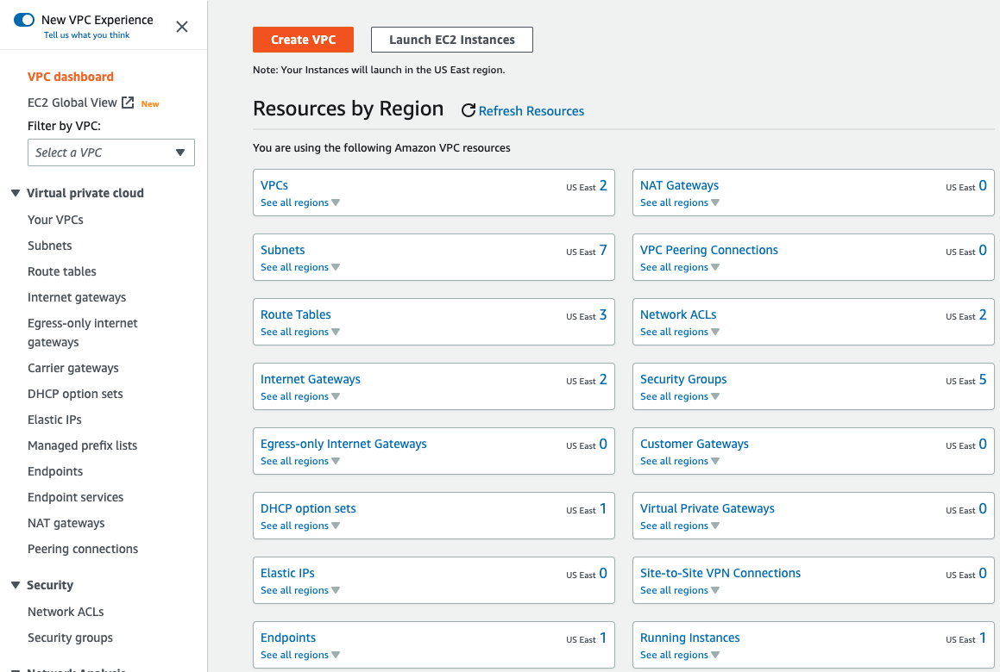
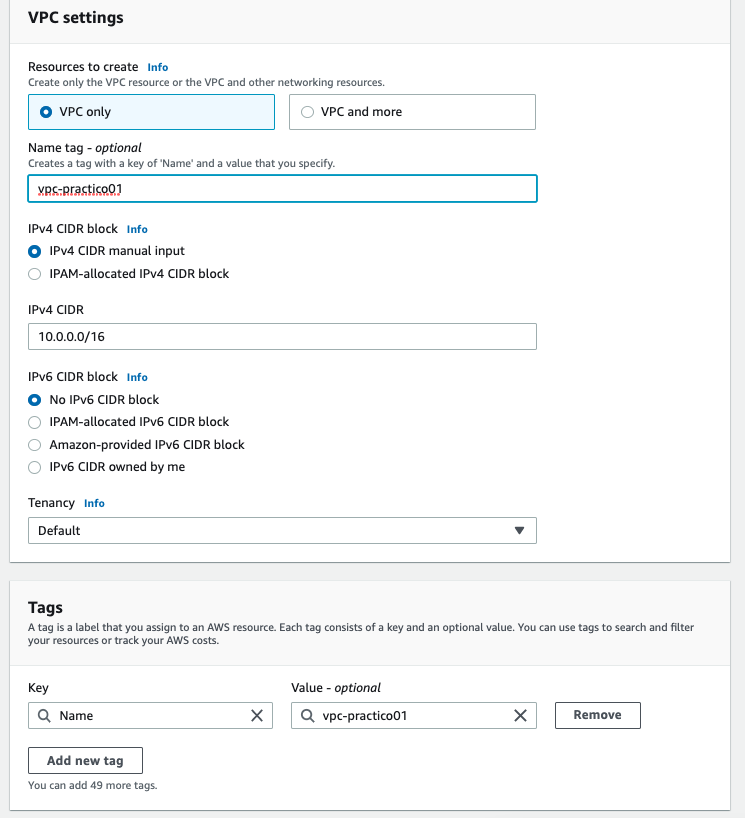
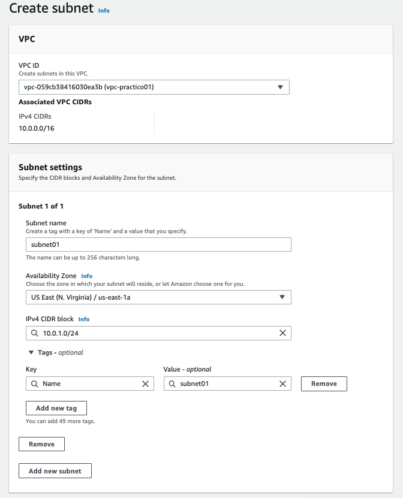
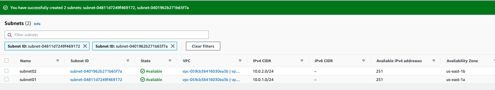
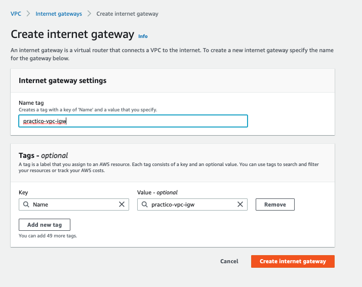
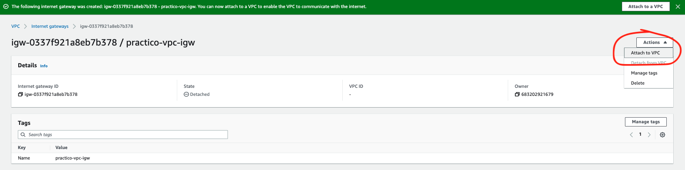
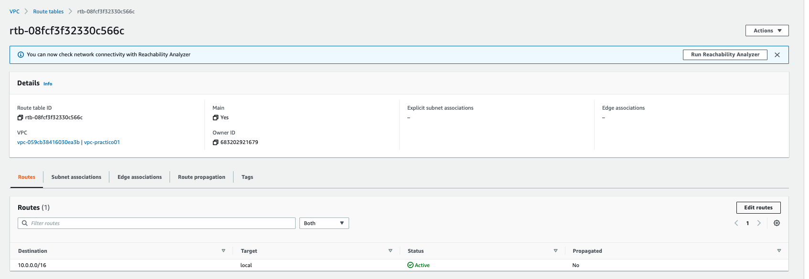
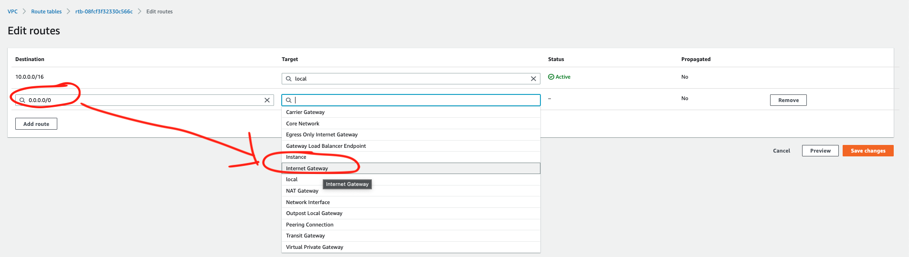

## Solución T/P VPC

Vamos a crear un VPC y todos los componentes necesarios, uno a uno, sin utilizar el wizard que crea todos los componentes de una sola vez.

1. Vamos a la consola de VPC y le damos al botón **Create VPC**.

2. Seleccionamos la opción **"VPC Only"** y llenamos los campos necesarios.

3. Creamos la **Subnet** desde la consola de VPC también

4. Creamos el **Internet Gateway** desde la consola de VPC

5. Asociamos el Internet Gateway recién creado, al VPC

6. Identificamos la **Route Table** que se crea automáticamente con la creación del VPC y le agregamos una ruta para que el tráfico hacia internet (0.0.0.0/0) se vaya a través del Internet Gateway.

