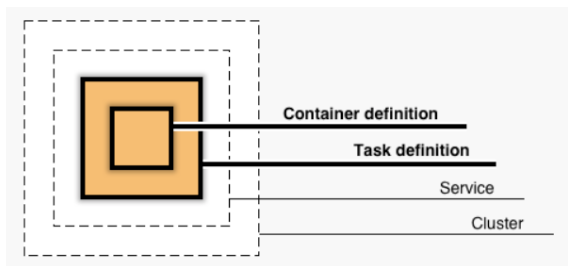
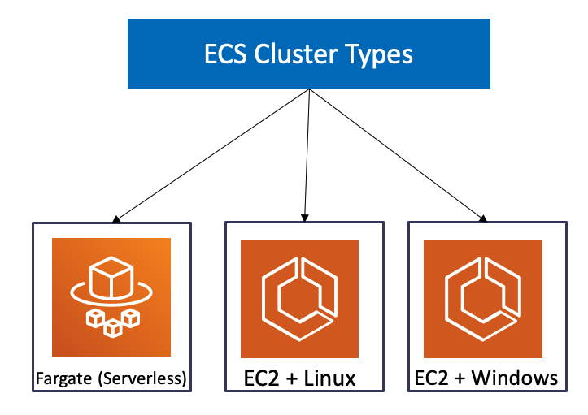
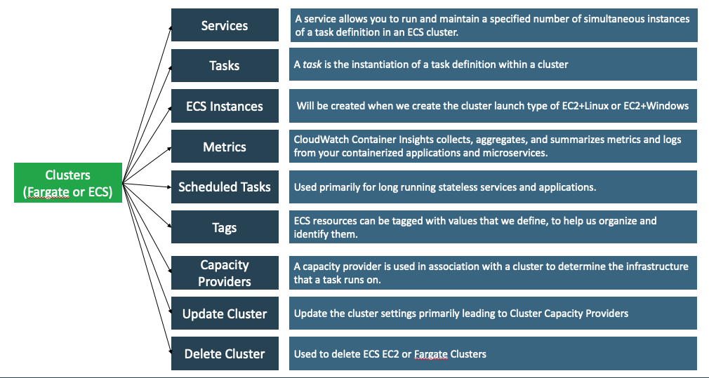
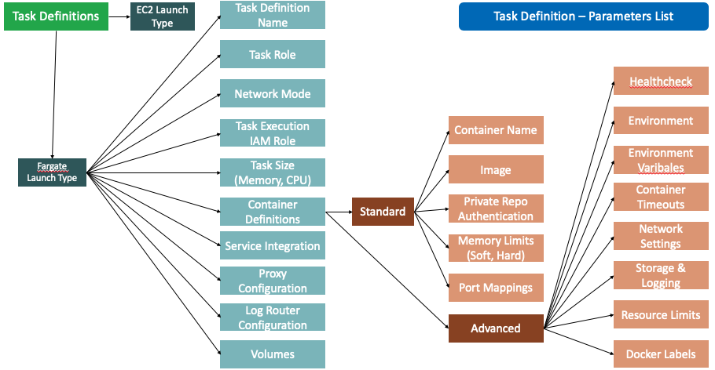

## 1 - Conceptos generales ECS

### ECS Architecture

- **Container definition:** 
    - Imagen del container y configuraciones a nivel del container (container image, port, registry, environment variables que se le pasan al container, etc.).
- Task definition: 
    - El task definition es un modelo para nuestra aplicación y describe uno o más contenedores a través de atributos.
    - Muy pocos atributos están configurados en el, pero la mayoría de los atributos están configurado por contenedor.
- Service:
    - Un service le permite ejecutar y mantener un número específico (el "desired count") de instancias simultáneas de una definición de tarea en un clúster de ECS.
- Fargate cluster:
    - AWS administra completamente la infraestructura en un clúster de Fargate. Nuestros contenedores se ejecutan sin que administremos ni configuremos instancias individuales de Amazon EC2.
- Task:
    - Una task es la instanciación de una task definition dentro de un clúster.
    - Una vez que hayamos creado una task definition para nuestra aplicación dentro de Amazon ECS, podemos especificar la cantidad de tasks que se ejecutarán en nuestro clúster (ejecutar la task directamente o configurar para que se ejecute desde un servicio).
    - Cada task que utiliza el tipo de lanzamiento Fargate tiene su propio límite de aislamiento y no comparte kernel, los recursos de CPU, los recursos de memoria o la interfaz de red elástica con otra tarea.

### Cluster types

- Tenemos dispinibles 3 tipos de templates de cluster para desplegar sobre ECS:
    - Fargate (serverless).
    - EC2 - Linux.
    - EC2 - Windows.
- Un cluster de ECS es una agrupación logica de tasks o services.
- Los cluster con especificos de regiones.
- Los cluster pueden contener tasks que utilicen tanto Fargate como EC2 launch types.

### ECS features

### Task definition and task definition parameters

- Task definition:
    - Un task definition es requeridos para correr Docker container en AWS ECS.
    - Una task definitioin es un modelo para nuestra aplicación y describe uno o más contenedores a través de
    atributos.
    - Algunos atributos se configuran a nivel de tarea, pero la mayoría de los atributos se configuran por
    envase.
- Task definition parameters (core)
    - La Docker image a usar por cada uno de los containers en las tasks.
    - Que tanto CPU y memoria va a usar cada task.
    - El launch type a utilizar, que va a determinar sobre que infraestructura se van ser hosteadas las tasks (EC2 o Fargate).
    - La modalidad del Docker networking a utilizar por los containers en nuestros tasks (Fargate soporta solamente awsvpc, pero EC2 soporta los modelos de docker networking como bridged, host, none y también awsvpc).
    - La configuración de logs para nuestras tasks.
    - Que debe de ocurrir cuando el contenedor finaliza o falla.
    - Cualquier volumen de datos que vaya a ser utilizado por los tasks.
    - Y varias parametrizaciones más...

## Próximos pasos
Para el siguiente paso del laboratorio, diríjase a [2 - Crear cluster ECS](../02-Crear-Cluster-ECS/Readme.md)