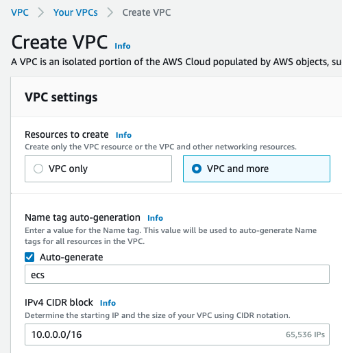
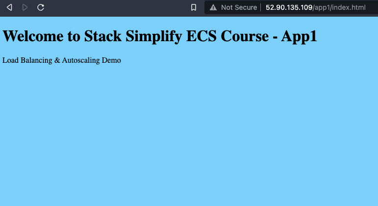
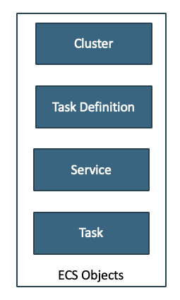

## 2 - Crear cluster ECS

### 01: Prerequisitos
- Asegurarse de tener una VPC en la region antes de crear el ECS Fargate o ECS EC2 cluster.
> Nota: Verificar de seleccionar la opción VPC and more y alterar el rango a 10.0.0.0/16, los demas valores se dejan por defecto.

<p align = "center">

</p>       

### 02: Create Fargate Cluster
- Ir al menú de ECS e ir a la opción `Create cluster` 
- Cluster Name: fargate-demo
- CloudWatch Container Insights: Enabled
- Verificar que el nuevo cluster fue creado correctamente.

### 03: Create ECS EC2 Linux Cluster
- **Pre-requisite**: Crear una keypair (ecs-`NOMBRE`) ej: `ecs_fd`. La misma la generan en el menu de EC2.
- **Cluster Settings**
    - Cluster Name: ecs-ec2-demo
    - Provisioning Model: On-Demand
    - EC2 Instance Type: t2.small
    - Number of Instances: 1
    - EC2 Ami Id: dejar por defecto
    - EBS storage (GiB): dejar por defecto
    - Keypair: ecs-`NOMBRE`
    - Networking: seleccionar la que generaron anteriormente.
    - Security group: dejar por defecto.
    - Container instance IAM role: Elegir el `LabRole`
    - CloudWatch Container Insights: enabled
- Verificar que el cluster se haya creado correctamente.

### 04: Create a simple Task Definition
   - Elegir tipo Fargate para desplegar el task. 
   - **Task Definition:** nginx-app1-td
   - **Task role:** `Labrole`
   - **Task execution role:** `Labrole`
   - **Task memory:** `0,5GB`
   - **Task CPU:** `0,25vCPU`
   - **Add container:**
    - **Name:** nginxapp1
    - **Image:** stacksimplify/nginxapp1:latest (disponible en Docker Hub)
    - **Port mappings:** 80
    - Dejar el resto por defecto y verificar que el task se genero correctamente.

## 05: Create Service
- Ir al Cluster de `fargate-demo` y crear un ECS service con:
- **Configure Service**
    - Launch Type: Fargate
    - Task Definition: nginx-app1
    - Service Name: nginx-app1-svc
    - Number of Tasks: 1
    - Dejar los demas valores por defecto.
- **Configure Network**
    - VPC: ecs-vpc
    - Subnets: las disponibles **PÚBLICAS** para la VPC.
    - Security Group: ecs-nginx (Inbound Port 80)
    - Auto Assign Public IP: Enabled
    - Dejar los demas valores por defecto.

- Acceder a la aplicación de nginx por la URL conformada por la dirección IP pública brindada por el service (deben de ir al Task para visualizarla una vez que quedo desplegado el Service).

>Nota: en caso de tener algún problema con la imagen anterior, utilizar alguna otra imagen para desplegar o alojarla directamente en el ECR de la cuenta.

```
http://<PUBLIC_IP>/app1/index.html
```

<p align = "center">

</p>  


## 06: Core Concepts

- Los siguientes conceptos tenemos que manejarlos de manera correcta para trabajar con containers.

<p align = "center">

</p>

## Próximos pasos
Para el siguiente paso del laboratorio, diríjase a [3 - Trabajando con ECR](../03-ECR-integraci%C3%B3n/README.md)