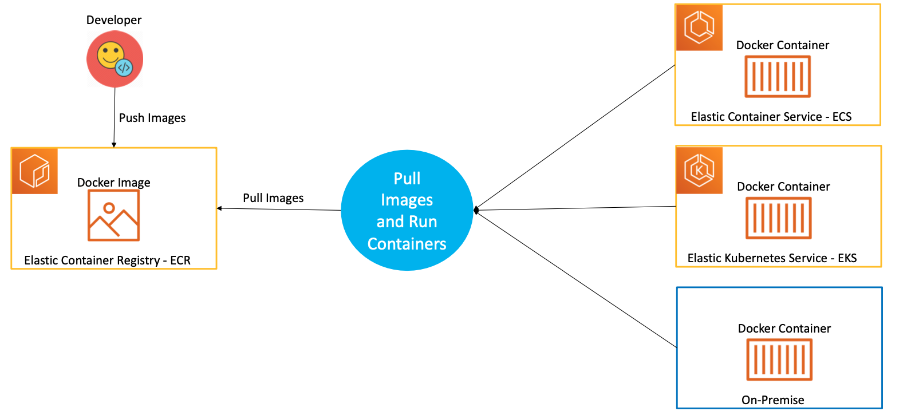

# AWS ECR - Elastic Container Registry Integration

## 01: Introduction to ECR

-  Elastic Container Registry (ECR) es un registry de contenedores de Docker completamente administrado que facilita a los desarrolladores almacenar, administrar e implementar imágenes de contenedores de Docker
- ECR está integrado con Elastic Container Service (ECS), lo que simplifica nuestro flujo de trabajo desde el desarrollo hasta la producción.
- ECR elimina la necesidad de operar nuestros propios repositorios de contenedores o preocuparse por escalar la infraestructura subyacente.
- ECR aloja nuestras imágenes en una arquitectura escalable y de alta disponibilidad, lo que nos permite implementar contenedores de manera confiable para nuestras aplicaciones.
- La integración con AWS Identity and Access Management (IAM) proporciona control a nivel de recursos de cada repositorio.
- Con Amazon ECR, no hay tarifas ni compromisos iniciales. Solo pagamos por la cantidad de datos que almacena en sus repositorios y los datos transferidos a Internet.


## 02: ECR Terminology

 - **Registry:** Se proporciona un registro ECR a cada cuenta de AWS; podemos crear repositorios de imágenes en nuestro registro y almacenar imágenes en ellos.
- **Repository:** Un repositorio de imágenes de ECR contiene nuestras imágenes de Docker.
- **Repository policy:** Podemos controlar el acceso a nuestros repositorios y las imágenes dentro de ellos con políticas de repositorio.
- **Authorization token:** Nuestro cliente de Docker debe autenticarse en los registros de Amazon ECR como usuario de AWS antes de poder enviar y extraer imágenes. El comando get-login de la AWS CLI nos proporciona credenciales de autenticación para pasar a Docker. 
- **Image:** Podemos enviar y extraer imágenes de contenedores a nuestros repositorios. Podemos usar estas imágenes localmente en su sistema de desarrollo o podemos usarlas en las definiciones de tareas de Amazon ECS.

## 03: How ECR works

<p align = "center">

</p>

## 04: Pre-requisites
- Tener instalado Docker.
- Tener instalado la AWS CLI.
- Configurar las credenciales de la cuenta de academy en el archivo `~/.aws/credentials`.

## 05: Create ECR Repository
- Crear un repo de ECR por la AWS console.
- Repository Name: aws-ecr-nginx
- Dejar los demas valores por defecto.
- Explorar el ECR generado y ver las opciones disponibles,

## 06: Create Docker Image locally
- Ir al **03-ECR-integración** del repo y descargar el contenido (`Dockerfile` y `index.html`).

- Revisar el `index.html` y modificarlo si quiere.
- Crear la imagen de Docker localmente.
- Validar que la imagen funciona localmente.

```
docker build -t <AWS_ACCOUNT_ID_NUMBER>.dkr.ecr.<REGION>.amazonaws.com/aws-ecr-nginx:1.0.0 . 
docker run --name aws-ecr-nginx -p 80:80 --rm -d <AWS_ACCOUNT_ID_NUMBER>.dkr.ecr.<REGION>.amazonaws.com/aws-ecr-nginx:1.0.0
```

## 07: Push Docker Image to AWS ECR
- Pushear la imagen de docker al ECR generado anteriormente.

- **AWS CLI Version 1.x**
```
AWS CLI Version 1.x
aws ecr get-login --no-include-email --region <your-region>
Usar el output del comando anterior y ejecutarlo
docker push <AWS_ACCOUNT_ID>.dkr.ecr.<REGION>.amazonaws.com/aws-ecr-nginx:1.0.0
```
- **AWS CLI Version 2.x**
```
AWS CLI Version 2.x
aws ecr get-login-password --region <your-region> | docker login --username AWS --password-stdin <your-ecr-repo-url>

aws ecr get-login-password --region <your-region> | docker login --username AWS --password-stdin <AWS_ACCOUNT_ID>.dkr.ecr.<REGION>.amazonaws.com/aws-ecr-nginx

docker push <AWS_ACCOUNT_ID>.dkr.ecr.<REGION>.amazonaws.com/aws-ecr-nginx:1.0.0
```

>Nota: En caso de tener problema con el docker login en cualquiera de las dos versiones, utilizar el siguiente comando: `docker login -u AWS -p $(aws ecr get-login-password --region <REGION>) <AWS_ACCOUNT_ID>.dkr.ecr.us-east-1.amazonaws.com`


## 08: Using ECR Image with Amazon ECS
- Crear un task definition a partir de la imagen subida anteriormente/
- Task definition: aws-ecr-nginx.
   - Container image: <AWS_ACCOUNT_ID>.dkr.ecr.<REGION>.amazonaws.com/aws-ecr-nginx:1.0.0
- Crear un service para poder acceder a al container.
   - Create service: aws-ecr-nginx-svc.

## Próximos pasos
Para el siguiente paso del laboratorio, diríjase a [4 - Load balancing and autoscaling](../04-LoadBalancing-AutoScaling/Readme.md)
